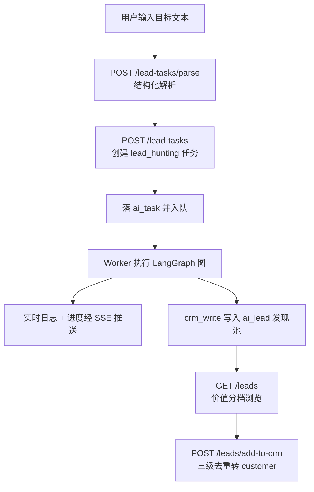
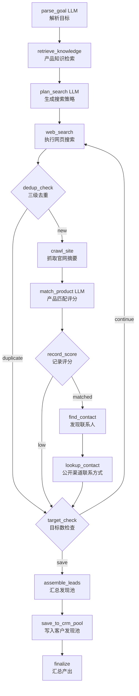

# AI 获客流程说明

> 面向对象：研发 / 产品 / 新成员上手
> 对应需求：`产品需求文档/03-AI获客.md`
> 图定义：`产品需求文档/LangGraph 工作流/00-P0工作流定义.md`
> 代码实现：`server/packages/workflows`、`server/packages/tools`、`server/apps/api/src/leads`

---

## 1. 定位与目标

AI 获客是 P0 模块之一。用户用**一句自然语言**下达获客目标，AI 数字员工（角色 `lead_hunter`）自主完成
「找客户 → 分析客户 → 评分 → 找联系人」，产出可进入 CRM 的潜在客户列表。

三条产品红线：

1. **AI 只负责发现与评分，不自动对外触达**。发开发信属销售中心流程，且强制人工审核。
2. **评分必须可解释**。每条评分理由都要带 `evidence` / `source`（Insight Schema），不允许黑盒分数。
3. **AI 不直接写 CRM**。发现结果先落「客户发现池」（`ai_lead`，`inCrm=false`），
   「加入 CRM」是用户动作（`POST /leads/add-to-crm`），并做三级去重。

---

## 2. 端到端业务链路

| 阶段 | 接口 | 说明 |
|---|---|---|
| 解析目标 | `POST /lead-tasks/parse` | 自然语言 → 结构化字段（市场/客户类型/目标产品/规模） |
| 创建任务 | `POST /lead-tasks` | 生成 `ai_task`（`type=lead_hunting`），入队异步执行 |
| 工作台概览 | `GET /lead-hunter/summary` | 员工状态 + 今日产出 + 当前任务进度 |
| 发现列表 | `GET /leads`、`GET /leads/summary` | 分页 / 价值分档计数 |
| 客户详情 | `GET /leads/{id}` | 评分理由、联系人、官网概览 |
| 加入 CRM | `POST /leads/add-to-crm` | 三级去重后转 `customer`（可批量） |
| 单条转化 | `POST /leads/{id}/convert` | 单条转化，返回 `mapped` 布尔 |
| 批量分析 | `POST /leads/batch-analyze` | 异步创建 `product_analysis` 任务 |

---

## 3. 核心工作流（LangGraph `lead_hunting` 图）

### 3.1 图拓扑

### 3.2 节点职责

| 节点 | 类型 | 职责 |
|---|---|---|
| `parse_goal` | LLM（轻） | 自然语言目标 → `parsed`（`targetMarket` / `customerType` / `targetProduct` / `companySize`），缺失字段留空 |
| `retrieve_knowledge` | tool | 检索企业产品知识（`scene=lead_match`，`topK=3`），作为评分依据 |
| `plan_search` | LLM（轻） | 生成 3~10 条英文搜索词 + 校准 `targetCount` |
| `web_search` | tool | 逐轮执行搜索，产出公司候选（**每轮换词**，映射到供应商分页） |
| `dedup_check` | flow | 三级去重 + `excludeDomains` / `companySizeRange` 硬过滤 |
| `crawl_site` | tool | 抓官网关键页（产品/About）生成摘要；单站不可达**降级跳过**不中断任务 |
| `match_product` | LLM（中） | 产品匹配度评分，**必须输出 Insight Schema**（`reasons[].evidence/source`） |
| `record_score` | flow | `scoreLevel` 由 `matchPct` 确定性映射 + 阈值分流 |
| `find_contact` | tool | 发现采购负责人 + 决策影响力 90/75/40 档映射 |
| `lookup_contact` | tool | 查**公开商务渠道**联系方式（GDPR/CCPA 边界） |
| `target_check` | flow | 达到目标数或轮次耗尽 → 收尾；否则回 `web_search` 继续 |
| `assemble_leads` | flow | 评分 × 联系人归并为发现池记录 |
| `save_to_crm_pool` | tool | 写 `ai_lead`（`inCrm=false`，不自动进 CRM） |
| `finalize` | flow | 统计落 `ai_task_log`，SSE 推 `done` |

### 3.3 关键分支

- `dedup_check` **命中重复** → 不抓站、不评分，直接进 `target_check` 继续搜下一轮。
- `record_score` **低于阈值** → **不找联系人**（省外部额度），直接进 `target_check`。
- `target_check` → `continue` 回到 `web_search`（翻页/换词）；`save` 进入汇总收尾。
- 全程受 `targetCount` 与轮次上限约束，避免无限循环。

### 3.4 LLM 提示词契约

提示词只锁 I/O 契约，`{{var}}` 点路径插值由 `runtime.renderTemplate` 处理。核心 3 条：

- `leadHunting.parseGoal`：提取明确给出的字段，缺失留空，禁止脑补。
- `leadHunting.planSearch`：结合结构化条件与产品知识要点，产出英文搜索词 + `targetCount`。
- `leadHunting.matchProduct`：基于官网摘要与知识要点评分，**理由必须给 evidence/source**；
  `scoreLevel` 仅供参考，最终以 `matchPct` 按分档线确定性映射。

---

## 4. 四个核心机制

### 4.1 评分：单一来源 + 确定性映射

`matchPct` 由 LLM 一次产出；`scoreLevel` **不做二次 AI 判断**，按分档线映射：

- High ≥ 85
- Medium ≥ 60
- 其余 Low

当 LLM 回显的 `scoreLevel` 与映射结果不一致时，**以映射结果为准**（保证可复算、可测试）。

### 4.2 三级去重（归一化域名优先）

| 层级 | 位置 | 口径 |
|---|---|---|
| 任务内 | `dedup_check` | 归一化域名（去协议/去 www/小写）优先，名称兜底；命中打标跳过 |
| 跨任务 / 发现池 | `crm_write` | 按 `company_domain` 命中 → **合并更新**（取更高分），不新建 |
| 加入 CRM | `addToCrm` | 域名 → 公司名 → 联系人邮箱域，逐级比对；命中则 `mapped` 关联已有客户 |

> 去重键为何域名优先：mock 供应商的公司名即查询词、必然同名，仅按名称归并会串数据。

### 4.3 联系人：职衔白名单 + 决策影响力确定性映射

1. 按 `jobTitles` 白名单排序（命中者优先，按白名单顺序）；未命中按影响力降级排后。
2. 决策影响力确定性映射（无 AI 判断、可复算）：
   - **90** = 采购决策层（Director/VP/Head/Chief/CPO + 采购职能词）
   - **75** = 采购执行层（Purchasing/Sourcing/Procurement Manager、Buyer、Merchandiser）
   - **40** = 影响层（Engineer/R&D/Quality 等）
   - **null** = 未命中（不猜测）
3. `find_contact` 仅产出职衔/姓名；联系方式归 `lookup_contact`（仅公开商务渠道）。

### 4.4 成本 / 额度控制（三层限额）

| 层级 | 机制 |
|---|---|
| 任务级 | `targetCount`（默认 35），同时作为进度分母 |
| 员工级 | 外部调用日额度令牌桶：`web_search`×1、`site_crawl`×2、`lookup_contact`×1 |
| 组织级 | LLM 日预算 |

超限 → 任务转 `paused`，日志记 `error`，次日可手动 resume。

---

## 5. 数据模型（关键表）

| 表 | 用途 |
|---|---|
| `ai_task` | 任务主表（`type=lead_hunting`、`progressPct`、`currentStep`、`status`、`input`） |
| `ai_task_log` | 执行日志（`search` / `found` / `crawl` / `match` / `contact` / `lookup` / `error`） |
| `ai_lead` | 客户发现池（`company_name`、`country`、`company_domain`、`match_pct`、`score_level`、`insight`、`in_crm`、`converted_customer_id`、`task_id`） |
| `ai_lead_contact` | 发现池联系人（`name`、`title`、`email`、`decision_influence_pct`、`source`） |
| `customer` | CRM 客户（加入 CRM 后落此表，`source_lead_id` 反查来源） |

---

## 6. 运行与状态

- **异步执行**：API 落 `ai_task` 后入队，Worker 执行图；节点完成后落 checkpointer，
  支持 `paused`（等审批 / 额度耗尽）与崩溃续跑。
- **实时反馈**：日志与进度走 SSE；`finalize` **先落库再推事件**，保证断线可补拉。
- **终态产出**：`outputs` 类型化为 `[{ type: 'leads', payload }]`，含
  `leads` / `foundCount` / `analyzedCount` / `highValueCount`，供前端发现列表渲染。

---

## 7. 代码位置索引

| 内容 | 路径 |
|---|---|
| 图结构 / State 通道声明 | `server/packages/workflows/src/sops.ts` |
| flow 控制流实现（去重/评分/收尾等） | `server/packages/workflows/src/flows.ts` |
| LLM 提示词契约 | `server/packages/workflows/src/prompts.ts` |
| 产出物组装 | `server/packages/workflows/src/outputs.ts` |
| 搜索 / 联系人工具 | `server/packages/tools/src/builtin/search-tools.ts` |
| CRM / 发现池写入工具 | `server/packages/tools/src/builtin/crm-tools.ts` |
| API 控制器 | `server/apps/api/src/leads/leads.controller.ts` |
| 业务服务 | `server/apps/api/src/leads/leads.service.ts` |
| 需求文档 | `产品需求文档/03-AI获客.md` |
| 工作流定义 | `产品需求文档/LangGraph 工作流/00-P0工作流定义.md` |

---

## 8. 一句话总结

> 用户下目标 → LLM 解析成结构化条件 → 搜索发现公司 → 三级去重 → 抓官网 → LLM 评分
> （**唯一评分源 + 确定性分档**）→ 仅对达标公司找联系人并查公开联系方式 →
> 汇总写入发现池（**不自动进 CRM**）→ 用户手动「加入 CRM」时再走三级去重落库。
