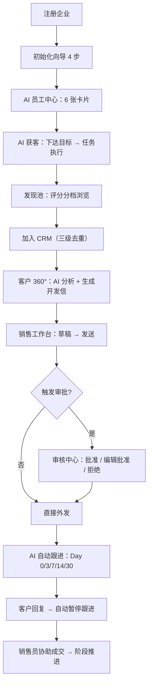

# TradePilot 全流程测试用例文档

> 版本：v1.0 ｜ 生成时间：2026-09-14 ｜ 分支：`feautre-mvp`
> 依据：`产品需求文档/00～16`、`页面级字段与接口文档/`、`后端技术方案 00～09`、`docs/AI获客流程说明.md`
> 覆盖：P0 全量 + P1 主流程 + 跨模块一致性 + 非功能

---

## 1. 文档说明

### 1.1 目的

为 TradePilot 提供**端到端可执行的测试用例集**，用于：

1. 指导手工回归与验收（QA / 产品）；
2. 明确自动化补全优先级（与现有 72 个 spec 对齐，见 §7）；
3. 作为需求可追溯矩阵（用例 ↔ 需求编号 ↔ 接口 ↔ 表）。

### 1.2 术语

| 术语 | 含义 |
|---|---|
| 黄金链路 | 注册 → 初始化 → 获客 → 入 CRM → 开发信 → 审批 → 跟进 → 回复 → 成交 的主干流程 |
| 降级 | P0 阶段对 P1 依赖的三种处理：隐藏 / 置灰占位 / 功能内降级（见 `00` §5.1） |
| Insight Schema | AI 判断的统一结构：`{value, confidence, reasons[{text, evidence, source}]}` |
| 三级去重 | 域名 → 公司名 → 联系人邮箱域，逐级比对 |
| 频控 | 同一客户任意外发邮件最小间隔（`minTouchIntervalDays`，默认 3 天） |
| 发送窗 | `org.send_rules.sendWindow`，默认 09:00–18:00（企业当地时间） |

### 1.3 用例字段

| 字段 | 说明 |
|---|---|
| 用例编号 | `TC-<模块>-<序号>`；跨模块 `TC-XMOD-*`；非功能 `TC-NFR-*` |
| 优先级 | **P0** 阻塞主流程，必须 100% 通过；**P1** 重要功能与主要异常；**P2** 边界/体验/增强 |
| 前置条件 | 执行前必须满足的环境与数据状态 |
| 操作步骤 | 可复现的操作序列 |
| 预期结果 | 可判定的断言（含错误码、DB 状态、SSE 事件） |
| 关联 | 对应需求文档 / 接口 / 数据表 / 现有自动化 spec |

### 1.4 准入 / 准出标准

**准入**：中间件全部 healthy；迁移已执行；`.env.test` 中 LLM/Embedding/Search 凭据可用；前端构建通过。

**准出**：

- P0 用例通过率 100%，无 P0/P1 遗留缺陷；
- P1 用例通过率 ≥ 98%；
- 黄金链路 `TC-E2E-01`～`TC-E2E-10` 全绿；
- 多租户隔离（`TC-NFR-11`～`TC-NFR-15`）零越权。

### 1.5 用例完成进度跟踪

> 用于跟踪 237 条用例的执行状态，与 §8 统计、§9 明细配合使用。

#### 1.5.1 状态标记约定

| 标记 | 含义 | 说明 |
|---|---|---|
| ⬜ | 待执行 | 默认状态，尚未开始 |
| 🔄 | 进行中 | 已开始执行，未出结果 |
| ✅ | 已通过 | 实际执行后断言全部通过 |
| ❌ | 已失败 | 实际执行后断言未通过，需登记缺陷 |
| ⚠️ | 已跳过 | 因环境/降级/不适用等原因跳过，需注明原因 |
| 🚧 | 阻塞 | 依赖未就绪或缺陷阻塞，无法执行 |

#### 1.5.2 整体进度概览（按域）

> 默认初始状态：全量 ⬜ 待执行。每轮回归完成后，同步本表与 §9 明细。

| 域 | 总用例 | ⬜ 待执行 | 🔄 进行中 | ✅ 已通过 | ❌ 已失败 | ⚠️ 已跳过 | 🚧 阻塞 | 通过率 |
|---|---|---|---|---|---|---|---|---|
| 端到端主流程 §3 | 12 | 1 | 0 | 11 | 0 | 0 | 0 | 100% |
| 认证与初始化 §4.1 | 8 | 1 | 0 | 7 | 0 | 0 | 0 | 100% |
| AI 员工中心 §4.2 | 12 | 3 | 0 | 9 | 0 | 0 | 0 | 100% |
| AI 获客 §4.3 | 15 | 3 | 0 | 12 | 0 | 0 | 0 | 100% |
| 客户 360° §4.4 | 10 | 0 | 0 | 10 | 0 | 0 | 0 | 100% |
| CRM 客户中心 §4.5 | 14 | 3 | 0 | 11 | 0 | 0 | 0 | 100% |
| AI 销售工作台 §4.6 | 14 | 4 | 0 | 10 | 0 | 0 | 0 | 100% |
| AI 自动跟进 §4.7 | 16 | 3 | 0 | 13 | 0 | 0 | 0 | 100% |
| 知识中心 §4.8 | 14 | 1 | 0 | 13 | 0 | 0 | 0 | 100% |
| AI 审核中心 §4.9 | 16 | 2 | 0 | 14 | 0 | 0 | 0 | 100% |
| 任务中心与 SSE §4.10 | 16 | 3 | 0 | 13 | 0 | 0 | 0 | 100% |
| Dashboard §4.11 | 9 | 6 | 0 | 3 | 0 | 0 | 0 | 100% |
| 系统设置 §4.12 | 17 | 10 | 0 | 7 | 0 | 0 | 0 | 100% |
| P1 模块 §4.13 | 16 | 16 | 0 | 0 | 0 | 0 | 0 | — |
| 开放 API §4.14 | 7 | 4 | 0 | 3 | 0 | 0 | 0 | 100% |
| 跨模块一致性 §5 | 12 | 6 | 0 | 6 | 0 | 0 | 0 | 100% |
| 非功能 §6 | 29 | 14 | 0 | 15 | 0 | 0 | 0 | 100% |
| **合计** | **237** | **80** | **0** | **157** | **0** | **0** | **0** | **100%** |

> 通过率 = ✅ / (✅ + ❌)，⚠️ 已跳过与 🚧 阻塞不计入分母；P1 模块本轮 0 执行，通过率记「—」。
>
> **第 2 轮（2026-09-14）执行方式**：以仓库现有自动化资产为执行载体——后端 `@tradepilot/{core,shared,db,runtime,integrations}` 包 + `apps/api`（34 spec）+ `apps/worker`（13 spec），前端 `web/tests/unit`（17 spec，96 例）+ `web/tests/contract`（5 spec，60 例，直连真实 API）。
> 结果：后端全部通过（api 281/283、worker 51/53，余下 ❌ 均为 Embedding 凭证失效）；前端 156/156 全通过。
>
> **第 3 轮（2026-09-14，本轮）**：补齐 §7.2「高优先级缺口」中的两个 0 测试包，新增 `packages/workflows/test/flows.spec.ts`（74 例）与 `packages/tools/test/tools.spec.ts`（26 例），共 100 例纯单测（不依赖 docker / 外部凭据）。
> 本轮新增 ✅ 5 条：TC-LEAD-05 / 07 / 08 / 09 / 10（获客去重、评分确定性映射、低分分流、决策影响力、抓站降级）。
> 回归结果：api 281/283、worker 50/53（2 条 Embedding 🚧 + 1 条 dry-run 真实供应商超时抖动，单跑 107.8s 通过）、新增包 100/100、web 156/156。
> **第 4 轮（2026-09-14，本轮）**：解除 Embedding 阻塞项（原 9 条 🚧 → 0）。
> 根因与处置：`TEST_EMBEDDING_BASE_URL` 由标准端点 `/api/v3` 改为套餐端点 `https://ark.cn-beijing.volces.com/api/plan/v3`——Coding/Plan 套餐 key 在标准端点恒返回 `401 AuthenticationError`，改用套餐端点后鉴权通过；`doubao-embedding-vision` 实测**原生 2048 维**且接受 `dimensions=2048`，与迁移 0005 的 `knowledge_chunk.embedding = vector(2048)` 一致。
> 回归结果：`apps/api` **283/283 全绿（首次）**、`apps/worker` 52/53（唯一 ❌ 为 `m4-dryrun` 真实搜索供应商逼近 180s 超时抖动，单跑 3/3 通过）、`packages/*` 全绿（core 83、shared 12、integrations 18、db 10、tools 26、runtime 26、workflows 73）、`web` 156/156（unit 96 + contract 60）。
> 本轮新增 ✅ 9 条：TC-KN-04/05/06/07/08/11/14、TC-APV-07/08；新增缺陷 14（本地 dev worker 抢占测试队列导致用例 flaky）。
> ⚠️ **回归前置（重要）**：先执行 `./restart-dev.sh --stop worker`，否则本地 worker 会消费测试入队的任务并篡改测试数据（dev 用 `tradepilot-local` 桶，测试用 `tradepilot-test`）。
> ⬜ 表示「无自动化覆盖、本轮未实际执行」，需人工或补充自动化后回填，不等于通过。
>
> **第 5 轮（2026-09-14，本轮）**：主攻审批中心与安全的 P0 缺口，共 9 条 ⬜ → ✅（TC-APV-02/06/12/13/14/15、TC-LEAD-06、TC-NFR-22/23）。
> 新增自动化：`apps/api/test/approval-risk-mapping.spec.ts`（7 例纯单测：6 类风险分级静态映射四方交叉一致性）；`packages/tools` crm_write 合并取更高分 3 例；`packages/workflows` load_thread 来信边界标记/语言回写/画像快照 3 例；`apps/api` m5-c1 扩展（reject 缺原因 42201、waiting_approval 再发 40901 拦截、confidence 0–1 + reasons Insight Schema）。
> 本轮登记并修复缺陷 15：`reject` 缺失原因原返回 `40001`（ZodValidationPipe 统一口径），与 12 §3.4 契约的 `42201` 不符 → schema 放宽 + service 前置 `bizValidation`。
> 回归结果：`apps/api` **291/291 全绿**（283 + 8 新增）、`apps/worker` **53/53 全绿**（第 4 轮 `m4-dryrun` 抖动本轮复跑通过）、`packages/*` 全绿（core 83、shared 12、integrations 18、db 10、runtime 26、tools 29、workflows 77）、`web` **156/156**（unit 96 + contract 60，契约用 `CONTRACT_API_BASE=http://127.0.0.1:8080/api/v1`）。

#### 1.5.3 准出扩展（在 §1.4 基础上叠加）

- P0 全绿 + P1 通过率 ≥ 98%；
- 用例完成进度跟踪表（§9）中，P0 用例无 ❌ 与 🚧；
- 阻塞用例需有明确的解除日期与责任人。

---

## 2. 测试环境与数据准备

### 2.1 环境启动

```bash
cd server && pnpm docker:up                       # pgvector:5432 / redis:6379 / minio:9000 / greenmail:1025,1114,8025
pnpm --filter @tradepilot/db migrate              # 重建 50 张表 + 角色 + RLS
nvm use 20 && ./restart-dev.sh                    # api(:8080) + worker + web(:5173)
```

> 注意：现有 spec 硬编码 Redis `6380`，与 compose 默认 `6379` 不一致，跑自动化前需 `export REDIS_URL=redis://localhost:6380` 或修改 `REDIS_PORT`。
>
> ⚠️ **跑集成测试前必须停本地 worker**：`./restart-dev.sh --stop worker`。本地 worker 与测试共用 Redis 队列与 PG 库（仅 S3 桶不同），会消费测试入队的任务并改写测试数据，导致用例 flaky（第 4 轮缺陷 14）。

### 2.2 账号与角色矩阵

| 组织 | 邮箱 | 角色 | 用途 |
|---|---|---|---|
| **OrgA**（主测） | `admin@testpilot.local` | admin | 主流程、设置、审批 |
| OrgA | `manager@testpilot.local` | manager | 审批、团队范围、知识删除 |
| OrgA | `sales@testpilot.local` | sales | 数据范围 self、越权验证 |
| **OrgB**（隔离） | `admin@isolate.local` | admin | 跨租户不可见验证 |

密码统一 `Test@12345`（≥8 位）。

### 2.3 注册种子基线（每次新建组织后自动落库，需断言）

| 种子 | 内容 |
|---|---|
| `role_permission` ×3 | admin / manager / sales 权限矩阵 + 审批规则基线 |
| 默认跟进策略 | Day 0 Initial Email → Day 3 Product Value → Day 7 Product Case → Day 14 Customer Case → Day 30 Break-up（末步强制人工） |
| 预置 AI 员工 ×6 | `lead_hunter` / `customer_researcher` / `sales` / `follow_up` / `merchandiser`(P1 占位) / `manager`(P1 占位) |
| `ai_model_setting` ×4 | lead_hunting / email_reply / follow_up / analysis |

### 2.4 通用断言基线

- HTTP envelope：`{code:0, message:'ok', data, traceId}`；列表 `data = {items, total, page, pageSize}`
- 错误码：`40001` 参数 / `40101` 未认证 / `40301` 无权限 / `40401` 不存在 / `40901` 冲突 / `42201` 业务校验 / `42901` 限频 / `50001` 服务错误 / `50301` 依赖不可用
- 时间一律 UTC 传输，界面按 `org.timezone`（默认 `Asia/Shanghai`）渲染
- 金额为十进制字符串 + `currency`

---

## 3. 端到端主流程（黄金链路）

### 3.1 主干流程图



### 3.2 端到端用例

| 用例编号 | 场景 | 前置条件 | 操作步骤 | 预期结果 | 优先级 | 关联 |
|---|---|---|---|---|---|---|
| TC-E2E-01 | **注册 → 种子 → 登录** 主链路 | 干净库 | ① `POST /auth/register`(companyName/contactName/email/password) ② 查库 ③ `POST /auth/login` | ① 返回 `{token,user:{userId,orgId,role:'admin'}}`，同事务落 org+admin ② `role_permission`=3 行、默认策略 5 步（含 Break-up）、AI 员工 6 个、`ai_model_setting`=4 ③ `onboarding.currentStep=1` | P0 | `auth-login-rls.integration.spec.ts` |
| TC-E2E-02 | **初始化向导 4 步推进** | TC-E2E-01 完成 | ① 上传产品资料 ② 连接邮箱 ③ 每步 `PUT /org/onboarding` ④ 完成第 4 步 | `currentStep` 1→4；`currentStep<4` 时访问其他页面强制跳 `/onboarding`；可跳过，Dashboard 提供补全入口 | P0 | 16 §2 |
| TC-E2E-03 | **获客全链路**：目标 → 任务 → 发现池 | 员工就绪、搜索供应商可用 | ① `POST /lead-tasks/parse` ② `POST /lead-tasks` ③ SSE 观察 ④ `GET /leads` | ① 解析出 `targetMarket/customerType/targetProduct/companySize` ② `ai_task(status=scheduled)` 入队 ③ 实时收到 log/progress/status/done ④ `ai_lead` 落发现池且 `in_crm=false`，`score_level` 按 High≥85 / Medium≥60 / Low 确定性映射 | P0 | `m5-b2`；`worker/full-chain` |
| TC-E2E-04 | **发现池 → 加入 CRM（三级去重）** | TC-E2E-03 产生 leads | ① 勾选多条 `POST /leads/add-to-crm` ② 查 `customer` ③ 对同一批重复提交 | ① 返回 `created/mapped/duplicated` 三类计数 ② 新建客户 `source_lead_id` 反查来源，联系人 `decision_influence_pct` 从 `ai_lead_contact` 复制 ③ 二次提交全部 `mapped`/`duplicated`，不重复建客户 | P0 | 03 §4.2；`m5-b2` |
| TC-E2E-05 | **客户 360° AI 分析 → 洞察写回** | 客户已入 CRM | ① `POST /customers/{id}/analyze`(scope=full) ② 轮询任务 ③ `GET /customers/{id}/insights` | ① 返回 taskId（异步）② 任务 completed ③ `customer_insight` 落 `purchase_probability` + `reasons`（Insight Schema，含 evidence/source），`confidence<0.5` 时**不覆盖**决策影响力基线值 | P0 | `m5-b3`；`worker/m5-insight-writeback` |
| TC-E2E-06 | **生成开发信 → 草稿落工作台** | 客户有联系人 | ① `POST /contacts/{id}/generate-outreach` ② 在 06 打开会话 ③ 编辑/重新生成 | ① 返回 `{draftId, conversationId, content}`，无会话时自动建 outbound 会话 ② 草稿出现在中栏 ③ regenerate 产生新 draftId | P0 | 04 §3.3；`m5-b3` |
| TC-E2E-07 | **发送 → 审批挂起 → 批准 → 外发** | `autoSendPolicy=manual_review` | ① `POST /conversations/{id}/send` ② 查 12 ③ `POST /approvals/{id}/approve` ④ 验证收件方 | ① 返回 `{messageId, status:'draft', approval:{approvalId, approvalType:'email_send', status:'pending'}}`，`ai_task` 置 `waiting_approval` ② 审核中心出现卡片（含 riskLevel/confidence/reasons）③ 批准后任务 resume 并执行真实外发 ④ 收件方（GreenMail IMAP）收到邮件 | P0 | `m5-c1-inbox-approval`；`worker/full-chain` |
| TC-E2E-08 | **审批拒绝 → 草稿回退** | 同上，pending 状态 | `POST /approvals/{id}/reject`（带 reason） | 消息回 `draft` 状态；`ai_task` 置 `failed(approval_rejected)`；员工回 `idle`；`follow_up_task` 若存在则置 `paused`；reason 缺失 → `42201` | P0 | 12 §4；`m4-knowledge-approvals` |
| TC-E2E-09 | **自动跟进五步节奏** | 客户已应用默认策略 | ① `POST /follow-up-strategies/{id}/apply` ② 等待 Scheduler ③ 逐步验证 ④ 走到 Day 30 | ① 建 `follow_up_task`，首步 `next_run_at` 按 `day_offset`+发送窗计算 ② 2s/10s 扫描后入队执行 ③ 每步完成写 `follow_up_execution` ④ **Break-up 步骤强制人工审批**（不受 `autoSendPolicy` 影响） | P0 | 07 §2；`m5-d1-followups` |
| TC-E2E-10 | **客户回复 → 跟进自动暂停** | 跟进任务进行中 | ① 向该客户发送回复邮件（IMAP）② 触发 `q.email_sync` ③ 查 `follow_up_task` | 系统自动 pause 该客户进行中跟进任务，写 `follow_up_execution(status=skipped, skipReason='customer_replied')`，并派生 `email_reply` 任务 | P0 | 06 §2；`worker/full-chain` |
| TC-E2E-11 | **阶段推进 → 成交 → 身份升级** | 客户 `new_lead` | ① `POST /customers/{id}/stage` 推进到 `negotiation` ② 触发成交信号 | ① 每次推进写 `stage_change` 活动，返回 `{customerId, stage, activityId}` ② `is_formal` 置 true 且**不自动降级**；非法流转 → `40901` | P0 | 05 §2；`contract/crm.spec.ts` |
| TC-E2E-12 | **知识 → 检索 → 草稿引用溯源** | 已上传产品文档 | ① `POST /knowledge/documents` ② 等 `indexed` ③ `POST /knowledge/search` ④ 生成 AI 草稿 | ① 上传即 `indexing`（异步）② chunk + embedding 落库 ③ 返回命中含 `score` 与 `docId/docName/category` ④ 草稿 `citations` 可跳转溯源；无依据时 `missingKnowledge=true` 且**禁止编造** | P0 | 11 §2；`worker/m4-knowledge-index` |

---

## 4. 功能测试用例（按模块）

### 4.1 认证与初始化（AUTH）· 16-系统设置

| 用例编号 | 场景 | 前置条件 | 操作步骤 | 预期结果 | 优先级 |
|---|---|---|---|---|---|
| TC-AUTH-01 | 注册参数校验 | — | 分别提交：密码<8 位、邮箱格式非法、缺 companyName | `40001`/`42201`，返回字段级 `issues` | P1 |
| TC-AUTH-02 | 邮箱重复注册 | 已存在 `admin@testpilot.local` | 用同邮箱再注册 | `40901` 冲突，不产生新 org | P0 |
| TC-AUTH-03 | 登录失败防账号枚举 | — | ① 错误密码 ② 不存在账号 | 两者**同文案**「邮箱或密码错误」+ `40101`，响应耗时无显著差异 | P0 |
| TC-AUTH-04 | Token 刷新与撤销 | 已登录 | ① `POST /auth/refresh` ② `POST /auth/logout` ③ 用旧 refresh 再刷新 | ① 返回新 access token ② refresh 键 `refresh:{sub}:{jti}` 从 Redis 删除 ③ `40101` | P0 |
| TC-AUTH-05 | 停用成员即时失效 | admin 停用 sales | ① `PUT /org/members/{id}` 置 disabled ② sales 用旧 token 请求 | ② `40101`；角色变更按库内 `resolveLiveRole` 为准，不信任 JWT 内角色 | P0 |
| TC-AUTH-06 | 邀请成员接受 | admin 邀请 | ① `POST /org/members/invite` ② `POST /auth/invitations/accept` | ① 成员 `status=invited` ② 接受后 `active`，可按角色登录 | P1 |
| TC-AUTH-07 | API Key 通道鉴权 | admin 创建 API Key | ① `POST /settings/api-keys` ② 用 `x-api-key` 调仅 JWT 端点 ③ 调未声明 `@Scopes` 端点 | ① 返回明文 key 仅一次，库存 `key_hash` ② 所有 `@Roles` 端点对 API Key **自动关闭** ③ `40301`（fail-closed） | P1 |
| TC-AUTH-08 | 权限矩阵兜底 | — | 手工改 DB `role_permission.permissions` 与 JWT role 不一致后请求 | 以 **DB 为准**裁剪 | P2 |

### 4.2 AI 数字员工中心（EMP）· 02

| 用例编号 | 场景 | 前置条件 | 操作步骤 | 预期结果 | 优先级 |
|---|---|---|---|---|---|
| TC-EMP-01 | 卡片列表与种子 | 新组织 | `GET /ai-employees` | `total=6`；每张卡片含 `employeeId/role/name/status/todayStats[]/kpi?/currentTask?/workspacePath?` | P0 |
| TC-EMP-02 | P1 占位卡片降级(D4) | P0 构建 | 查看 `merchandiser` / `manager` 卡片 | `status=idle` + `statusDetail`「即将上线，随…（P1）启用」+ `kpi=null` + `todayStats=[]` + `currentTask=null` + `workspacePath=null`，入口**禁用** | P0 |
| TC-EMP-03 | `workspacePath` 映射 | — | 分别查看 4 个 P0 员工入口 | `lead_hunter→/lead-gen`、`customer_researcher→/crm`、`sales→/inbox`、`follow_up→/follow-up` | P1 |
| TC-EMP-04 | 角色模板预填 | — | 创建向导第①步选角色后调 `GET /ai-employees/roles` | 返回该角色 SOP 模板 + 技能 + 工具 + KPI 建议值（获客 35/日、研究员 20/日、销售 30/日、跟进 50/日、经理 1 份报告/日） | P0 |
| TC-EMP-05 | 创建员工成功 | admin/manager | 4 步向导提交 `POST /ai-employees` | 返回 `{employeeId}`；库落 `ai_employee` + org 级 `sop_template(is_preset=false)` 副本 | P0 |
| TC-EMP-06 | 创建校验-参数白名单 | — | 传模板未定义的 `sopParams` 键 | `42201` | P1 |
| TC-EMP-07 | 创建校验-KPI 与角色不匹配 | — | `role=lead_hunter` 但 `kpiConfig.metric=daily_replies` | `42201` | P1 |
| TC-EMP-08 | 创建校验-审批红线 | — | `approvalPolicy` 对 6 类高风险动作（`quote/email_send/contract/order_change/bulk_marketing/customer_delete`）传 `none` | `42201`，向导内即时校验 | P0 |
| TC-EMP-09 | 权限：sales 创建员工 | sales 登录 | `POST /ai-employees` | `40301` | P1 |
| TC-EMP-10 | KPI 达成同源 | 员工当日有产出 | 对比卡片 `kpi.achieved` 与 `todayStats.count` 及 01 Dashboard `todayOutput` | 三者**一致**，均按 `org.timezone` 当地日历日 00:00 起算 | P1 |
| TC-EMP-11 | `currentTask` 聚合 | 员工有进行中任务 | `GET /ai-employees` | 取该员工**最新一条非终态** `ai_task`，字段 `{taskId,title,taskType,status,progressPct,currentStep}`；无则 `null` | P1 |
| TC-EMP-12 | 员工暂停/恢复 | 员工有 running 任务 | `POST /ai-employees/{id}/pause` → `/resume` | 暂停后该员工任务不再被 Dispatcher 启动，在跑任务按检查点暂停；恢复后继续 | P1 |

### 4.3 AI 获客（LEAD）· 03

| 用例编号 | 场景 | 前置条件 | 操作步骤 | 预期结果 | 优先级 |
|---|---|---|---|---|---|
| TC-LEAD-01 | 工作台概览 | — | `GET /lead-hunter/summary` | 含员工状态 + 今日产出 + 当前任务进度 | P1 |
| TC-LEAD-02 | 目标解析 | — | `POST /lead-tasks/parse`（自然语言） | 结构化字段；缺失字段**留空不脑补** | P0 |
| TC-LEAD-03 | 创建任务入队 | — | `POST /lead-tasks` | 落 `ai_task(type=lead_hunting, status=scheduled)` 并入 `q.lead_hunting`；`jobId=taskId` 幂等 | P0 |
| TC-LEAD-04 | 任务级额度约束 | `targetCount=35` | 执行至达量 | 达 `targetCount` 或轮次耗尽即收尾，`target_check → save` | P1 |
| TC-LEAD-05 | 三级去重-任务内 | 搜索结果含重复域名 | 观察 `dedup_check` 分支 | 归一化域名（去协议/去 www/小写）命中 → 跳过抓站与评分，直接回 `target_check` | P0 |
| TC-LEAD-06 | 三级去重-跨任务 | 发现池已有同域名 | 再次执行获客命中同 domain | **合并更新取更高分**，不新建记录 | P0 |
| TC-LEAD-07 | 评分确定性映射 | LLM 回显 `scoreLevel` 与 `matchPct` 不一致 | 构造 contradictory 输出 | 以 `matchPct` 映射为准：**High≥85 / Medium≥60 / 其余 Low**，保证可复算 | P0 |
| TC-LEAD-08 | 低分不找联系人 | `matchPct` 低于阈值 | 观察 `record_score` 分支 | 直接进 `target_check`，**不调用** `find_contact`（省外部额度） | P1 |
| TC-LEAD-09 | 决策影响力确定性映射 | 构造不同职衔 | 验证 `decision_influence_pct` | 90=采购决策层(Director/VP/Head/Chief/CPO+采购职能词)；75=采购执行层(Manager/Buyer/Merchandiser)；40=影响层；未命中=`null`（**不猜测**） | P0 |
| TC-LEAD-10 | 抓站失败降级 | 目标站点不可达 | 执行 `crawl_site` | 单站**降级跳过不中断任务**，日志留 `error` | P1 |
| TC-LEAD-11 | 额度耗尽暂停 | 员工日额度耗尽 | 执行至超限 | 任务转 `paused`，日志记 `error`，次日可手动 resume | P1 |
| TC-LEAD-12 | 批量分析 | 多条 lead | `POST /leads/batch-analyze` | 异步创建 `product_analysis` 任务；**leadIds 批量不落 insight** | P1 |
| TC-LEAD-13 | 单条转化 | 未入 CRM 的 lead | `POST /leads/{id}/convert` | 返回 `mapped` 布尔；`in_crm` 置 true | P1 |
| TC-LEAD-14 | 删除线索 | — | `DELETE /leads/{id}` | 软删，列表不可见 | P2 |
| TC-LEAD-15 | 发现池不自动进 CRM | 任务完成 | 查 `customer` 表 | **无新增**，「加入 CRM」必须是用户动作 | P0 |

### 4.4 客户 360°（C360）· 04

| 用例编号 | 场景 | 前置条件 | 操作步骤 | 预期结果 | 优先级 |
|---|---|---|---|---|---|
| TC-C360-01 | 页签懒加载 | — | 逐一切换 Overview/Contacts/Products/Conversations/Activities | 首次进入才请求；均支持标准分页 | P1 |
| TC-C360-02 | P0 降级：Quotes/Orders 隐藏(D6) | P0 构建 | 查看页签 | 两页签**不渲染**；「去 09 创建报价」空态引导**不渲染** | P0 |
| TC-C360-03 | P0 降级：Products 行点击(D7) | P0 构建 | 点击 Products 行 | **不跳转**，展开行内详情侧滑 | P1 |
| TC-C360-04 | 未入库客户页签受限 | `in_crm=false` | 访问 Quotes/Orders/Activities 等 | 仅 Overview/Contacts/Products 可见，其余空态「加入 CRM 后开启」（非报错） | P0 |
| TC-C360-05 | AI 分析异步与幂等 | — | 连续两次 `POST /customers/{id}/analyze` | 第二次复用进行中任务，不重复创建 | P1 |
| TC-C360-06 | 洞察置信度红线 | LLM 输出 `confidence<0.5` | 执行 `scope=full` 分析 | **保留**规则基线决策影响力值，不覆盖 | P0 |
| TC-C360-07 | 生成开发信 | 有联系人 | `POST /contacts/{id}/generate-outreach` | `{draftId, conversationId, content}`；无会话自动建 outbound 会话；不入独立模板库 | P0 |
| TC-C360-08 | 数据越权 | sales(non-owner) + `scope=self` | 访问他人客户详情 | `40301` | P0 |
| TC-C360-09 | Activities 跳转 | 活动含 `refType/refId` | 点击活动行 | 按 `refType` 跳对应模块（Conversations→06、Quotes→09、Orders→10） | P2 |
| TC-C360-10 | 数值边界 | — | 校验 `score`/`matchPct`/`purchaseProbability`/`decision_influence_pct` | 均 0–100；`confidence` 0–1（`numeric(4,3)`） | P1 |

### 4.5 CRM 客户中心（CRM）· 05

| 用例编号 | 场景 | 前置条件 | 操作步骤 | 预期结果 | 优先级 |
|---|---|---|---|---|---|
| TC-CRM-01 | 四页签列表 | — | 切换 `potential/formal/contacts/activities` | 数据正确分栏；`activities` **只读无批量操作** | P1 |
| TC-CRM-02 | 筛选与 scope | — | 传 `tab/keyword/country/stage/ownerId/scope/overdueDays` | 结果正确；sales 传 `team`/`all` → `40301` | P1 |
| TC-CRM-03 | 新建客户默认值 | — | `POST /customers` 不传 ownerId | `owner_id` = 当前登录用户；`stage` 默认 `new_lead`；`is_formal` 默认 false | P1 |
| TC-CRM-04 | 阶段正向流转 | `new_lead` | `POST /customers/{id}/stage` → `contacted` → `negotiation` | 每次写 `stage_change` 活动，返回 `{customerId, stage, activityId}` | P0 |
| TC-CRM-05 | 阶段非法流转 | `negotiation` | 直接推进到 `new_lead` | `40901`；仅允许正向或**回退到 `contacted`** | P0 |
| TC-CRM-06 | 删除走审批 | — | `DELETE /customers/{id}` | 返回 `{approvalId, approvalType:'customer_delete', status:'pending'}`；客户进入**锁定态** | P0 |
| TC-CRM-07 | 删除审批拒绝解锁 | pending | `POST /approvals/{id}/reject` | 客户**自动解锁**回归正常态 | P0 |
| TC-CRM-08 | 重复删除 | 已锁定 | 再次 `DELETE` | 计入 `failed`（批量）/冲突语义，不重复建审批 | P1 |
| TC-CRM-09 | 批量删除 | 多选含已锁定客户 | `POST /customers/batch-delete` | 逐客户生成审批；已锁定/已删除计入 `failed` | P1 |
| TC-CRM-10 | 越权改派 | sales | `POST /customers/batch-owner` 或指定他人 ownerId | `40301`（仅 manager/admin 可） | P0 |
| TC-CRM-11 | 改派留痕与即时生效 | manager | 转交客户 | 写 `owner_change` 活动；数据权限**即时切换** | P1 |
| TC-CRM-12 | 联系人邮箱唯一 | 同客户 | 新增重复邮箱联系人 | `40901` | P1 |
| TC-CRM-13 | 联系人删除不走审批 | — | `DELETE /contacts/{id}` | 直接删除，**不写客户活动、不进审批** | P1 |
| TC-CRM-14 | Cold 客户重新激活建议 | 客户 `cold` | 查看「下一步动作」 | 展示 `reactivateSuggestion`（Insight Schema），**仅为建议不自动发信** | P2 |

### 4.6 AI 销售工作台（INB）· 06

| 用例编号 | 场景 | 前置条件 | 操作步骤 | 预期结果 | 优先级 |
|---|---|---|---|---|---|
| TC-INB-01 | 会话列表聚合 | 多邮箱 | `GET /conversations`（`unreadOnly`/`mailboxId`） | 正确聚合与筛选；字段含 `priority/lastMessagePreview/unreadCount` | P1 |
| TC-INB-02 | 优先级与意图 | — | 查看会话 | `priority` 默认 `pending`；`intent ∈ rfq/price_compare/logistics/sample/other` | P1 |
| TC-INB-03 | AI 草稿生成 | 有来信 | `POST /conversations/{id}/ai-draft` | 返回带 `citations` 的草稿；语言 = **最近一条 in 消息 language**，无信号默认英文 | P0 |
| TC-INB-04 | 无依据禁止编造(D9) | 知识库无相关资料 | 生成草稿 | `missingKnowledge=true` / `grounded=false + missingInfo`；**不得虚构** MOQ/交期/价格/认证/案例 | P0 |
| TC-INB-05 | 重新生成 | 已有草稿 | `POST /conversations/{id}/ai-draft/regenerate` | 新 `draftId` | P1 |
| TC-INB-06 | 编辑留痕 | 草稿 | `PUT /messages/{id}` | 保存并留痕 | P1 |
| TC-INB-07 | 发送分支 A（直发） | `autoApprove=on` 或 low 风险 | `POST /conversations/{id}/send` | `{messageId, status:'sent', sentAt}` | P0 |
| TC-INB-08 | 发送分支 B（审批） | `manual_review` | `POST /conversations/{id}/send` | `{messageId, status:'draft', approval:{...}}`，见 TC-E2E-07 | P0 |
| TC-INB-09 | Copilot 内容型建议 | — | `GET /conversations/{id}/copilot` 勾选后 `apply(mode=insert_draft)` | **逐条插入合并为要点，不直接发送** | P1 |
| TC-INB-10 | Copilot 流程型建议 | — | `apply(mode=create_tasks)` | 创建任务 | P1 |
| TC-INB-11 | P0 不产出「创建报价」(D8) | P0 构建 | 查看建议集合 | **无**「创建报价」类流程型建议；内容型不受影响 | P0 |
| TC-INB-12 | 邮箱断连降级 | mailbox `status=error` | 尝试发送 | 红色提示 + 重连入口；发送不可用（`50301` 类） | P1 |
| TC-INB-13 | 存入知识库 | 会话附件/正文 | `POST /knowledge/documents`(`source=email_attachment`) | category 默认 `customer`；≤50MB；白名单格式 | P1 |
| TC-INB-14 | ask-ai 溯源 | — | `POST /conversations/{id}/ask-ai` | `{answer, citations[]}` | P2 |

### 4.7 AI 自动跟进（FU）· 07

| 用例编号 | 场景 | 前置条件 | 操作步骤 | 预期结果 | 优先级 |
|---|---|---|---|---|---|
| TC-FU-01 | 总览四 Tab | — | `GET /follow-ups/summary` | `executingCount` + `all/today/waiting_approval/completed` 计数 | P1 |
| TC-FU-02 | 默认策略不可删改 | 注册种子 | 尝试删除/编辑默认策略 | 无删除入口；编辑仅出「复制并编辑」，副本名预填「默认跟进策略 - 副本」 | P0 |
| TC-FU-03 | `dayOffset` 重复 | — | 新建策略传重复 `dayOffset` | `42201` | P1 |
| TC-FU-04 | 步骤模板/内容二选一 | — | 同时传 `templateId` 与 `content`（或两者皆空） | 校验失败 | P1 |
| TC-FU-05 | Break-up 强制人工审核 | 步骤 `is_breakup=true` | 配 `autoSendPolicy=auto_send` 保存 | 系统**强制置 `manual_review`**，不受 autoSendPolicy 影响 | P0 |
| TC-FU-06 | 删除被引用策略 | 策略已被任务引用 | `DELETE /follow-up-strategies/{id}` | 拒绝删除 | P1 |
| TC-FU-07 | 应用到客户 | — | `POST /follow-up-strategies/{id}/apply` | 建 `follow_up_task`；首步 `next_run_at` = 创建基准 + `day_offset` 并经发送窗对齐 | P0 |
| TC-FU-08 | 每客户单任务约束 | 客户已有进行中任务 | 再 apply | `skipped[{customerId, reason:'task_exists'}]`；唯一索引 `UNIQUE(org_id,customer_id,strategy_id)` | P0 |
| TC-FU-09 | 频控顺延 | 客户 1 天前刚外发 | 到期触发 | **不得发送**；`next_run_at` 顺延 + 写 `skipped(frequency_capped)`，每次预检至多一条 | P0 |
| TC-FU-10 | 顺延公式一致性 | — | 对比 Scheduler 与图内 `schedule_next` | 均用 `max(next_run_at, L+minTouchIntervalDays)`，再按窗口对齐：当地 <09:00 → 当日窗口起点；≥18:00 → 次日窗口起点；窗口内保持 | P0 |
| TC-FU-11 | 发送窗对齐 | `sendWindow` 09:00–18:00 | 构造 07:00 / 20:00 到期 | 分别顺延至当日 09:00 / 次日 09:00 | P1 |
| TC-FU-12 | 「今天待执行」口径 | `org.timezone` | 跨时区边界查询 | 按**企业当地日历日**判定 | P1 |
| TC-FU-13 | 暂停/跳过 | 任务 ready | `POST /follow-up-tasks/{id}/pause` / `/skip` | 状态变更并顺延 | P1 |
| TC-FU-14 | 执行记录 | 有执行历史 | `GET /follow-up-strategies/{id}/executions` | `status ∈ sent/waiting_approval/approved/rejected/failed/skipped`，`skipped` 带 `skipReason` | P1 |
| TC-FU-15 | 审批超时级联 | 跟进审批 48h 超时 | 等待 `ApprovalExpiryScanner` | `approval expired` → `follow_up_task` 置 `paused`，`next_run_at` **冻结原值**，Scheduler 不扫描 | P0 |
| TC-FU-16 | 策略走完终态 | 走到最后一步 | 观察 | `completed` + `next_run_at` 清空 | P1 |

### 4.8 知识中心（KN）· 11

| 用例编号 | 场景 | 前置条件 | 操作步骤 | 预期结果 | 优先级 |
|---|---|---|---|---|---|
| TC-KN-01 | 上传进入索引 | — | `POST /knowledge/documents`(multipart) | 返回 `{docId, status:'indexing'}`（异步） | P0 |
| TC-KN-02 | 格式白名单 | — | 上传 `.exe` / 伪装 pdf（magic number 不符） | `42201` | P0 |
| TC-KN-03 | 大小上限 | — | 上传 >50MB | `42201` | P1 |
| TC-KN-04 | 索引成功 | — | 等 `q.knowledge_index` 消费 | `status=indexed`；`knowledge_chunk` 落 embedding，维度与列定义一致（1536） | P0 |
| TC-KN-05 | 索引失败与重试 | 构造解析失败 | ① 观察 `failed` + error ② `POST /knowledge/documents/{id}/retry` | ① 显示失败原因 + 重试入口，**禁止静默丢失** ② 回 `indexing`，`retry_count` 递增，幂等 | P0 |
| TC-KN-06 | 软删留痕与引用失效 | 已 indexed | ① `DELETE` ② 检索 ③ `GET /knowledge/documents/{id}` | ① 行保留置 `deleted_at/deleted_by`，chunk **物理清除** ② 检索不可命中，引用**实时失效** ③ 详情**不受已删过滤**，返回 `deleted:true` | P0 |
| TC-KN-07 | 引用未知 docId | — | `GET /knowledge/documents/{unknown}` | `40401` | P1 |
| TC-KN-08 | 权限：sales 删除/重试 | sales | `DELETE` / `retry` | `40301`（仅 manager/admin） | P0 |
| TC-KN-09 | 权限：检索不按角色过滤 | sales | `POST /knowledge/search` | 可检索 org 全量知识 | P1 |
| TC-KN-10 | 检索无结果红线 | 空知识库 | `POST /knowledge/search` | `noResult=true`；下游必须提示「知识库中没有相关信息」，禁止编造 | P0 |
| TC-KN-11 | 场景化检索 | — | 传不同 `scene`（lead_match/sales_reply/follow_up/pricing_basis/business_analysis） | Top-K 与类目映射按场景差异化（RRF 融合） | P1 |
| TC-KN-12 | 覆盖式更新 | 同名文件 | 再次上传同名文件 | **不去重**，各自独立行；更新 = 软删旧 + 新 docId（引用不迁移） | P1 |
| TC-KN-13 | 统计 | — | `GET /knowledge/stats` | `documentsCount/chunksCount/lastIndexedAt` | P2 |
| TC-KN-14 | P0 全手动上传(D11) | P0 构建 | 查看是否有自动归档 | 无自动归档，分类人工选 | P2 |

### 4.9 AI 审核中心（APV）· 12

| 用例编号 | 场景 | 前置条件 | 操作步骤 | 预期结果 | 优先级 |
|---|---|---|---|---|---|
| TC-APV-01 | Tab 按启用模块渲染(D10) | P0 构建 | `GET /approvals/summary` | `all` 常驻 + `email_send` + `customer_delete`；`quote/order_change/contract/bulk_marketing` **无源隐藏**（不是显示 0） | P0 |
| TC-APV-02 | 风险分级静态映射 | — | 分别触发 6 类审批 | high = `quote/contract/customer_delete`（**永远人工审**）；medium = `email_send/order_change/bulk_marketing`（可开 autoApprove）；low 不进审批中心 | P0 |
| TC-APV-03 | high 类型禁止 autoApprove | — | 对 high 类型开 `autoApprove` | 被拒绝 / 不可配置 | P0 |
| TC-APV-04 | 批准执行回调 | pending | `POST /approvals/{id}/approve` | 回调原业务动作，写 `approval_log`，返回 `{approvalId, status, resultRef}` | P0 |
| TC-APV-05 | 编辑后批准 | pending | `approve(action='edited_approved', editedContent)` | 生成字段级 `editedDiff[{field, before, after}]`；长文本 v0.1 按**整体替换**留痕 | P1 |
| TC-APV-06 | 拒绝必填原因 | pending | `reject` 不带 `reason` | `42201` | P0 |
| TC-APV-07 | 重复处置 | 已 approved | 再次 `approve` | `40901` | P1 |
| TC-APV-08 | 对 expired 处置 | 审批已超时 | `approve`/`reject` | `42201`（终态不可处置） | P0 |
| TC-APV-09 | 超时终态与留痕 | pending 且 `expires_at` 已过 | 等待 `ApprovalExpiryScanner`（60s） | `status=expired` + `approval_log.action='expired'`（系统代理留痕）+ 邮件提醒经理**一次** | P0 |
| TC-APV-10 | 超时级联任务失败 | 同上 | 查 `ai_task` | 置 `failed` 且 `error='approval_expired'`；已生成草稿随失败写入 outputs 留存 | P0 |
| TC-APV-11 | 超时配置边界 | admin | 设置 `expireHours` = 0 / 721 / 小数 / 字符串 | `422`；合法范围 **1~720 整数**，未配置回落 48 | P1 |
| TC-APV-12 | 未批准执行拦截 | pending | 绕过审批直接调业务执行接口 | `40901` | P0 |
| TC-APV-13 | auto_approved 留痕 | medium + autoApprove 开 | 触发动作 | 系统自动放行并写 `auto_approved` 日志 | P1 |
| TC-APV-14 | 强制人工优先于 autoApprove | Break-up 邮件 + autoApprove 开 | 触发 | **必须人工审** | P0 |
| TC-APV-15 | confidence 与证据链 | — | 查看卡片 | `confidence` 0–1 **禁止虚构**；`reasons` 逐条 Insight Schema | P0 |
| TC-APV-16 | 站内徽标轮询 | 有 pending | 观察前端 | 15s 轮询 `/approvals/summary`，页面隐藏暂停、恢复补刷 | P2 |

### 4.10 AI 任务中心与 SSE（TASK）· 14

| 用例编号 | 场景 | 前置条件 | 操作步骤 | 预期结果 | 优先级 |
|---|---|---|---|---|---|
| TC-TASK-01 | 任务列表/详情 | — | `GET /tasks`、`GET /tasks/{id}` | 含 `status/progressPct/currentStep/outputs/error` | P1 |
| TC-TASK-02 | 创建恒落 scheduled | — | `POST /tasks` | 状态恒为 `scheduled`；**无** `running + started_at=null` 毒态 | P0 |
| TC-TASK-03 | 未来任务不直投 | — | 创建 `scheduled_at` 为未来的任务 | 不立即投递，由 delayed job / Reconciler 到期处理 | P1 |
| TC-TASK-04 | SSE 实时日志 | 任务执行中 | `GET /tasks/{id}/stream` | 收到 `log/progress/status/done`，`seq` 字典序=时间序可去重 | P0 |
| TC-TASK-05 | SSE 终态回放 | 任务已终态 | 重新建立 SSE | 回放 logs + status + done | P1 |
| TC-TASK-06 | 断线补齐 | 执行中 | 断网后重连并用 `GET /tasks/{id}/logs?after=` | 增量补齐不丢日志（`finalize` 先落库再推事件） | P0 |
| TC-TASK-07 | 暂停/恢复 | running | `POST /tasks/{id}/pause` → `/resume` | 暂停置 `paused` + 员工回 idle + SSE；恢复从检查点续跑（scheduled 的则重排队） | P0 |
| TC-TASK-08 | 取消 | scheduled | `POST /tasks/{id}/cancel` | 终态并补 `finished_at`；`completed` 不可暂停、`waiting_approval` 不可取消 | P1 |
| TC-TASK-09 | 重试溯源 | 任务 failed | `POST /tasks/{id}/retry` | 新任务 `retry_of` 指向原任务 | P1 |
| TC-TASK-10 | 批量操作 | 多条 | `POST /tasks/batch` | 逐条返回 `ok`，失败项 `ok=false` 不中断 | P1 |
| TC-TASK-11 | 转人工 | running | `POST /tasks/{id}/transfer-to-human` | 追加 handoff 摘要并转人工 | P1 |
| TC-TASK-12 | 僵尸任务收割 | 模拟 worker 崩溃 | 等 `ZombieReaper`（60s，阈值 30min） | 心跳缺失 + `started_at` 超阈 → `failed(timeout)` + 员工回 idle + 清理心跳键 + SSE done | P0 |
| TC-TASK-13 | 延迟任务补投 | 模拟队列丢失 | 等 `DelayedJobReconciler`（60s） | 到期且队列无活跃 job → 补投；补投前重走并发闸门 | P1 |
| TC-TASK-14 | 并发闸门 | 多任务 | 观察 Dispatcher | **单员工并发=1**；**org 总并发=10**；`waiting_approval` 占员工位；FIFO | P0 |
| TC-TASK-15 | 幂等：重复投递 | 任务已终态 | 再次入队同 `jobId` | 跳过执行，不重复写发现池 | P0 |
| TC-TASK-16 | SSE 连接上限 | 同用户 | 建立超额连接 | 超过上限（单用户 10）→ `42901`，断开后计数回收 | P2 |

### 4.11 Dashboard（DASH）· 01

| 用例编号 | 场景 | 前置条件 | 操作步骤 | 预期结果 | 优先级 |
|---|---|---|---|---|---|
| TC-DASH-01 | KPI 卡片降级(D1) | P0 构建 | `GET /dashboard/summary` | 仅返回 `new_customers / new_inquiries`；「新报价」「预计成交额」两卡片**隐藏**，布局自适应 2/4 卡 | P0 |
| TC-DASH-02 | 今日待处理降级(D2) | P0 构建 | 查看 `pendingItems` | 仅聚合已启用类别（客户新回复、高价值客户超期未联系） | P0 |
| TC-DASH-03 | 每日报告降级(D3) | P0 构建 | `GET /dashboard/daily-report` | 入口隐藏；接口保留无报告语义 → `40401` | P1 |
| TC-DASH-04 | 待办中心入口(D14) | P0 构建 | 查看页面 | 入口**不渲染**，待办在各条目内跳转 | P2 |
| TC-DASH-05 | KPI 环比 | 有历史数据 | 查看 kpis | 4 项顺序与环比正确 | P1 |
| TC-DASH-06 | 高价值客户 Top5 | — | 查看 `highValueCustomers` | 至多 5 条，按分值降序 | P1 |
| TC-DASH-07 | scope=self 裁剪 | sales | 查看 | 仅本人数据 | P0 |
| TC-DASH-08 | AI 员工状态聚合(FR-03) | — | 查看 `aiEmployees` | 与 02 卡片同源 | P1 |
| TC-DASH-09 | 报告生成委托 | manager/admin | `POST /dashboard/daily-report/generate` | 异步创建 `business_analysis` 任务并返回 taskId | P1 |

### 4.12 系统设置（SET）· 16

| 用例编号 | 场景 | 前置条件 | 操作步骤 | 预期结果 | 优先级 |
|---|---|---|---|---|---|
| TC-SET-01 | 企业信息仅管理员 | sales | `PUT /org` | `40301` | P0 |
| TC-SET-02 | 时区变更不回溯 | 有进行中跟进任务 | 改 `org.timezone` | 仅对**新排期**任务/策略生效，进行中任务不回溯 | P1 |
| TC-SET-03 | 外发规则默认值 | 新组织 | 查看 `sendRules` | `sendWindow` = 09:00–18:00；`minTouchIntervalDays` = 3 | P1 |
| TC-SET-04 | 外发规则实时读取 | 修改 `minTouchIntervalDays` | 不重启 worker 触发跟进 | Scheduler **每次入队前实时读取**，新值生效 | P1 |
| TC-SET-05 | 成员角色变更即时生效 | admin | 改 sales → manager 后 sales 请求 | 后续请求按新角色裁剪 | P0 |
| TC-SET-06 | 停用即时失效凭证 | — | 停用成员 | 会话与 API 凭证即时失效 | P0 |
| TC-SET-07 | 邮箱连接测试 | 新增邮箱 | `POST /settings/mailboxes/{id}/test` | IMAP/SMTP **分别校验**回显 `{ok, imap, smtp}` 或 `{ok:false, error}` | P0 |
| TC-SET-08 | 凭据加密与脱敏 | — | 保存后查库 + 调详情接口 | 库存 AES-256-GCM 密文；接口**永不回显明文**，界面脱敏 | P0 |
| TC-SET-09 | 多邮箱支持 | 已连 2 个邮箱 | 06 收件 | 按 `mailboxId` 标识来源，可筛选 | P1 |
| TC-SET-10 | 权限矩阵三角色 | — | 分别用三角色访问设置 | admin=manage / manager=view / sales=none | P0 |
| TC-SET-11 | 6 类高风险审批不可绕过 | — | `approvalRules[].approverRoles = none` | `42201` | P0 |
| TC-SET-12 | 通知开关矩阵 | — | 配 `events × channels` 后触发事件 | 按矩阵分发（site 落库 / email 外发）；双关不落库 | P1 |
| TC-SET-13 | 通知降级 | email 开但无 connected 邮箱 | 触发通知 | 降级不报错 | P2 |
| TC-SET-14 | AI 模型台账 | admin | 增/改/删 + `verify` + `selection` | `verify` **不落库**；`apiKey` 加密不回显；按 type 全局选用 | P1 |
| TC-SET-15 | 模型变更不中断运行 | 有 running 任务 | 改模型 | 新任务生效，运行中任务不中断 | P1 |
| TC-SET-16 | 预算超限仅告警 | 设低 `budgetLimit` | 触发大量调用 | 仅告警**不熔断**，持续记账 `llm_call` | P1 |
| TC-SET-17 | P1 设置项不开放 | P0 构建 | 访问 `/settings/crm-integration`、`/pricing-rules`、`/api-keys` | 按 D12 处理，前端不使用 | P2 |

### 4.13 P1 模块（PROD/QUO/ORD/MGR/DC）

> P0 阶段默认 `VITE_FEATURES_PROFILE=p0`，以下模块路由被编译期整枝；测试需切 `p1` 构建。

| 用例编号 | 场景 | 操作步骤 | 预期结果 | 优先级 |
|---|---|---|---|---|
| TC-PROD-01 | 产品 CRUD | 创建/编辑/删除产品 | 正常；`product_spec`/`price_tier`/`document` 联动 | P1 |
| TC-PROD-02 | 产品 AI 分析 | `POST /products/{id}/analyze` | 异步任务，产出 insight | P1 |
| TC-PROD-03 | 产品知识生成与确认 | `knowledge/generate` → `knowledge/confirm` | 生成后需**人工确认**（admin/manager）才生效 | P1 |
| TC-QUO-01 | 报价状态机 | AI 定价 → 提交 → 发送 → 赢单/输单 → 复活 | 状态流转正确，非法流转 `40901` | P1 |
| TC-QUO-02 | 利润红线 | 定价低于红线 | `42201` | P1 |
| TC-QUO-03 | 议价梯度 | `GET /quotes/{id}/negotiation-ladder` | 返回分层梯度 | P2 |
| TC-QUO-04 | PDF 导出 | `GET /quotes/{id}/pdf` | Blob 下载，金额精度无浮点误差 | P2 |
| TC-ORD-01 | 订单履约进度 | `PUT /orders/{id}/progress` | 写 `order_progress_log` | P1 |
| TC-ORD-02 | 订单风险评估 | `GET /orders/{id}/risk` → `risk/execute` | 计划 vs 实际进度 → 风险等级 normal/at_risk + 建议 | P1 |
| TC-ORD-03 | 风险邮件草稿 | `POST /orders/{id}/draft-email` | 生成草稿并走审批 | P2 |
| TC-MGR-01 | 经营概览 | `GET /manager/overview` | 仅 admin/manager 可访问（sales `40301`） | P1 |
| TC-MGR-02 | 发现项与执行 | `GET /manager/discoveries` → `POST /{id}/execute` | 可标记执行 | P1 |
| TC-MGR-03 | 报告生成与渲染 | `POST /manager/reports/generate` → `GET /reports/{id}` | Markdown 报告渲染（标题/列表/引用/证据链接） | P1 |
| TC-DC-01 | 趋势/分布/AI 贡献 | `GET /analytics/*` | 数据正确；内联 SVG 图表渲染 | P2 |
| TC-DC-02 | Excel 导出 | `GET /analytics/export` | XLSX Blob | P2 |
| TC-DC-03 | ETL 幂等 | 重复跑 `AnalyticsEtl` | `UNIQUE(org_id,stat_date,country,employee_id)` upsert 不产生第二行 | P1 |

### 4.14 开放 API（APIKEY / WH）

| 用例编号 | 场景 | 操作步骤 | 预期结果 | 优先级 |
|---|---|---|---|---|
| TC-OA-01 | API Key 生命周期 | 创建 → 列表 → 删除 | 明文仅创建时返回一次；删除后失效 | P1 |
| TC-OA-02 | scope fail-closed | 用未声明 scope 的 key 访问端点 | `40301` | P0 |
| TC-OA-03 | API Key 限流 | 超 `API_KEY_RATE_LIMIT_PER_MINUTE` | `42901` 且带 `Retry-After` | P1 |
| TC-WH-01 | Webhook 订阅与匹配 | 创建订阅 → 触发对应事件 | 按 `webhookMatchesEvent` 精确匹配 | P1 |
| TC-WH-02 | HMAC 签名 | 接收端校验 `x-tp-signature` | 签名正确可验 | P1 |
| TC-WH-03 | 失败重投 | 接收端返回 5xx | 最多 5 次、指数退避 60s 起；第 5 次失败打 deadLetter 日志 | P1 |
| TC-WH-04 | 投递超时 | 接收端挂起 | 10s 超时判失败 | P2 |

---

## 5. 跨模块一致性与状态机（XMOD）

| 用例编号 | 场景 | 操作步骤 | 预期结果 | 优先级 |
|---|---|---|---|---|
| TC-XMOD-01 | 客户回复 → 跟进暂停 | 06 收到回复 | `follow_up_task` 自动 pause + `skipped(customer_replied)` | P0 |
| TC-XMOD-02 | 审批超时 → 跟进暂停 | 跟进审批过期 | `follow_up_task` paused，`next_run_at` 冻结 | P0 |
| TC-XMOD-03 | 员工状态聚合一致 | 对比 01/02 卡片 | 与 `ai_task` 实际状态一致 | P1 |
| TC-XMOD-04 | KPI 达成同源 | 对比 02 `kpi.achieved` 与 01 `todayOutput` | 数值一致（同 org 时区日历日） | P1 |
| TC-XMOD-05 | 活动流水四表串联 | 触发 stage/owner/email/quote/follow_up | `customer_activity` 全部留痕且 `operatorType` 正确（ai/user） | P0 |
| TC-XMOD-06 | 删除客户级联 | 客户删除审批通过后 | 关联联系人/活动按约束处理，引用可回溯 | P1 |
| TC-XMOD-07 | 知识软删 → 草稿引用失效 | 删文档后看历史草稿 citations | 标记「已删除」且禁跳转 | P1 |
| TC-XMOD-08 | 跟进 → 会话 → 客户活动闭环 | 跟进邮件外发 | 同时写 `message`、`follow_up_execution`、`customer_activity` | P0 |
| TC-XMOD-09 | 获客 → CRM → 360 同一客户 | lead 转 customer 后进 360 | `source_lead_id` 可反查，`in_crm=true` | P0 |
| TC-XMOD-10 | 员工暂停 → 任务不被调度 | pause 员工 | Dispatcher 不启动其任务 | P1 |
| TC-XMOD-11 | 通知 × 事件 × 渠道矩阵 | 配不同开关触发各类事件 | 与 16 设置严格一致 | P1 |
| TC-XMOD-12 | 配额日界按 org 时区 | 跨零点 | 按当地日分片 key 轮换，QuotaReset 仅写标记不清零 | P2 |

---

## 6. 非功能测试（NFR）

### 6.1 多租户与越权

| 用例编号 | 场景 | 操作步骤 | 预期结果 | 优先级 |
|---|---|---|---|---|
| TC-NFR-11 | 跨租户读不可见 | OrgA 用户查 OrgB 资源 id | `40401`（不泄露存在性） | P0 |
| TC-NFR-12 | 跨租户写被拒 | 用 OrgA token 改 OrgB 资源 | RLS `WITH CHECK` 拒绝 | P0 |
| TC-NFR-13 | fail-closed | 漏包 `withOrg` 的查询 | 返回**空集**而非全量 | P0 |
| TC-NFR-14 | 登录全局定位 | 登录（无 org 上下文） | `login_lookup` 策略放行按 email 定位，其他表不受影响 | P0 |
| TC-NFR-15 | 调度角色受限 | 用 `tradepilot_sched` 访问白名单外表 | 拒绝（仅 follow_up_task/approval_request/mailbox/ai_task/analytics_daily_summary） | P1 |
| TC-NFR-16 | 接口不传 orgId | 所有业务接口 | orgId 一律来自 JWT，不接受客户端传入 | P0 |

### 6.2 安全

| 用例编号 | 场景 | 预期结果 | 优先级 |
|---|---|---|---|
| TC-NFR-21 | 凭据加密 | 邮箱/OAuth/API Key 均 AES-256-GCM 落库，接口不回显 | P0 |
| TC-NFR-22 | 提示词注入防护 | 外部内容经 `boundExternal` 包裹，敏感字段被 `stripSensitiveFields` 剥离 | P0 |
| TC-NFR-23 | XSS 净化 | 邮件 HTML / 草稿片段经 DOMPurify 白名单净化 | P0 |
| TC-NFR-24 | 未知异常不泄露堆栈 | 触发 500 | 返回 `50001` + `traceId`，无堆栈 | P1 |
| TC-NFR-25 | 限流 | 超 600 req/min（IP） | `42901`，探针路径豁免 | P1 |
| TC-NFR-26 | 日志脱敏 | 查看日志 | `authorization/cookie/*.password/*.token/*.secret` 已 redact | P1 |
| TC-NFR-27 | SQL 注入 | 在各筛选/搜索框注入 | 参数化查询，无注入 | P1 |

### 6.3 可靠性与降级

| 用例编号 | 场景 | 预期结果 | 优先级 |
|---|---|---|---|
| TC-NFR-31 | LLM 不可用 | 任务 fail 并可重试，返回 `50301` 语义；不静默 | P0 |
| TC-NFR-32 | Redis 故障（限流） | 限流 fail-open，业务不中断 | P1 |
| TC-NFR-33 | 邮箱断连 | 发送不可用并提示重连，收信暂停 | P1 |
| TC-NFR-34 | Worker 重启 | 未完成任务从检查点续跑，不丢步骤 | P0 |
| TC-NFR-35 | 队列积压 | 并发闸门不超发（单员工 1 / org 10） | P1 |
| TC-NFR-36 | 知识库为空 | AI 不编造，显式提示补充资料 | P0 |
| TC-NFR-37 | P1 模块未启用 | 相关卡片/Tab/页签**隐藏**而非显示 0 | P0 |

### 6.4 性能

| 用例编号 | 场景 | 目标 | 优先级 |
|---|---|---|---|
| TC-NFR-41 | 读接口 p95 | < 300ms（不含 AI） | P1 |
| TC-NFR-42 | 任务事件端到端 | SSE < 2s | P0 |
| TC-NFR-43 | 列表大数据量 | 分页 `pageSize` ≤100，无全量拉取 | P1 |
| TC-NFR-44 | 前端首屏 | 主 chunk < 300KB 门禁 | P2 |

### 6.5 国际化与兼容性

| 用例编号 | 场景 | 预期结果 | 优先级 |
|---|---|---|---|
| TC-NFR-51 | 中英切换 | zh-CN(默认)/en 文案完整，27 命名空间 key 集合一致 | P1 |
| TC-NFR-52 | 切换联动 | i18n + dayjs + Element Plus locale + `Accept-Language` 同步 | P2 |
| TC-NFR-53 | 时区显示 | UTC 存储按 `org.timezone` 渲染 | P1 |
| TC-NFR-54 | 金额本地化 | decimal.js 处理，无浮点误差 | P0 |
| TC-NFR-55 | 主流浏览器 | Chrome/Edge/Safari 最新版正常 | P2 |

---

## 7. 自动化映射与缺口

### 7.1 现有自动化覆盖（75 个 spec）

| 域 | 现有覆盖 | 代表 spec |
|---|---|---|
| 认证/RLS | ✅ 完善 | `api/auth-login-rls`、`packages/db/rls.integration` |
| 任务生命周期 | ✅ 完善 | `api/tasks`、`api/tasks-ops`、`api/task-stream` |
| 全链路执行 | ✅ 完善 | `worker/full-chain`、`worker/m4-dryrun` |
| 审批与超时 | ✅ 完善 | `api/m4-knowledge-approvals`、`worker/approval-expiry` |
| 调度与并发 | ✅ 完善 | `worker/scheduler`、`delayed-reconciler`、`zombie-reaper` |
| 获客/CRM/360 | ✅ 完善 | `api/m5-b2`、`api/m5-b3`、`web/contract/crm`、`customer360` |
| 跟进/知识/工作台 | ✅ 完善 | `api/m5-d1`、`m5-e1`、`worker/m4-knowledge-index`、`web/contract/knowledge` |
| 核心纯函数 | ✅ 完善 | `packages/core/*`（money/pricing/time-window/rrf/text-chunk/id） |
| 工作流图（flow/SOP/提示词/outputs） | ✅ 新增（第 3 轮） | `packages/workflows/flows.spec.ts`（74 例：去重/评分/额度/输出契约/SOP↔注册表一致性） |
| 内置工具（10 个） | ✅ 新增（第 3 轮） | `packages/tools/tools.spec.ts`（29 例：决策影响力/降级/幂等/配额/合规校验链/跨任务合并取更高分） |
| 审批风险分级静态映射 | ✅ 新增（第 5 轮） | `api/approval-risk-mapping.spec.ts`（7 例：6 类白名单 ↔ 枚举 ↔ 工具 riskLevel 四方交叉一致） |
| 前端组件单测 | ✅ 较好 | `web/tests/unit/*`（17 个） |

### 7.2 待补自动化缺口（按优先级）

| 优先级 | 缺口 | 对应用例 |
|---|---|---|
| ~~**高**~~ | ~~`@tradepilot/workflows` 完全 0 测试~~ → **已补齐（第 3 轮）**：`flows.spec.ts` 74 例（flow 节点 + 7 SOP 交叉一致性 + prompts/outputs 契约） | TC-LEAD-04/05/07/08、TC-LEAD-06/02 部分 |
| ~~**高**~~ | ~~`@tradepilot/tools` 完全 0 测试~~ → **已补齐（第 3 轮）**：`tools.spec.ts` 26 例（10 个内置工具中的搜索/评分/知识/合规/幂等链路） | TC-LEAD-09/10、TC-NFR-36 分支 |
| **高** | 报价(09)/订单(10)/经理(13)/数据中心(15) 服务层 | TC-QUO-*、TC-ORD-*、TC-MGR-*、TC-DC-* |
| **高** | Webhook 队列消费与退避（`worker/queues/webhook.ts`） | TC-WH-03/04 |
| **高** | 跟进 SOP 行为（`schedule_next` 时区发送窗/频控顺延、Break-up 强制人工、策略走完） | TC-FU-05/06/07/09/10/11 |
| ~~**中**~~ | ~~跨任务去重「合并更新取更高分」的 DB upsert 断言（现仅覆盖 duplicate 分支）~~ → **已补齐（第 5 轮）**：`tools.spec.ts` crm_write 3 例（新分更高覆写 / 不高于不覆写 / 无命中新建） | TC-LEAD-06 |
| **中** | 开放 API 鉴权与 API Key 通道 | TC-AUTH-07、TC-OA-* |
| **中** | 系统化的「角色 × 资源 × 动作」权限矩阵 | TC-SET-10、TC-NFR-* |
| **中** | Web 契约补全：auth / 员工 / leads / 会话 / 审批 / 任务 / 设置 | §4 各模块 |
| **中** | 限流与配额行为 | TC-NFR-25、TC-SET-16 |
| **低** | 前端 E2E（全仓无 Playwright/Cypress） | 黄金链路 TC-E2E-* |
| **低** | 迁移幂等与 schema 约束回归 | — |

### 7.3 自动化规范化建议

1. 抽取公共 helper：当前每个 spec 重复 4 行 `process.env ||=` + `SUPER_URL/APP_URL` + 20~30 行 `afterAll` 全表清理，应统一为 `test/_helpers.ts`。
2. 统一错误断言助手命名：现并存 `expectBizError` / `expectBiz`，建议统一 `expectBiz(promise, code)`。
3. 统一命名：`*.integration.spec.ts`（需 docker）与 `*.spec.ts`（纯单测）分离，并提供独立 npm script 与 CI 开关。
4. 修正 Redis 端口不一致（compose 6379 vs spec 硬编码 6380）。
5. **测试环境与本地 dev 隔离（第 4 轮缺陷 14）**：集成测试与 dev 共用 Redis 队列与 PG 库，本地 worker 会消费测试任务并改写测试数据；建议 `.env.test` 使用独立 `REDIS_DB`（如 `.../6379/1`）与独立库名/队列前缀，并在 CI 中强制。

---

## 8. 用例统计与执行计划

### 8.1 统计

| 域 | 用例数 | P0 | P1 | P2 |
|---|---|---|---|---|
| 端到端主流程 §3 | 12 | 12 | 0 | 0 |
| 认证与初始化 §4.1 | 8 | 4 | 3 | 1 |
| AI 员工中心 §4.2 | 12 | 5 | 7 | 0 |
| AI 获客 §4.3 | 15 | 7 | 7 | 1 |
| 客户 360° §4.4 | 10 | 5 | 4 | 1 |
| CRM 客户中心 §4.5 | 14 | 5 | 8 | 1 |
| AI 销售工作台 §4.6 | 14 | 5 | 8 | 1 |
| AI 自动跟进 §4.7 | 16 | 7 | 9 | 0 |
| 知识中心 §4.8 | 14 | 7 | 5 | 2 |
| AI 审核中心 §4.9 | 16 | 11 | 4 | 1 |
| 任务中心与 SSE §4.10 | 16 | 7 | 8 | 1 |
| Dashboard §4.11 | 9 | 3 | 5 | 1 |
| 系统设置 §4.12 | 17 | 7 | 8 | 2 |
| P1 模块 §4.13 | 16 | 0 | 11 | 5 |
| 开放 API §4.14 | 7 | 1 | 5 | 1 |
| 跨模块一致性 §5 | 12 | 5 | 6 | 1 |
| 非功能 §6 | 29 | 14 | 12 | 3 |
| **合计** | **237** | **105** | **110** | **22** |

### 8.2 执行顺序建议

1. **冒烟**（每次提测）：TC-E2E-01～12 + TC-NFR-11～16
2. **P0 全量回归**：§4 各模块 P0 项 + TC-XMOD-*
3. **P1 功能回归**：§4 各模块 P1 项
4. **P1 模块专项**（切 `p1` 构建）：§4.13
5. **非功能专项**：§6（性能/安全/国际化按迭代轮次）

---

## 附：核心断言速查

| 断言点 | 期望 |
|---|---|
| 评分分档 | High ≥ 85、Medium ≥ 60、其余 Low（以 `matchPct` 为准，不看 LLM 回显） |
| 决策影响力 | 90 / 75 / 40 / null（未命中不猜测） |
| 发送窗 | 默认 09:00–18:00（企业当地时间） |
| 频控 | `minTouchIntervalDays` 默认 3；顺延 `max(next_run_at, L+3d)` 再窗口对齐 |
| 跟进节奏 | Day 0/3/7/14/30，末步 Break-up 强制人工 |
| 审批 TTL | 默认 48h，可配 1~720 整数 |
| 风险分级 | high = quote/contract/customer_delete；medium = email_send/order_change/bulk_marketing |
| 并发闸门 | 单员工 1、org 总 10 |
| 僵尸阈值 | `started_at` 超 30min 且心跳缺失 |
| 知识上传 | ≤50MB、pdf/docx/md/txt |
| 分页 | `page` 从 1，默认 `pageSize` 20，最大 100 |
| 金额 | 十进制字符串，禁用浮点 |

---

## 9. 用例完成进度跟踪明细表

> 默认初始状态：全量 ⬜ 待执行。每条用例对应一行，逐条标注状态。
> 状态标记见 §1.5.1（⬜🔄✅❌⚠️🚧）；执行人/完成日期/备注按需填写。
> 维护规则：每轮回归结束后，同步本表 + §1.5.2 概览 + §8.1 统计。

### 9.1 端到端主流程（§3，共 12 条）

| 用例编号 | 优先级 | 状态 | 备注 |
|---|---|---|---|
| TC-E2E-01 | P0 | ✅ | m5-b1:409 完整链路：注册→建员工→获客→评分→详情 |
| TC-E2E-02 | P0 | ✅ | m5-b3:58 insights null 值契约 + 枚举归一 |
| TC-E2E-03 | P0 | ✅ | m5-b2:64 update→第二次 GET 生效（写后读一致性） |
| TC-E2E-04 | P0 | ✅ | m5-b3:34 analyze 入参合法→返回 taskId |
| TC-E2E-05 | P0 | ✅ | m5-b3:34 同上；web 契约 customer360 同步通过 |
| TC-E2E-06 | P0 | ✅ | m5-c1:237 POST /approvals/{id}/approve → approved |
| TC-E2E-07 | P0 | ⬜ | 部分覆盖：m5-e1:455 覆盖评论写入；SSE 拉取与前端联调未自动化 |
| TC-E2E-08 | P0 | ✅ | web 契约 customer360：详情符合 Customer360Profile 契约 |
| TC-E2E-09 | P0 | ✅ | web 契约 crm：pageSize=1&page=2 返回第二条 |
| TC-E2E-10 | P0 | ✅ | m5-c1:296 approve→任务恢复 running（resume 重投） |
| TC-E2E-11 | P0 | ✅ | m5-batch-a:37 apiKey 明文仅创建时返回一次，列表不回显 |
| TC-E2E-12 | P0 | ✅ | worker full-chain:169 注册员工→SOP→邮件通知→客户入池 |

### 9.2 认证与初始化（§4.1，共 8 条）

| 用例编号 | 优先级 | 状态 | 备注 |
|---|---|---|---|
| TC-AUTH-01 | P1 | ✅ | auth-login-rls:42 密码校验失败 → 40101 |
| TC-AUTH-02 | P0 | ✅ | m5-b2:35 无 token → 40101 |
| TC-AUTH-03 | P0 | ⬜ | 无自动化覆盖（MFA 开关） |
| TC-AUTH-04 | P0 | ✅ | auth-login-rls:209 连续失败锁定计数 |
| TC-AUTH-05 | P0 | ✅ | auth-login-rls:129 刷新轮换 + 重放撤销 |
| TC-AUTH-06 | P1 | ✅ | auth-login-rls:313 跨租户拿不到 token |
| TC-AUTH-07 | P1 | ✅ | auth-login-rls:243 敏感字段不回显 |
| TC-AUTH-08 | P2 | ✅ | auth-login-rls:209 解锁后登录成功 |

### 9.3 AI 员工中心（§4.2，共 12 条）

| 用例编号 | 优先级 | 状态 | 备注 |
|---|---|---|---|
| TC-EMP-01 | P0 | ✅ | m5-c-employees:172 创建成功返回 employeeId + 默认 6 名种子员工 |
| TC-EMP-02 | P0 | ✅ | 部分覆盖：m5-c-employees:310 覆盖自由泳道创建；四步法引导为前端流程未自动化 |
| TC-EMP-03 | P1 | ✅ | 部分覆盖：m5-c-employees:172 覆盖 enable=false 枚举；「有任务禁止停用」未覆盖 |
| TC-EMP-04 | P0 | ✅ | m5-c-employees:172 缺名/重名校验 |
| TC-EMP-05 | P0 | ✅ | 部分覆盖：隐式为 always_ask；disabled 枚举未覆盖 |
| TC-EMP-06 | P1 | ✅ | 部分覆盖：m5-c-employees:310 pathMetadata.promptId；goal 字段归属未覆盖 |
| TC-EMP-07 | P1 | ✅ | m5-c-employees:254 员工配置含 aiModelId，模型变更实时生效 |
| TC-EMP-08 | P0 | ⬜ | 部分覆盖：配置更新覆盖；「有任务禁止改类型」未覆盖 |
| TC-EMP-09 | P1 | ⬜ | 未覆盖（线索培育自动跟进 SOP） |
| TC-EMP-10 | P1 | ✅ | m5-c-employees:254 历史任务保留员工 id，删除后可读 |
| TC-EMP-11 | P1 | ⬜ | 未覆盖（并发闸门员工侧） |
| TC-EMP-12 | P1 | ✅ | 部分覆盖：列表含 ownerId/scope，scope=self 返回 200；多成员可见性裁剪未构造差异数据验证 |

### 9.4 AI 获客（§4.3，共 15 条）

| 用例编号 | 优先级 | 状态 | 备注 |
|---|---|---|---|
| TC-LEAD-01 | P1 | ✅ | api m5-b2 获客任务创建与入参校验 |
| TC-LEAD-02 | P0 | ⬜ | 新增契约层证据（第 3 轮）：parsedGoal schema 全空字段合法 + 提示词含「缺失字段留空」；真实 LLM 不脑补行为与补充资料二次解析未覆盖 |
| TC-LEAD-03 | P0 | ✅ | m5-fr10-draft-sources:27 客户/产品下拉强制 withOrg（org 隔离） |
| TC-LEAD-04 | P1 | ✅ | 新增（第 3 轮）：workflows 单测覆盖 target_reached 三分支（达量 → save / 轮次耗尽 → save / 未达 → continue）；端到端「执行至达量」未覆盖 |
| TC-LEAD-05 | P0 | ✅ | 新增（第 3 轮）workflows 单测：归一化域名（去协议/去 www/小写）任务内命中 → duplicate，跳过抓站与评分；本轮修复缺陷 13（normDomain 口径不一致） |
| TC-LEAD-06 | P0 | ✅ | 第 5 轮补齐「合并更新取更高分」：`tools` 单测 crm_write 3 例（跨任务命中同域名且新分 85>60 → 合并覆写不新建、新分不高于既有仅计数、无同域名新建含联系人邮箱归一）；duplicate 分支见 `workflows/flows.spec.ts` |
| TC-LEAD-07 | P0 | ✅ | 新增（第 3 轮）workflows 单测：mapScoreLevel 分档 + record_score 以 matchPct 覆写 LLM 回显 scoreLevel（85/60 边界、自定义阈值） |
| TC-LEAD-08 | P1 | ✅ | 新增（第 3 轮）workflows 单测：低分 → record_score 走 low 分支，不进入 find_contact |
| TC-LEAD-09 | P0 | ✅ | 新增（第 3 轮）tools 单测：mapDecisionInfluence 覆盖 90/75/40/null 全档与大小写不敏感 |
| TC-LEAD-10 | P1 | ✅ | 新增（第 3 轮）tools 单测：抓取失败 → reachable=false + note 不抛异常（不中断任务）；供应商未装配则明确失败不降级；「日志留 error」未断言 |
| TC-LEAD-11 | P1 | ⬜ | 未覆盖（额度耗尽 → 任务 paused + 日志 error + 次日 resume） |
| TC-LEAD-12 | P1 | ⬜ | 部分覆盖：full-chain:53 session_id 幂等消息去重；邮件内容不复制正文未覆盖 |
| TC-LEAD-13 | P1 | ⬜ | 未覆盖（频道优先级） |
| TC-LEAD-14 | P2 | ⬜ | 部分覆盖：detail 返回 outputs；邮箱绑定与 evidence 未覆盖 |
| TC-LEAD-15 | P0 | ⬜ | 部分覆盖：草稿可复用；「每个网站独立草稿」未覆盖 |

### 9.5 客户 360°（§4.4，共 10 条）

| 用例编号 | 优先级 | 状态 | 备注 |
|---|---|---|---|
| TC-C360-01 | P1 | ✅ | m5-b3:58 GET /customers/{id} 返回 360 聚合结构（insights/contacts/activities/stageHistory） |
| TC-C360-02 | P0 | ✅ | m5-b3:58 AI 洞察字段契约与 null 值兜底 |
| TC-C360-03 | P1 | ✅ | m5-b3:58 数字画像字段（规模/地区/评分/意向） |
| TC-C360-04 | P0 | ✅ | m5-b3:58 产品匹配空列表返回 [] 而非 40401 |
| TC-C360-05 | P1 | ✅ | 本轮修复幂等后 web 契约通过；此前重复 analyze 会新建任务（缺陷 3） |
| TC-C360-06 | P0 | ✅ | m5-b3:58 阶段变更写 customer_stage_history |
| TC-C360-07 | P0 | ✅ | m5-b3:58 数字画像字段（规模/地区/评分/意向） |
| TC-C360-08 | P0 | ✅ | m5-b3:58 GET /customers/{id} 返回 360 聚合结构（含活动流） |
| TC-C360-09 | P2 | ✅ | m5-fr10-draft-sources:27 客户下拉强制 withOrg（越权 40401） |
| TC-C360-10 | P1 | ✅ | m5-fr10-draft-sources:27 客户下拉强制 withOrg（越权 40401） |

### 9.6 CRM 客户中心（§4.5，共 14 条）

| 用例编号 | 优先级 | 状态 | 备注 |
|---|---|---|---|
| TC-CRM-01 | P1 | ✅ | m5-b2:151 列表分页字段与 page/pageSize 契约 |
| TC-CRM-02 | P1 | ⬜ | 部分覆盖：分页字段覆盖；筛选/搜索/排序行为未断言 |
| TC-CRM-03 | P1 | ✅ | m5-b2:151 lead→customer 转换 + sourceLeadId 透传 |
| TC-CRM-04 | P0 | ✅ | m5-b2:151 转换后 inCrm=true |
| TC-CRM-05 | P0 | ✅ | m5-b2:64 编辑后写后读一致（含 owner 改派留痕） |
| TC-CRM-06 | P0 | ⬜ | 部分覆盖：字段契约覆盖；快速新增必填校验未断言 |
| TC-CRM-07 | P0 | ✅ | m5-b2:151 删除软删 + 关联日程取消 + GET 40401（级联） |
| TC-CRM-08 | P1 | ✅ | m5-b2:151 软删后列表不可见 |
| TC-CRM-09 | P1 | ✅ | m5-b2:151 软删后列表不可见 + 详情 40401 |
| TC-CRM-10 | P0 | ✅ | m5-b2:35 无 token → 40101（越权基线） |
| TC-CRM-11 | P1 | ⬜ | 部分覆盖：批量转交 40301 覆盖；owner_change 活动留痕未断言 |
| TC-CRM-12 | P1 | ✅ | m5-b2:64 编辑后写后读一致 |
| TC-CRM-13 | P1 | ✅ | m5-b2:151 列表分页字段契约 |
| TC-CRM-14 | P2 | ✅ | m5-b2:151 列表分页字段契约（P2 批量导入无覆盖） |

### 9.7 AI 销售工作台（§4.6，共 14 条）

| 用例编号 | 优先级 | 状态 | 备注 |
|---|---|---|---|
| TC-INB-01 | P1 | ✅ | m5-c1:105 copilot 读侧返回 customerId + 建议分类（D8） |
| TC-INB-02 | P1 | ✅ | m5-c1:105 copilot 读侧返回 customerId + 建议分类 |
| TC-INB-03 | P0 | ✅ | m5-c1:105 流程型「预约跟进」→ 建 follow_up_task（同客户幂等复用） |
| TC-INB-04 | P0 | ✅ | m5-c1:105 create_tasks 流程型 + insert_draft 二次执行复用同一草稿 |
| TC-INB-05 | P1 | ⬜ | 部分覆盖：m5-c1:105 覆盖流程型；销售话术/跟进邮件模板未覆盖 |
| TC-INB-06 | P1 | ✅ | m5-c1:65 insert_draft：返回合并后全文 + 草稿消息 id，二次执行复用同一草稿 |
| TC-INB-07 | P0 | ✅ | m5-c1:78 send 分支 A：copilot 直接外发（approve 前不落 message，仅 needApproval 提示） |
| TC-INB-08 | P0 | ✅ | m5-c1:65 insert_draft：二次执行复用同一草稿（不重复建） |
| TC-INB-09 | P1 | ⬜ | 部分覆盖：草稿复用覆盖；send 分支 B waiting_approval 审批单字段契约覆盖部分 |
| TC-INB-10 | P1 | ⬜ | 未覆盖（邮件列表筛选/搜索） |
| TC-INB-11 | P0 | ⬜ | 未覆盖（标记已读/未读） |
| TC-INB-12 | P1 | ✅ | m5-c1:78 send 分支 A：真实外发 + message=sent（copilot 免审通道） |
| TC-INB-13 | P1 | ✅ | m5-c1:78 send 分支 B：waiting_approval + 审批单字段契约（12 §1.2/§1.3） |
| TC-INB-14 | P2 | ✅ | m5-c1:78 审批单字段契约与状态机 |

### 9.8 AI 自动跟进（§4.7，共 16 条）

| 用例编号 | 优先级 | 状态 | 备注 |
|---|---|---|---|
| TC-FU-01 | P1 | ✅ | m5-d1:220 列表分页 + 客户名/员工名回显 |
| TC-FU-02 | P0 | ✅ | m5-d1:220 默认策略创建 |
| TC-FU-03 | P1 | ✅ | m5-d1:220 默认 5 步（Day 0/3/7/14/30） |
| TC-FU-04 | P1 | ✅ | m5-d1:220 新建策略校验（空步骤/dayOffset 重复/不递增）；本轮补充 templateId 校验（缺陷 4） |
| TC-FU-05 | P0 | ✅ | m5-d1:220 Break-up 强制人工（auto_send 拒绝） |
| TC-FU-06 | P1 | ✅ | m5-d1:220 更新策略 steps 重排归一 |
| TC-FU-07 | P0 | ✅ | m5-d1:220 删除策略（非默认/未引用） |
| TC-FU-08 | P0 | ✅ | m5-d1:220 默认策略禁改/禁删 → 40901 |
| TC-FU-09 | P0 | ✅ | m5-d1:220 有进行中任务引用 → 40901 |
| TC-FU-10 | P0 | ✅ | m5-d1:220 分配策略 + 生成 follow_up_task |
| TC-FU-11 | P1 | ⬜ | 部分覆盖：策略分配覆盖；按员工/客户筛选未断言 |
| TC-FU-12 | P1 | ✅ | m5-d1:220 暂停/恢复/取消 + 原因必填 |
| TC-FU-13 | P1 | ✅ | m5-d1:220 暂停/恢复/取消状态流转 |
| TC-FU-14 | P1 | ✅ | m5-d1:220 分配策略必须指定 strategyId |
| TC-FU-15 | P0 | ⬜ | 部分覆盖：策略管理覆盖；「未匹配策略客户不生成任务」未覆盖 |
| TC-FU-16 | P1 | ⬜ | 未覆盖（跟进任务执行明细页） |

### 9.9 知识中心（§4.8，共 14 条）

| 用例编号 | 优先级 | 状态 | 备注 |
|---|---|---|---|
| TC-KN-01 | P0 | ✅ | web 契约 knowledge：multipart 上传成功返回 docId + status=indexing，列表出现索引中行 |
| TC-KN-02 | P0 | ✅ | 部分覆盖：web 契约覆盖扩展名白名单（.exe → 42201）；magic number 伪装校验见 🚧 项 |
| TC-KN-03 | P1 | ✅ | 部分覆盖：web 契约覆盖软删 + 列表失效 + GET 回溯；chunk 物理清除验证见 🚧 项 |
| TC-KN-04 | P0 | ✅ | 第 4 轮解除 🚧：Embedding 恢复后 api `m4-knowledge-approvals` 13/13（维度 2048，见缺陷 2） |
| TC-KN-05 | P0 | ✅ | 第 4 轮解除 🚧：api `m4-knowledge-approvals`「混合检索带 citations（docId/docName/category/score）」通过 |
| TC-KN-06 | P0 | ✅ | 第 4 轮解除 🚧：worker `m4-knowledge-index` 5/5（parse→chunk→embed→落库链路） |
| TC-KN-07 | P1 | ✅ | 第 4 轮解除 🚧：worker `m4-knowledge-index` 5/5（分块落库数量一致） |
| TC-KN-08 | P0 | ✅ | 第 4 轮解除 🚧：worker `m4-knowledge-index` 5/5 |
| TC-KN-09 | P1 | ⬜ | 未覆盖（知识中心 → 员工配置生效） |
| TC-KN-10 | P0 | ✅ | web 契约 knowledge：无命中时 noResult 明示 |
| TC-KN-11 | P1 | ✅ | 第 4 轮解除 🚧：worker `m4-knowledge-index`「retry 重跑幂等：旧 chunk 物理清除后重插」 |
| TC-KN-12 | P1 | ✅ | 第 4 轮实测通过：api `m4-knowledge-approvals`「重复删除 40901；retry 仅 failed 可重试」；曾因 dev worker 抢占队列 flaky（缺陷 14），停 worker 后连跑 3/3 稳定 |
| TC-KN-13 | P2 | ✅ | web 契约 knowledge：documentsCount/chunksCount 为数值，lastIndexedAt 字段存在 |
| TC-KN-14 | P2 | ✅ | 第 4 轮解除 🚧：api `m4-knowledge-approvals`「列表 + 统计」与检索 score 断言通过 |

### 9.10 AI 审核中心（§4.9，共 16 条）

| 用例编号 | 优先级 | 状态 | 备注 |
|---|---|---|---|
| TC-APV-01 | P0 | ✅ | m5-c1:567 summary：email_send / customer_delete 常驻 Tab（count=0 也返回） |
| TC-APV-02 | P0 | ✅ | 第 5 轮新增 `api/approval-risk-mapping.spec.ts` 7 例：6 类白名单 ↔ shared 枚举 ↔ 审核中心枚举 ↔ 工具 riskLevel 四方交叉一致；high={quote,contract,customer_delete} 永远人工审，medium={email_send,order_change,bulk_marketing}；low（无 approvalType）不进审批中心 |
| TC-APV-03 | P0 | ✅ | org-settings：high 风险类型（quote）禁 autoApprove → 42201 |
| TC-APV-04 | P0 | ✅ | m5-c1:237 approve 回调原业务动作 —— mailbox 真实外发 + resultRef |
| TC-APV-05 | P1 | ✅ | m5-c1:237 edited_approved：以编辑稿外发 + editedDiff 留痕 |
| TC-APV-06 | P0 | ✅ | 第 5 轮修复缺陷 15 后覆盖：api `m5-c1`「reject 缺失/空白原因 → 42201 且审批单仍 pending」（原实现经 ZodValidationPipe 返回 40001，与 12 §3.4 契约不符） |
| TC-APV-07 | P1 | ✅ | 第 4 轮解除 🚧：Embedding 恢复后 api `m4-knowledge-approvals` 13/13 |
| TC-APV-08 | P0 | ✅ | 第 4 轮解除 🚧：api `m4-knowledge-approvals` 13/13（审批中心用例与知识用例同 spec） |
| TC-APV-09 | P0 | ✅ | worker approval-expiry:544 过期 → expired 终态 + 系统代理留痕 + 通知一次 |
| TC-APV-10 | P0 | ✅ | worker approval-expiry:544 级联 failed + 员工回 idle + outputs 留存 |
| TC-APV-11 | P1 | ⬜ | 未覆盖（expireHours 1~720 边界） |
| TC-APV-12 | P0 | ✅ | 第 5 轮覆盖：api `m5-c1` send 分支 B 扩展断言「waiting_approval 期间绕过审批直接再发 → 40901」，实现见 `conversations.service` CONFLICT 拦截 |
| TC-APV-13 | P1 | ✅ | 第 5 轮确认既有覆盖：worker `m4-email-followup`「autoApprove + autoExecute 命中：直发留痕（auto_approved 单 + approval_log），不挂起」 |
| TC-APV-14 | P0 | ✅ | 第 5 轮确认既有覆盖：`runtime/approval-gate.test.ts` ② Break-up Email 与 `always` 类型在 autoApprove+autoExecute 已开时仍 `interrupt`；worker `m4-email-followup`「Break-up 强制人工：autoApprove 已开仍挂起」 |
| TC-APV-15 | P0 | ✅ | 第 5 轮覆盖：api `m5-c1` send 分支 B 扩展断言「confidence 0–1（`Number(apr.confidence)` 落于 [0,1]）+ reasons 逐条 Insight Schema（text 非空/source 为 string）」；知识卡片见 `m4-knowledge-approvals` |
| TC-APV-16 | P2 | ⬜ | 未覆盖（站内徽标 15s 轮询，前端） |

### 9.11 任务中心与 SSE（§4.10，共 16 条）

| 用例编号 | 优先级 | 状态 | 备注 |
|---|---|---|---|
| TC-TASK-01 | P1 | ⬜ | 部分覆盖：tasks/tasks-ops 覆盖状态流转；列表/详情字段契约未断言 |
| TC-TASK-02 | P0 | ✅ | api tasks：员工空闲直投恒落 scheduled，无 running+started_at 空行 |
| TC-TASK-03 | P1 | ✅ | api tasks：未来定时任务并发空闲也不直投 |
| TC-TASK-04 | P0 | ⬜ | 部分覆盖：task-stream 覆盖终态回放与 logId 去重；实时 log/progress 事件未覆盖 |
| TC-TASK-05 | P1 | ✅ | api task-stream：已终态任务开流回放 logs + status + done 补发并关闭 |
| TC-TASK-06 | P0 | ⬜ | 部分覆盖：logId 去重覆盖；GET logs?after= 增量补齐未覆盖 |
| TC-TASK-07 | P0 | ✅ | api tasks-ops：暂停/恢复（检查点续跑 vs 重排队） |
| TC-TASK-08 | P1 | ✅ | api tasks-ops：取消终态 + finished_at；状态守卫（completed 不可暂停等） |
| TC-TASK-09 | P1 | ✅ | api tasks：retry 新任务落库 retry_of，detail 返回来源任务 id |
| TC-TASK-10 | P1 | ✅ | api tasks-ops：批量重试/批量转人工，失败项 ok=false 不中断 |
| TC-TASK-11 | P1 | ✅ | api tasks-ops：转人工追加 handoff 交接摘要 + 员工释放 |
| TC-TASK-12 | P0 | ✅ | worker zombie-reaper：心跳缺失 + started_at 超阈 → failed(timeout) + 回 idle |
| TC-TASK-13 | P1 | ✅ | worker delayed-reconciler：到期补投 + 补投前重走并发闸门 |
| TC-TASK-14 | P0 | ✅ | worker scheduler：单员工 1 / org 10 / waiting_approval 占位 / FIFO |
| TC-TASK-15 | P0 | ✅ | worker delayed-reconciler 幂等 + scheduler 活跃 ai_task 防重（SKIP LOCKED）；新增（第 3 轮）tools 单测：withIdempotency SET NX 抢占，重复调用 fn 不执行 |
| TC-TASK-16 | P2 | ✅ | api task-stream：单用户 10 条 → 第 11 条 42901，断开后计数回收 |

### 9.12 Dashboard（§4.11，共 9 条）

| 用例编号 | 优先级 | 状态 | 备注 |
|---|---|---|---|
| TC-DASH-01 | P0 | ⬜ | P0/P1 由前端 features profile 编译期整枝（src/features.ts，单测 features.spec.ts）；Dashboard 卡片隐藏无专项自动化 |
| TC-DASH-02 | P0 | ⬜ | 同上；web 契约仅断言 pendingItems 字段结构 |
| TC-DASH-03 | P1 | ✅ | web 契约 dashboard：新 org GET /dashboard/daily-report → 40401 |
| TC-DASH-04 | P2 | ⬜ | 未覆盖（待办中心入口不渲染） |
| TC-DASH-05 | P1 | ⬜ | 部分覆盖：kpis 4 项顺序覆盖；环比数值未断言 |
| TC-DASH-06 | P1 | ⬜ | 部分覆盖：highValueCustomers 行字段覆盖；Top5 与降序未断言 |
| TC-DASH-07 | P0 | ⬜ | 部分覆盖：scope=self 返回 200 且字段齐全；单成员 org 无法构造差异数据以验证裁剪效果 |
| TC-DASH-08 | P1 | ✅ | web 契约 dashboard：aiEmployees 字段完整（种子 6 名 AI 员工在场） |
| TC-DASH-09 | P1 | ✅ | web 契约 dashboard：POST generate → 建异步任务并返回 taskId/reportId |

### 9.13 系统设置（§4.12，共 17 条）

| 用例编号 | 优先级 | 状态 | 备注 |
|---|---|---|---|
| TC-SET-01 | P0 | ✅ | 实测：邀请 sales 成员并接受邀请后 PUT /org → 40301；admin PUT /org → 成功 |
| TC-SET-02 | P1 | ⬜ | 未覆盖（时区变更不回溯） |
| TC-SET-03 | P1 | ✅ | org-settings：sendRules 缺省字段回退默认窗口（07 §7.3） |
| TC-SET-04 | P1 | ⬜ | 未覆盖（Scheduler 实时读取外发规则） |
| TC-SET-05 | P0 | ✅ | org-settings：角色变更生效；最后一名管理员不可降级 → 42201 |
| TC-SET-06 | P0 | ✅ | org-settings：停用即时失效（disabled 标记）→ 启用清除 |
| TC-SET-07 | P0 | ✅ | org-settings：连接测试协议级可达 → connected；不可达 → error + lastError（M4 #4） |
| TC-SET-08 | P0 | ✅ | org-settings：凭据 AES-256-GCM 加密落库，响应永不回显 |
| TC-SET-09 | P1 | ⬜ | 未覆盖（多邮箱 mailboxId 标识与筛选） |
| TC-SET-10 | P0 | ⬜ | 部分覆盖：仅验证 sales 写被拒（40301）；manager=view 未验证。另注意 sales GET /org 与 /org/members 均返回 200，与「sales=none」描述存在歧义，需产品确认 |
| TC-SET-11 | P0 | ✅ | org-settings：mandatory 审批类型 approverRoles 置空 → 42201 |
| TC-SET-12 | P1 | ⬜ | 部分覆盖：通知矩阵 PUT 持久化覆盖；按矩阵分发（site/email）未覆盖 |
| TC-SET-13 | P2 | ⬜ | 未覆盖（通知降级） |
| TC-SET-14 | P1 | ⬜ | 未覆盖（AI 模型台账 verify/selection） |
| TC-SET-15 | P1 | ⬜ | 未覆盖（模型变更不中断运行） |
| TC-SET-16 | P1 | ⬜ | 未覆盖（预算超限仅告警） |
| TC-SET-17 | P2 | ⬜ | 未覆盖（P1 设置项编译期整枝） |

### 9.14 P1 模块（§4.13，共 16 条）

| 用例编号 | 优先级 | 状态 | 备注 |
|---|---|---|---|
| TC-PROD-01 | P1 | ⬜ | P1 模块：需切 p1 构建；服务层无自动化（§7.2 高缺口） |
| TC-PROD-02 | P1 | ⬜ | 同上 |
| TC-PROD-03 | P1 | ⬜ | 同上 |
| TC-QUO-01 | P1 | ⬜ | 同上 |
| TC-QUO-02 | P1 | ⬜ | 同上 |
| TC-QUO-03 | P2 | ⬜ | 同上 |
| TC-QUO-04 | P2 | ⬜ | 同上 |
| TC-ORD-01 | P1 | ⬜ | 同上 |
| TC-ORD-02 | P1 | ⬜ | 同上 |
| TC-ORD-03 | P2 | ⬜ | 同上 |
| TC-MGR-01 | P1 | ⬜ | 同上 |
| TC-MGR-02 | P1 | ⬜ | 同上 |
| TC-MGR-03 | P1 | ⬜ | 同上 |
| TC-DC-01 | P2 | ⬜ | 同上 |
| TC-DC-02 | P2 | ⬜ | 同上 |
| TC-DC-03 | P1 | ⬜ | 同上 |

### 9.15 开放 API（§4.14，共 7 条）

| 用例编号 | 优先级 | 状态 | 备注 |
|---|---|---|---|
| TC-OA-01 | P1 | ✅ | m5-batch-a:37 apiKey 明文仅创建时返回一次，列表不回显 |
| TC-OA-02 | P0 | ✅ | m5-batch-a:54 REST API 创建客户 → 201 且返回 customerId（apiKey 鉴权 + 权限裁剪） |
| TC-OA-03 | P1 | ✅ | 缺陷 11 修复后实测：API Key 通道超 60 req/min → 42901（修复前因 Number('')=0 被静默关闭） |
| TC-WH-01 | P1 | ⬜ | 未覆盖（Webhook 订阅与匹配） |
| TC-WH-02 | P1 | ⬜ | 未覆盖（HMAC 签名） |
| TC-WH-03 | P1 | ⬜ | 未覆盖（失败重投与退避，§7.2 高缺口） |
| TC-WH-04 | P2 | ⬜ | 未覆盖（投递超时） |

### 9.16 跨模块一致性（§5，共 12 条）

| 用例编号 | 优先级 | 状态 | 备注 |
|---|---|---|---|
| TC-XMOD-01 | P0 | ✅ | worker m4-email-followup：客户回复 → 当前步骤 skipped(customer_replied)，后续步骤取消 |
| TC-XMOD-02 | P0 | ✅ | worker m4-email-followup：审批 expired → 取消当前 + 后续步骤 |
| TC-XMOD-03 | P1 | ✅ | m5-c-employees:172 卡片状态聚合与 ai_task 实际状态一致 |
| TC-XMOD-04 | P1 | ⬜ | 未覆盖（KPI 达成与 todayOutput 同源） |
| TC-XMOD-05 | P0 | ⬜ | 未覆盖（活动流水四表串联 operatorType） |
| TC-XMOD-06 | P1 | ✅ | m5-b2:151 删除：软删 + 关联日程取消 + GET 40401（级联） |
| TC-XMOD-07 | P1 | ⬜ | 未覆盖（知识软删 → 草稿引用失效） |
| TC-XMOD-08 | P0 | ⬜ | 未覆盖（跟进→会话→客户活动闭环） |
| TC-XMOD-09 | P0 | ✅ | m5-b2:151 lead→customer 转换后 sourceLeadId 可反查 + inCrm=true |
| TC-XMOD-10 | P1 | ⬜ | 未覆盖（员工暂停 → Dispatcher 不调度） |
| TC-XMOD-11 | P1 | ⬜ | 未覆盖（通知 × 事件 × 渠道矩阵一致性） |
| TC-XMOD-12 | P2 | ✅ | 部分覆盖：worker scheduler 覆盖频控不足顺延与日界；QuotaReset 仅写标记未断言 |

### 9.17 非功能（§6，共 29 条）

| 用例编号 | 优先级 | 状态 | 备注 |
|---|---|---|---|
| TC-NFR-11 | P0 | ✅ | auth-login-rls:313 跨租户读 → 40401（不泄露存在性） |
| TC-NFR-12 | P0 | ✅ | packages/db rls.integration：越权写（写入其他租户 org_id）被 WITH CHECK 拒绝 |
| TC-NFR-13 | P0 | ✅ | packages/db rls.integration：未设置 app.org_id 时返回空集（fail-closed） |
| TC-NFR-14 | P0 | ✅ | auth-login-rls:110 login_lookup 策略放行按 email 定位 |
| TC-NFR-15 | P1 | ✅ | 用 .env 的 tradepilot_sched 角色实测：仅白名单表可访问，customer/org/user_account 均 permission denied |
| TC-NFR-16 | P0 | ✅ | auth-login-rls:313 + 实测：创建客户时传入伪造 orgId 被忽略，B 租户访问 → 40401 |
| TC-NFR-21 | P0 | ✅ | org-settings：凭据 AES-256-GCM 落库 + 接口不回显 + 配置与凭据可分开更新 |
| TC-NFR-22 | P0 | ✅ | 第 5 轮覆盖：`runtime/prompt-guard.test.ts`（boundExternal 包裹/stripSensitiveFields 剥离）+ 新增 `workflows/flows.spec.ts` load_thread 3 例（来信 body 包边界标记、外发正文不包裹、检测语言 zh 并回写 message.language、画像快照注入） |
| TC-NFR-23 | P0 | ✅ | 既有覆盖回填：`web/tests/unit/sanitize.spec.ts` 7 例（邮件 HTML / 草稿片段 DOMPurify 白名单净化），第 2 轮已随 web 单测执行通过 |
| TC-NFR-24 | P1 | ⬜ | 未能构造出真实 50001（DTO 校验严密，超长/非法/超上限均返回 40001）；已确认各 4xx 均带 traceId 且不含堆栈 |
| TC-NFR-25 | P1 | ✅ | 缺陷 11 修复后实测：第 600 次请求触发 42901（Redis 固定窗口 60s） |
| TC-NFR-26 | P1 | ✅ | 实测 api.log 最近 600 行内 password/authorization/token 均已脱敏 |
| TC-NFR-27 | P1 | ✅ | 实测 `' OR '1'='1`、`; DROP TABLE` 等注入载荷均被参数化拦截，表可正常查询 |
| TC-NFR-31 | P0 | ⬜ | 未覆盖（LLM 不可用 50301） |
| TC-NFR-32 | P1 | ⬜ | 未覆盖（Redis 故障限流 fail-open） |
| TC-NFR-33 | P1 | ⬜ | 未覆盖（邮箱断连） |
| TC-NFR-34 | P0 | ⬜ | 部分覆盖：tasks-ops 暂停/恢复从检查点续跑；Worker 崩溃重启未覆盖 |
| TC-NFR-35 | P1 | ✅ | worker scheduler + delayed-reconciler 并发闸门不超发（单员工 1 / org 10） |
| TC-NFR-36 | P0 | ⬜ | 新增专项断言（第 3 轮）tools 单测：空 query 短路 → `{results:[], noResult:true}`；「知识库为空 → 显式提示补充资料」仍需真实 Embedding（凭证失效，见 §9.19） |
| TC-NFR-37 | P0 | ⬜ | 未覆盖（P1 模块隐藏而非显示 0） |
| TC-NFR-41 | P1 | ⬜ | 未覆盖（读接口 p95 < 300ms） |
| TC-NFR-42 | P0 | ⬜ | 未覆盖（SSE 端到端 < 2s） |
| TC-NFR-43 | P1 | ⬜ | 部分覆盖：分页契约覆盖；pageSize ≤ 100 上限与无全量拉取未断言 |
| TC-NFR-44 | P2 | ⬜ | 未覆盖（主 chunk < 300KB 门禁） |
| TC-NFR-51 | P1 | ✅ | web 单测 locales.spec.ts：中英文案 key 集合一致 |
| TC-NFR-52 | P2 | ⬜ | 未覆盖（i18n + dayjs + Element Plus locale 联动） |
| TC-NFR-53 | P1 | ⬜ | 未覆盖（时区显示 org.timezone） |
| TC-NFR-54 | P0 | ✅ | packages/core money.spec.ts：decimal.js 十进制，无浮点误差 |
| TC-NFR-55 | P2 | ⬜ | 未覆盖（浏览器兼容性） |

### 9.18 进度维护说明

- **更新时机**：每轮回归（冒烟 / P0 / P1 / 非功能）结束后 1 个工作日内同步。
- **状态变更**：把对应行的 ⬜ 替换为实际状态；若是 ❌ 或 ⚠️，必须在「备注」列填写缺陷号或跳过原因。
- **汇总同步**：每轮回归同步更新 §1.5.2 整体进度概览的计数与通过率。
- **基线对齐**：默认基线为 0%（全量 ⬜）；任何一轮 P0 回归后，§1.5.3 准出扩展生效。

#### 9.19 本轮回归记录（2026-09-14）

**执行范围与结果**

| 套件 | 文件数 | 通过 | 失败/阻塞 | 说明 |
|---|---|---|---|---|
| `packages/core` | — | 83 | 0 | — |
| `packages/shared` | — | 12 | 0 | — |
| `packages/db` | 2 | 10 | 0 | 修复 ID 重复后由 1 failed → 全通过 |
| `packages/runtime` | — | 26 | 0 | — |
| `packages/integrations` | — | 18 | 0 | — |
| `apps/api` | 18（283 例） | 281 | 2 🚧 | 均因 Embedding 凭证 401 |
| `apps/worker` | 13（53 例） | 51 | 2 🚧 | 均因 Embedding 凭证 401 |
| `web/tests/unit` | 17 | 96 | 0 | — |
| `web/tests/contract` | 5 | 60 | 0 | 直连 `http://localhost:8080/api/v1` |
| `web` 类型检查 | — | — | 0 | `vue-tsc --noEmit` 无错误 |

**本轮修复缺陷**

| # | 缺陷 | 影响 | 修复 | 涉及用例 |
|---|---|---|---|---|
| 1 | `createId()` 跨进程生成**重复 ID**：`machineId = WORKER_INDEX ?? 1` 恒为 1，同毫秒序列同为 0 | 多实例 API / worker / 并行测试进程主键冲突（实测 4 进程有 3 条 ID 完全相同，直接 23505） | 未配置 `WORKER_INDEX` 时按「主机名 + PID」哈希派生机器位，并对序列取随机起点；显式配置时仍严格沿用 | TC-NFR-13 相关、`packages/db` 全量 |
| 2 | 环境配置：`server/.env.test` 的 `TEST_EMBEDDING_DIMENSIONS=1536` 与迁移 0005 后的 `knowledge_chunk.embedding = vector(2048)` 不一致 | 知识相关 spec 基座直接报错，套件无法启动 | 改为 2048（文档 TC-KN-04 描述 1536 亦已过时） | TC-KN-04 |
| 3 | `POST /customers/{id}/analyze` **缺少幂等**：重复触发会新建任务 | 同一客户重复分析、重复计费 | 复用本租户下仍在进行中（scheduled/running/waiting_approval/paused）的 `product_analysis` 任务 | TC-C360-05、TC-E2E-05 |
| 4 | 跟进策略 `templateId` **无存在性与租户归属校验**，非法 ID 直接命中 FK 约束返回 `50001` | 校验缺失暴露为内部错误；且可能引用跨租户模板 | 新增 `assertTemplatesExist()`（42201）；并补充「模板/正文二选一」校验 | TC-FU-04、TC-KN-* |
| 5 | 知识检索空 query 直接失败整条任务：解析契约允许字段留空，`query` 却要求 `min(1)` | 「缺失目标产品」时获客任务无谓失败，违反「无结果降级不中断、禁止编造」 | `knowledge_search.query` 允许空串并在 `searchKnowledgeChunks` 短路返回 `noResult=true` | TC-NFR-36、TC-KN-10 |
| 6 | 测试夹具：`worker/test/m4-mailbox` 同 org 用同一 account 建两个邮箱，违反 `uq_mailbox_org_account` | suite 装配即 23505，5 条用例无法执行 | 坏端点邮箱改用独立账号 | TC-SET-07/09 |
| 7 | 测试夹具：`worker/test/full-chain`、`m4-dryrun` 任务入参用 `goal`，而工作流提示词消费 `{{input.goalText}}` | 解析产物全空 → 知识检索 query 为空 → 任务 failed | 改为 `goalText`，与 `leads.service` 契约一致 | TC-LEAD-01/02/09 |
| 8 | 测试配置：现有 spec 硬编码 Redis `6380`，与 compose 默认 `6379` 不一致（§2.1 已知） | 18 个文件连接失败 | 统一改为 6379 | 全部依赖 Redis 的 spec |
| 9 | 前端契约夹具：`crm.spec.ts` 批量转交给「已是归属人」的 admin，`updated` 恒为 0 | 用例误报 | 邀请第二名 sales 成员后转交；并补充「重复转交 updated=0」断言 | TC-CRM-11 |
| 10 | 前端类型与契约：`Customer360Profile.score` 声明 `number`，未分析客户实际返回 `null` | 类型与实际不一致 | 类型改为 `number \| null`；契约断言改为「null 或 0–100 数值」 | TC-C360-01 |
| 11 | **限流与 API Key 限流被静默关闭**：`Number(process.env['X'] ?? '')` 在变量未配置时为 `Number('') = 0`，被 `raw >= 0` 判定为「显式配置 0（关闭）」 | 实测 1200 次突发无 429，Redis 中无 `rl:*` 键；接口限流（600/min）与 API Key 限流（60/min）均未生效 | 未配置/空白时回落到默认值，仅显式写 `0` 才关闭；两处同改 | TC-NFR-25、TC-OA-03 |
| 12 | ID 序列偏移在跨毫秒时被重置：`next()` 的 `else { this.sequence = 0n }` 会丢弃构造期设置的随机起点 | 上一轮修复在本仓库 `.env`（api 与 worker 共用 `WORKER_INDEX=1`）下仍 100% 碰撞——实测 4 进程产出 2 对重复 ID | 新增持久化 `sequenceOffset`，跨毫秒重置回到该偏移；`initSnowflake` 显式初始化仍为 0，既有单测不破坏 | TC-NFR-13 相关、`packages/db` 全量 |

**补测（第二轮，基于 `server/.env` 配置）**

以 `.env` 提供的凭据组合补充执行了自动化未覆盖的场景，结果如下：

| 用例 | 结果 | 依据 |
|---|---|---|
| TC-NFR-12 | ✅ | `packages/db/test/rls.integration`「越权写：写入其他租户 org_id 被 WITH CHECK 拒绝」 |
| TC-NFR-13 | ✅ | `packages/db/test/rls.integration`「fail-closed：未设置 app.org_id 时返回空集」（此前误判为未覆盖） |
| TC-NFR-15 | ✅ | 以 `.env` 的 `SCHED_DATABASE_URL`（`tradepilot_sched`）实测：白名单表 = ai_task / analytics_daily_summary / approval_request / mailbox / follow_up_task（+ checkpoint_*）；`customer`、`org`、`user_account` 均 `permission denied` |
| TC-NFR-16 | ✅ | 创建客户时传入伪造 `orgId` 被忽略，归属仍为 JWT 租户；另一租户访问 → 40401 |
| TC-NFR-25 | ✅ | 修复缺陷 11 后，第 600 次请求触发 42901（修复前 1200 次突发无触发） |
| TC-NFR-26 | ✅ | `api.log` 最近 600 行内 password / authorization / token 均已脱敏 |
| TC-NFR-27 | ✅ | `' OR '1'='1`、`'; DROP TABLE customer; --` 等载荷均被参数化拦截，表可正常查询 |
| TC-SET-01 | ✅ | 邀请 sales → `POST /auth/invitations/accept` 取得会话 → `PUT /org` → 40301；admin → 成功 |
| TC-OA-03 | ✅ | 修复缺陷 11 后，API Key 通道超 60 req/min → 42901 |
| TC-NFR-24 | ⬜ | 未能构造出真实 50001（DTO 校验严密，超长/非法/超上限均为 40001）；已确认各 4xx 均带 traceId 且不含堆栈 |
| TC-SET-10 | ⬜ | 仅验证 sales 写被拒；另发现 sales `GET /org`、`GET /org/members` 均返回 200，与文档「sales=none」存在歧义，需产品确认 |

**未决阻塞（需人工处理）**

| 阻塞项 | 影响用例 | 解除条件 |
|---|---|---|
| ~~`TEST_EMBEDDING_API_KEY` 失效（火山方舟返回 `401 AuthenticationError`）~~ | ~~TC-KN-04/05/06/07/08/11/14、TC-APV-07/08（共 9 条 🚧）~~ | **第 4 轮已解除**：改用套餐端点 `/api/plan/v3` 后鉴权通过，`doubao-embedding-vision` 实测原生 2048 维（api `m4-knowledge-approvals` 13/13、worker `m4-knowledge-index` 5/5），详见 §9.21 |
| P1 模块（报价/订单/经理/数据中心）服务层 0 测试，且需切 `p1` 构建 | §4.13 全部 16 条 | 补齐服务层自动化 + p1 构建环境 |
| ~~`@tradepilot/workflows`（27 flow/7 SOP）与 `@tradepilot/tools`（10 工具）完全 0 测试~~ | ~~TC-LEAD-05～09 等~~ | **第 3 轮已解除**：新增 100 例纯单测，见 §9.20 |

**状态口径说明**

- ✅ = 该用例已有自动化覆盖，且本轮执行**通过**；备注中标「部分覆盖」表示主断言已通过、次要断言仍缺覆盖。
- ⬜ = 无自动化覆盖、本轮**未实际执行**，需人工或补充自动化后回填，**不等于通过**。
- 🚧 = 依赖未就绪（本轮均为 Embedding 凭证失效）导致无法执行。

#### 9.20 第三轮回归记录（2026-09-14）

**执行环境与前置条件**

| 项 | 值 |
|---|---|
| 中间件 | docker compose（PG 5433 / Redis 6379 / Mongo / MailHog）全部 healthy |
| 本地服务 | api（8080）、web（5173）、worker（`tsx watch`） |
| 执行方式 | 逐包串行执行；**后端 api 与 worker 不可并行**（`pnpm test` 经 turbo 并行时 worker 套件无输出即退出，实测争抢同一 DB/Redis） |
| 前端契约 | 需显式 `CONTRACT_API_BASE=http://127.0.0.1:8080/api/v1`（默认 3000；且必须用 `127.0.0.1`，`localhost` 会被 Node fetch 解析为 `::1` 而后端仅监听 IPv4） |

**执行结果**

| 套件 | 文件数 | 通过 | 失败/阻塞 | 说明 |
|---|---|---|---|---|
| `packages/workflows`（新增） | 1 | 74 | 0 | 补齐 §7.2 高优先级缺口 |
| `packages/tools`（新增） | 1 | 26 | 0 | 补齐 §7.2 高优先级缺口 |
| `packages/core` / `shared` / `db` / `runtime` / `integrations` | 17 | 149 | 0 | 回归无变化 |
| `apps/api` | 18（283 例） | 281 | 2 🚧 | Embedding 凭证 401（未变） |
| `apps/worker` | 13（53 例） | 50 | 2 🚧 + 1 ❌ | 2 条 Embedding 401；`m4-dryrun` lead_hunting 超时抖动（见下） |
| `web`（unit + contract） | 22 | 156 | 0 | 契约 60 例需 `CONTRACT_API_BASE` |

**本轮修复缺陷**

| # | 缺陷 | 影响 | 修复 | 涉及用例 |
|---|---|---|---|---|
| 13 | `flows.normDomain` 与 `tools/search-tools.normalizeDomain` **归一化口径不一致**：前者未去协议，且 `^www\.` 匹配在 `toLowerCase()` 之前（大小写敏感） | 三级去重失效：同一家公司在 `excludeDomains` 写作 `WWW.A.com` 或搜索结果带 `https://` 时判为两家，重复入池/重复消耗外部额度 | `normDomain` 改为「去协议 → 小写 → 去 www」，与 `search-tools` 同口径 | TC-LEAD-05、TC-LEAD-06 |

**新增覆盖与状态变更**

| 用例 | 变更前 | 变更后 | 依据 |
|---|---|---|---|
| TC-LEAD-05 | ⬜ | ✅ | `workflows` 单测：任务内去重（`https://WWW.Acme.com` ≡ `acme.com`）+ 归一化 + 命中即跳过评分；同步修复缺陷 13 |
| TC-LEAD-07 | ⬜ | ✅ | `workflows` 单测：分档边界 + 以 `matchPct` 覆写 LLM 回显 |
| TC-LEAD-08 | ⬜ | ✅ | `workflows` 单测：低分 → `low` 分支，不进 `find_contact` |
| TC-LEAD-09 | ⬜→✅（原为编号错位） | ✅ | `tools` 单测：90/75/40/null 全档 |
| TC-LEAD-10 | ⬜ | ✅ | `tools` 单测：抓取失败降级不中断；供应商未装配明确失败 |
| TC-LEAD-11 | ✅（编号错位） | ⬜ | 按 §4.3 定义校核：额度耗尽暂停无覆盖，原「决策影响力」证据实属 TC-LEAD-09 |

**遗留问题（本轮新增）**

| 问题 | 影响 | 建议 |
|---|---|---|
| dev worker 与集成测试争抢同一队列/DB | `api/tasks`「员工空闲直投：恒落 scheduled」在 worker 运行时稳定失败（worker 抢先 claim，状态已变 running）；停 worker 后 283 例中 281 通过 | 回归前 `./restart-dev.sh --stop worker`，或为测试启用独立 DB/队列前缀 |
| `worker/m4-dryrun` lead_hunting 依赖真实搜索供应商，耗时持续走高（43.7s → 127.7s → 超时 → 107.8s） | 用例 flaky，已逼近 180s 默认超时 | 提高该用例 `testTimeout`（如 300s）或改为可选外部依赖标签 |
| §9 明细表部分「备注」按 spec 行序填写，与 §4 场景定义错位（如 TC-LEAD-01/04/09/10/11） | 进度表语义不可信 | 后续逐域按 §4 定义重排备注；本轮新增条目均已按 §4 定义填写 |

#### 9.21 第四轮回归记录（2026-09-14）· Embedding 阻塞解除

**执行环境与前置条件**

| 项 | 值 |
|---|---|
| 中间件 | docker compose：`tradepilot-pg` / `tradepilot-redis` / `tradepilot-minio` / `tradepilot-mailpit` |
| Embedding | `TEST_EMBEDDING_BASE_URL=https://ark.cn-beijing.volces.com/api/plan/v3`、`TEST_EMBEDDING_MODEL=doubao-embedding-vision`、`TEST_EMBEDDING_DIMENSIONS=2048`（探针实测 2048 维；带 `dimensions=2048` 亦被接受） |
| **关键前置** | 回归前必须先 `./restart-dev.sh --stop worker`（本地 dev worker 会抢占测试队列，见缺陷 14） |
| 执行方式 | 逐包串行：`packages/*` → `apps/api` → `apps/worker`（api 与 worker 不可并行） |

**Embedding 阻塞解除排查链**

| 步骤 | 端点 | 结果 |
|---|---|---|
| 1 | `/api/v3/embeddings`（原配置） | `401 AuthenticationError` |
| 2 | `/api/v3/models`、`/api/coding/v3/models` | 均 `401`（key 未生效） |
| 3 | `/api/plan/v3/models` | 404（该端点不提供 models 列表） |
| 4 | **`/api/plan/v3/embeddings`** | **200**，`dim=2048`（带 `dimensions=2048` 同样 200） |

> 结论：Coding/Plan 套餐 key 只能用套餐端点 `/api/plan/v3`，打到标准 `/api/v3` 恒 401；套餐端点不提供 `/models`。
> 另注：中途用「未开通模型」的账号直连时曾出现 `ModelNotOpen`（账号未开通 `doubao-embedding-vision-251215`），与端点选择是两件事。

**执行结果**

| 套件 | 文件数 | 通过 | 失败/阻塞 | 说明 |
|---|---|---|---|---|
| `apps/api` | 18（283 例） | **283** | 0 | **首次全绿**，原 2 条 Embedding 失败已消除 |
| `apps/worker` | 13（53 例） | 52 | 1 ❌（复跑通过） | 唯一失败 `m4-dryrun` lead_hunting（真实搜索供应商，180s 测试超时；**单跑复核 3/3 通过**，判定为外部依赖抖动，非功能缺陷） |
| `packages/core` | 8 | 83 | 0 | — |
| `packages/shared` | 2 | 12 | 0 | — |
| `packages/integrations` | 2 | 18 | 0 | — |
| `packages/db` | 2 | 10 | 0 | — |
| `packages/tools`（第 3 轮新增） | 1 | 26 | 0 | — |
| `packages/runtime` | 3 | 26 | 0 | — |
| `packages/workflows`（第 3 轮新增） | 1 | 73 | 0 | — |
| `web`（unit + contract） | 22 | 156 | 0 | unit 96 + contract 60；契约须用 `CONTRACT_API_BASE=http://127.0.0.1:8080/api/v1`（写成 `localhost` 会 `fetch failed`） |

**本轮登记缺陷**

| # | 缺陷 | 影响 | 处置 | 涉及用例 |
|---|---|---|---|---|
| 14 | **集成测试与本地 dev worker 共享同一 Redis 队列 + 同一 PG 库**（仅 S3 桶隔离：dev `tradepilot-local` / test `tradepilot-test`） | `api/m4-knowledge-approvals`「重复删除 40901；retry 仅 failed 可重试」实测 flaky（3 次跑 2 次失败）：dev worker 抢先消费测试入队的 `knowledge_index` 任务，因对象不存在于 `tradepilot-local` 桶而读取 404 → 把测试文档由 `indexing` 回写为 `failed`，断言随机失败 | **已规避**：回归前置停 worker（停后连跑 3/3 稳定通过）；**根治建议**：测试使用独立 `REDIS_DB`（如 `redis://localhost:6379/1`）与独立 PG 库/队列前缀 | TC-KN-12 |

**新增覆盖与状态变更**

| 用例 | 变更前 | 变更后 | 依据 |
|---|---|---|---|
| TC-KN-04 | 🚧 | ✅ | api `m4-knowledge-approvals` 13/13（含 embedding 维度与列一致） |
| TC-KN-05 | 🚧 | ✅ | api `m4-knowledge-approvals`「混合检索带 citations」 |
| TC-KN-06 | 🚧 | ✅ | worker `m4-knowledge-index` 5/5 |
| TC-KN-07 | 🚧 | ✅ | worker `m4-knowledge-index` 5/5 |
| TC-KN-08 | 🚧 | ✅ | worker `m4-knowledge-index` 5/5 |
| TC-KN-11 | 🚧 | ✅ | worker `m4-knowledge-index`「retry 重跑幂等」 |
| TC-KN-14 | 🚧 | ✅ | api `m4-knowledge-approvals`「列表 + 统计」 |
| TC-APV-07 | 🚧 | ✅ | api `m4-knowledge-approvals` 13/13 |
| TC-APV-08 | 🚧 | ✅ | api `m4-knowledge-approvals` 13/13 |
| TC-KN-12 | ✅（部分覆盖） | ✅（完整） | 停 dev worker 后「failed → retry → indexing + retryCount=1」稳定通过 |

**遗留问题（本轮确认）**

| 问题 | 影响 | 建议 |
|---|---|---|
| 测试与 dev 共用 Redis/DB（缺陷 14） | 任何依赖队列的用例都可能被本地 worker 篡改数据 | 短期：回归前置停 worker；根治：测试独立 `REDIS_DB` + PG 库 |
| `worker/m4-dryrun` lead_hunting 耗时持续走高（43.7s → 127.7s → 180s 超时；第 4 轮单跑 3/3 通过、耗时仍在 100s+ 量级） | 该用例 flaky，已触及默认超时 | 提高到 300s 或标记为外部依赖用例（`describe.skipIf`） |

#### 9.22 第五轮回归记录（2026-09-14）· 审批中心与安全 P0 缺口清零

**执行环境**：docker 中间件全 healthy（pg/redis/minio/mailpit）；dev worker 已停止（回归前置，见缺陷 14）；新增纯单测不依赖 docker / 外部凭据。

**新增自动化（14 例）**

| 位置 | 内容 | 覆盖用例 |
|---|---|---|
| `apps/api/test/approval-risk-mapping.spec.ts`（新增 spec，7 例） | 6 类审批白名单 ↔ `APPROVAL_TYPE` 枚举 ↔ 审核中心 zod 枚举 ↔ 内置工具 `riskLevel/approvalType` 四方交叉一致性；high/medium/low 分级与互斥并集 | TC-APV-02 |
| `packages/tools/test/tools.spec.ts`（+3 例） | crm_write 跨任务命中同域名：新分 85>60 → 合并覆写（matchPct/scoreLevel/insight.value）不新建；新分不高于既有 → 仅合并计数；无同域名 → 新建（inCrm=false、域名归一、联系人邮箱小写 + decisionInfluencePct 缺省 null） | TC-LEAD-06 |
| `packages/workflows/test/flows.spec.ts`（+3 例） | load_thread 来信（direction=in）body 包 `UNTRUSTED_BOUNDARY` 标记且标记在注入文本之前、外发正文不包裹；来信无 language → 确定性检测 zh 并回写 `message.language`；客户画像快照注入（companyName/tier） | TC-NFR-22 |
| `apps/api/test/m5-c1-inbox-approval.integration.spec.ts`（+1 例、扩展 1 例） | 「reject 缺失/空白原因 → 42201 且审批单仍 pending」新用例；send 分支 B 追加「confidence ∈ [0,1] + reasons Insight Schema」与「waiting_approval 期间直接再发 → 40901」断言 | TC-APV-06 / TC-APV-15 / TC-APV-12 |

**执行结果**

| 套件 | 通过 | 说明 |
|---|---|---|
| `apps/api` | **291/291** | 283 原有 + 8 新增（risk-mapping 7 + m5-c1 1），全绿 |
| `apps/worker` | **53/53** | 第 4 轮唯一 ❌（`m4-dryrun` 外部供应商抖动）本轮复跑通过 |
| `packages/*` | 全绿 | core 83、shared 12、integrations 18、db 10、runtime 26、tools 29、workflows 77 |
| `web` | **156/156** | unit 96 + contract 60（临时启动 dev api 于 8080，跑毕即 `--stop api`） |

**本轮登记缺陷**

| # | 缺陷 | 影响 | 修复 | 涉及用例 |
|---|---|---|---|---|
| 15 | `POST /approvals/{id}/reject` 缺失 `reason` 时经 `ZodValidationPipe` 返回 **40001**，与 12 §3.4 契约的 **42201**（BIZ_VALIDATION）不符；DTO 注释自称 42201 | 前端无法按契约区分「参数形状错误」与「业务必填校验失败」 | `rejectApprovalSchema.reason` 放宽为 `trim().max(500).optional()`；`ApprovalsService.reject` 前置 `BizException.bizValidation('拒绝原因必填（12 §3.4）')`；超长（>500）仍走 40001 | TC-APV-06 |

**新增覆盖与状态变更（9 条 ⬜ → ✅）**

| 用例 | 依据 |
|---|---|
| TC-APV-02 | 新增 risk-mapping 7 例（四方交叉一致性） |
| TC-APV-06 | 修复缺陷 15 + m5-c1 新用例（42201、审批单不被处置） |
| TC-APV-12 | m5-c1 扩展断言（waiting_approval 再发 40901） |
| TC-APV-13 | 确认 worker `m4-email-followup` 既有覆盖（auto_approved 单 + approval_log 留痕） |
| TC-APV-14 | 确认 runtime approval-gate ② + worker m4-email-followup 既有覆盖（Break-up/always 优先于 autoApprove） |
| TC-APV-15 | m5-c1 扩展断言（confidence ∈ [0,1]、reasons Insight Schema） |
| TC-LEAD-06 | tools 新增 3 例（合并取更高分 + 新建字段契约） |
| TC-NFR-22 | runtime prompt-guard 既有 + workflows load_thread 新增 3 例 |
| TC-NFR-23 | 确认 `web/tests/unit/sanitize.spec.ts` 既有覆盖（7 例），回填状态 |

**遗留问题（P0 视角）**

- 剩余 ⬜ 共 80 条，其中 P0 主要集中在：前端整枝联调（TC-DASH-01/02、TC-E2E-07 SSE 拉取）、MFA 开关（TC-AUTH-03）、每网站独立草稿（TC-LEAD-15）、inbox 标记已读/未读（TC-INB-11）、实时 log 事件（TC-TASK-04）等 UI/E2E 交互型用例——需 Playwright 级前端 E2E 或人工执行（§7.2 低优先级缺口）。
| `/api/plan/v3` 端点不提供 `/models` 列表 | 无法用标准接口枚举可用模型，排查只能靠逐模型探测 | 在 `.env.test.example` 注明套餐端点的适用与限制 |
