# TradePilot 系统架构图（详解版）

> 生成时间：2026-09-14 ｜ 分支：`feautre-mvp`
> 数据来源：源码实测（`server/apps/*`、`server/packages/*`、`web/src`）+ 后端技术方案 00～09 / 前端技术方案 00～06
> 阅读方式：本文按 **部署 → 工程 → 后端 → 前端 → 数据 → 运行时 → 流程 → 集成** 共 16 个视图展开，均为可直接渲染的 Mermaid 源码。

---

## 目录

| 视图 | 内容 |
|---|---|
| [一](#一系统总体架构部署拓扑) | 系统总体架构（部署拓扑） |
| [二](#二monorepo-工程结构) | Monorepo 工程结构 |
| [三](#三后端包依赖-dag分层拓扑) | 后端包依赖 DAG（分层拓扑） |
| [四](#四前端架构分层) | 前端架构分层 |
| [五](#五前端路由与页面地图) | 前端路由与页面地图 |
| [六](#六api-模块与全局请求管道) | API 模块与全局请求管道 |
| [七](#七认证--rbac--多租户-请求链路) | 认证 / RBAC / 多租户 请求链路 |
| [八](#八rls-多租户硬隔离机制) | RLS 多租户硬隔离机制 |
| [九](#九worker-队列与调度器) | Worker 队列与调度器 |
| [十](#十agent-runtime-执行引擎) | Agent Runtime 执行引擎 |
| [十一](#十一sop-工作流图7-张) | SOP 工作流图（7 张） |
| [十二](#十二任务全链路时序图) | 任务全链路时序图 |
| [十三](#十三数据层-er-分组49-张业务表) | 数据层 ER 分组（49 张业务表） |
| [十四](#十四外部集成与防腐层) | 外部集成与防腐层 |
| [十五](#十五可观测性与运维) | 可观测性与运维 |
| [十六](#十六关键常量速查表) | 关键常量速查表 |

---

## 一、系统总体架构（部署拓扑）

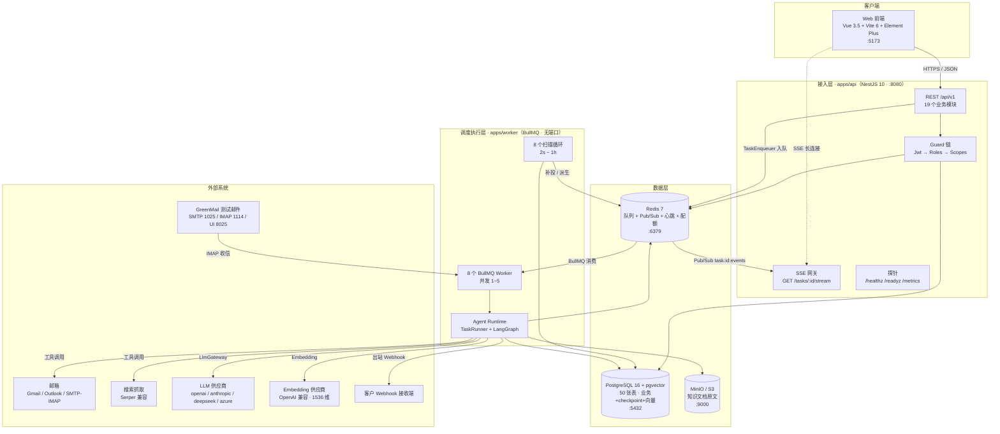

**双进程核心模型**

| 进程 | 职责 | 是否执行 AI 图 |
|---|---|---|
| `apps/api` | 鉴权、校验、入队、查询、SSE 推流 | ❌ 绝不执行 |
| `apps/worker` | 消费队列、驱动图执行、定时扫描 | ✅ 唯一执行方 |

---

## 二、Monorepo 工程结构

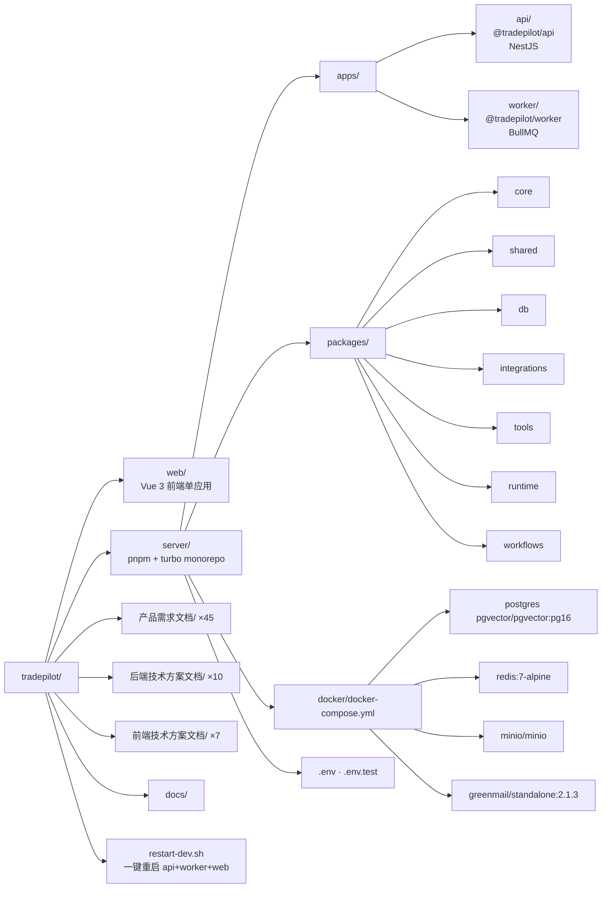

**构建拓扑序（turbo）**：`core` ∥ `shared` → `db` ∥ `integrations` → `tools` → `runtime` → `workflows` → `apps/*`

---

## 三、后端包依赖 DAG（分层拓扑）

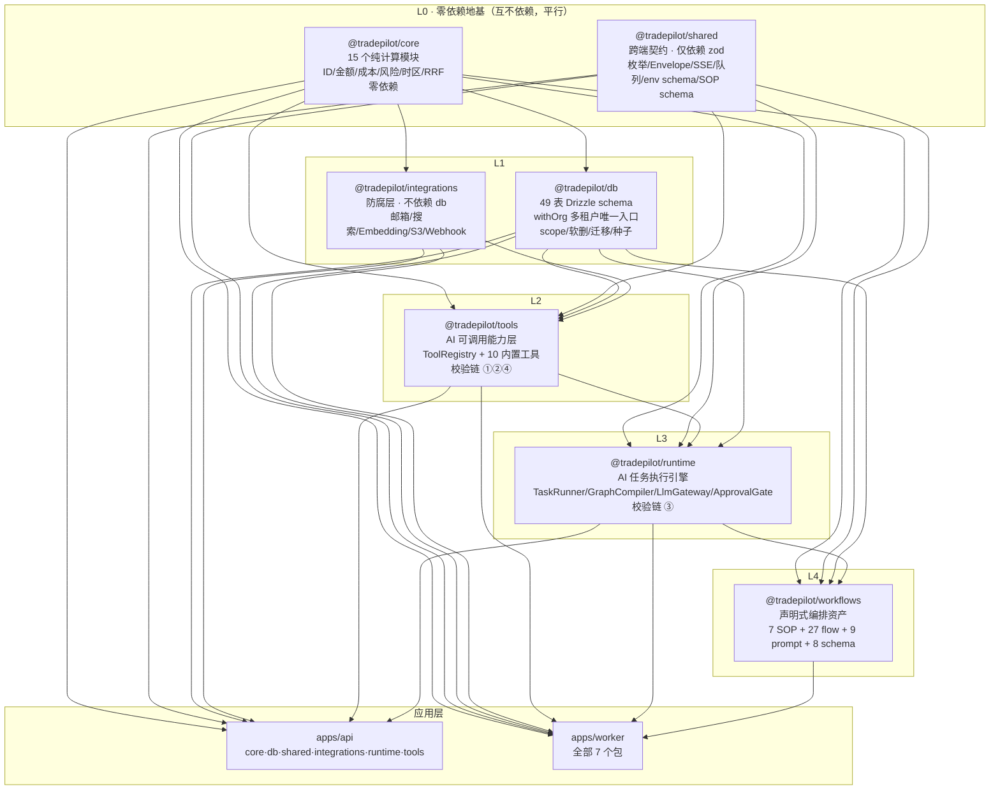

**三条关键设计约束**

| # | 约束 | 意义 |
|---|---|---|
| 1 | `core` 与 `shared` 平行且互不依赖 | core 装「算法」，shared 装「契约」，地基不互相污染 |
| 2 | `workflows → runtime` 单向（依赖倒置） | runtime 只暴露 `Simple*Registry` / `TaskSopProvider` 接口，由 worker 注入 workflows 实现 → 引擎可脱离具体业务流测试 |
| 3 | `integrations` 不依赖 `db` | 驱动层只吃结构性入参，api（连接测试/发信）与 worker（同步/索引）无差别复用 |

**依赖矩阵（✅ = package.json 声明且 src 实际 import）**

| ↓依赖 \ 被依赖→ | core | shared | db | integrations | tools | runtime | workflows |
|---|---|---|---|---|---|---|---|
| core | — | | | | | | |
| shared | | — | | | | | |
| db | ✅ | | — | | | | |
| integrations | ✅ | | | — | | | |
| tools | ✅ | ✅ | ✅ | ✅ | — | | |
| runtime | ✅ | ✅ | ✅ | 间接 | ✅ | — | |
| workflows | ✅ | ✅ | ✅ | | | ✅ | — |
| apps/api | ✅ | ✅ | ✅ | ✅ | ✅ | ✅ | ❌ |
| apps/worker | ✅ | ✅ | ✅ | ✅ | ✅ | ✅ | ✅ |

---

## 四、前端架构分层

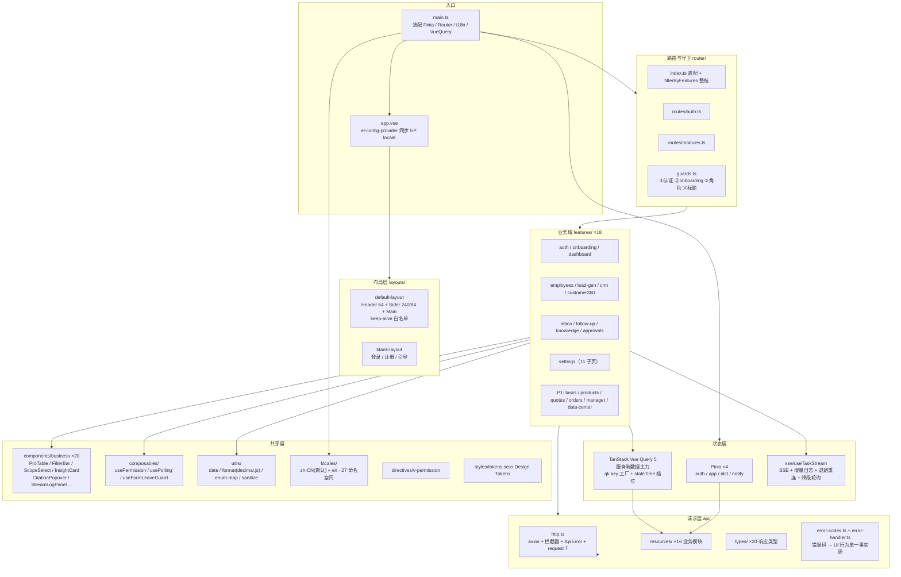

**技术栈**：Vue 3.5 / TypeScript 5.9 strict / Vite 6 / Element Plus 2.14（按需导入）/ Pinia 2.3 / Vue Router 4.6 / axios 1.20 / TanStack Vue Query 5 / vue-i18n 9 / @microsoft/fetch-event-source（SSE）/ Tiptap 3（富文本）/ dayjs / decimal.js / dompurify / @vueuse/core

> 两个值得注意的事实：① **无图表库**，数据中心 `TrendChart` / `MarketDistribution` 为内联 SVG 手写；② 服务端数据几乎全部交给 Vue Query，Pinia 仅存 4 类客户端状态。

---

## 五、前端路由与页面地图

```mermaid
flowchart TB
    ROOT["/（DefaultLayout）"] --> DASH["/dashboard 工作台"]
    ROOT --> EMP["/ai-employees AI 员工中心"]
    ROOT --> LEAD["/lead-gen AI 获客"]
    LEAD --> LEADD["/lead-gen/leads 线索池"]
    ROOT --> CRM["/crm 客户中心"]
    CRM --> CRMC["/crm/contacts 联系人页签"]
    ROOT --> INB["/inbox AI 销售工作台（满屏三窗格）"]
    ROOT --> OUT["/outreach 开发信（占位）"]
    ROOT --> FU["/follow-up 自动跟进"]
    FU --> FUS["/follow-up/strategies 跟进策略"]
    ROOT --> TPL["/templates 话术模板（占位）"]
    ROOT --> KN["/knowledge 知识中心"]
    ROOT --> APV["/approvals 审核中心（带待审角标）"]
    ROOT --> C360["/customers/:id 客户 360°"]

    ROOT --> SET["/settings 设置中心（二级侧导航）"]
    SET --> S1["org 企业信息"]
    SET --> S2["members 成员"]
    SET --> S3["mailboxes 邮箱连接"]
    SET --> S4["approval-rules 审批规则"]
    SET --> S5["notifications 通知"]
    SET --> S6["ai-employees 员工入口"]
    SET --> S7["crm-integration CRM 集成（admin+manager）"]
    SET --> S8["pricing-rules 定价规则（admin+manager）"]
    SET --> S9["ai-models 模型台账（admin）"]
    SET --> S10["api-keys API Key + Webhook（admin）"]

    ROOT -.->|"P1 · feature 开关"| P1A["/tasks · /tasks/:id"]
    ROOT -.-> P1B["/products · /products/:id"]
    ROOT -.-> P1C["/quotes · /quotes/:id"]
    ROOT -.-> P1D["/orders · /orders/:id"]
    ROOT -.->|"roles: admin,manager"| P1E["/manager AI 外贸经理"]
    ROOT -.-> P1F["/data-center 数据中心"]

    AUTH["/login · /register · /onboarding（BlankLayout 免认证）"]
    ERR2["/403 · /404"]
```

**特性开关**：`src/features.ts` 依据 `VITE_FEATURES_PROFILE`（默认 `p0`）在**编译期**决定 `quotes / orders / products / manager / taskCenter / dataCenter` 六个模块，路由、菜单、页签、卡片、推荐动作五处读同一份常量，`p0` 构建时 `filterByFeatures` 整枝剔除。

---

## 六、API 模块与全局请求管道

### 6.1 19 个业务模块 → 路由前缀

```mermaid
flowchart LR
    subgraph MOD["apps/api 业务模块"]
        M1["auth → /auth"]
        M2["org → /org"]
        M3["settings → /settings · /settings/ai-models"]
        M4["tasks → /tasks（含 SSE :id/stream）"]
        M5["knowledge → /knowledge"]
        M6["approvals → /approvals"]
        M7["conversations → /conversations · /messages · /copilot"]
        M8["customers → /customers · /contacts · /activities"]
        M9["leads → /lead-hunter · /lead-tasks · /leads"]
        M10["dashboard → /dashboard"]
        M11["employees → /ai-employees"]
        M12["follow-ups → /follow-ups · /follow-up-tasks · /follow-up-strategies"]
        M13["products → /products"]
        M14["quotes → /quotes"]
        M15["orders → /orders"]
        M16["analytics → /analytics"]
        M17["manager → /manager（@Roles admin,manager）"]
        M18["open-api → /settings/api-keys · /settings/webhooks"]
        M19["health → /healthz · /readyz（根路径）"]
    end

    subgraph GLOBAL["全局模块"]
        G1["db.module @Global<br/>Provider DB + EnvService"]
        G2["redis.module @Global<br/>Provider REDIS"]
        G3["logging.module<br/>pino + pino-http"]
        G4["metrics.module<br/>prom-client → /metrics"]
        G5["security.module<br/>限流中间件 forRoutes(*)"]
    end
```

> **无独立 repository 层**：全仓 0 个 `*repository*` 文件，数据访问由 `*.service.ts` 直接用 Drizzle schema + `withOrg()` 事务完成。

### 6.2 请求管道（中间件 → 守卫 → 拦截器）

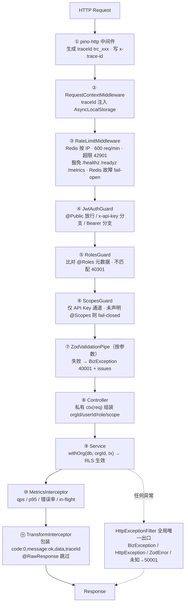

**四类异常映射**：`BizException` → 业务错误码；`HttpException` → `mapHttpStatus`（404→40401）；`ZodError` → `40001` + 字段级 issues；未知 → `50001`（不泄露堆栈）。

---

## 七、认证 / RBAC / 多租户 请求链路

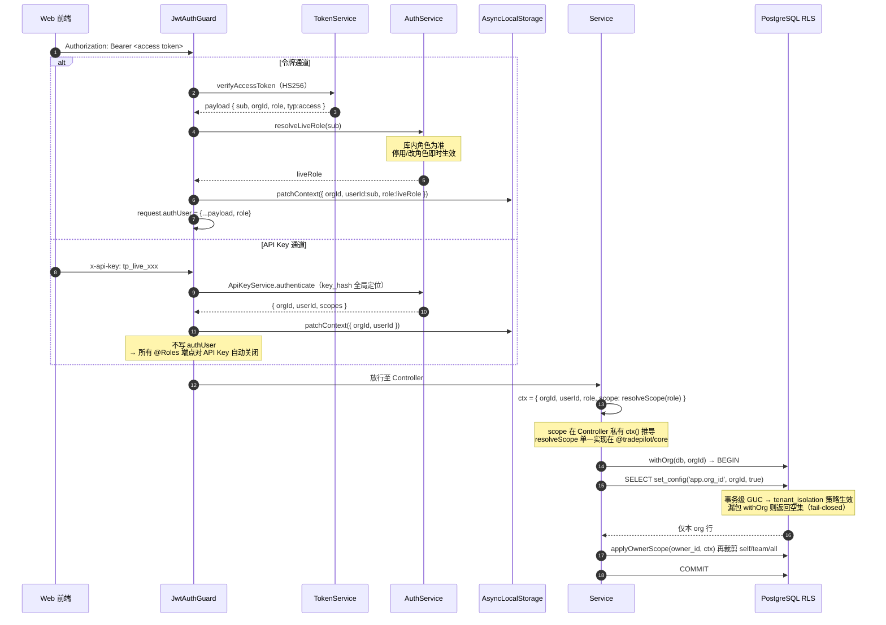

**令牌规格**

| 令牌 | Payload | TTL | 存储 |
|---|---|---|---|
| Access | `{ sub, orgId, role, typ:'access' }` | 2h | 前端内存 + localStorage `tradepilot.token` |
| Refresh | `{ sub, orgId, role, typ:'refresh', jti }` | 14d | Redis `refresh:{sub}:{jti}`（可撤销/轮换） |

**数据范围（scope）**：`self` → `owner_id = userId`；`team` → MVP 不追加（RLS 已限 org）；`all` → 不追加。

---

## 八、RLS 多租户硬隔离机制

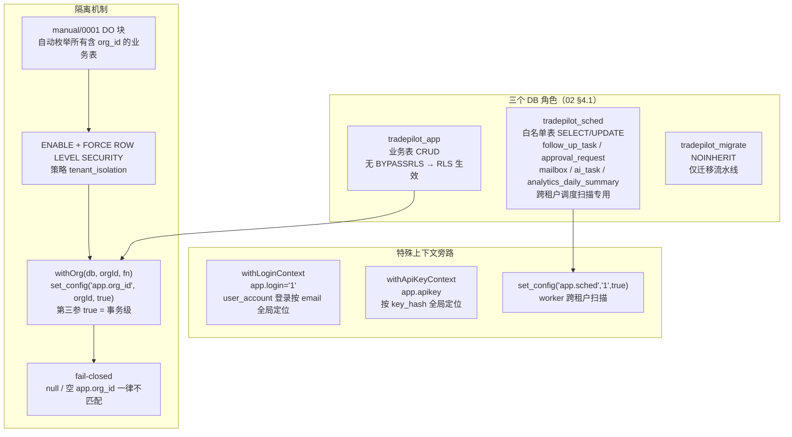

**应用层双保险**：RLS 解决 org **之间** 隔离；org **之内** 按 `owner_id` 裁剪由 `applyOwnerScope` 落地，越权判定 `resolveScope` / `assertScopeAllowed` 收口在 `@tradepilot/core`。

---

## 九、Worker 队列与调度器

### 9.1 八条 BullMQ 队列

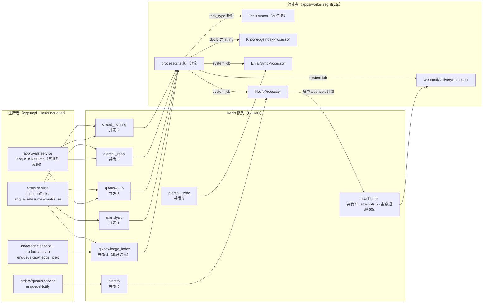

**task_type → 队列映射（8 → 5）**

| task_type | 队列 |
|---|---|
| `lead_hunting` | `q.lead_hunting` |
| `email_reply` | `q.email_reply` |
| `follow_up` | `q.follow_up` |
| `knowledge_index` / `product_analysis` / `product_knowledge` | `q.knowledge_index` |
| `business_analysis` / `order_monitor` | `q.analysis` |

**投递策略**：`attempts = 1`（任务级不自动重投，失败走手动 `retry_of` 新任务）；`removeOnComplete {age:3600,count:1000}`；`removeOnFail {age:24h}`；**唯一例外** `q.webhook` = 5 次指数退避。
**幂等**：`jobId = taskId` / `kidx.{docId}` / `mbxsync.{mailboxId}`，入队前 `removeTerminalJob()` 清历史（否则同 jobId `add` 是 no-op 被静默吞掉）。
> 注意：BullMQ 禁 `:` 故真实队列名为 `q.xxx`（文档口径常写作 `q:xxx`）。

### 9.2 八个扫描循环

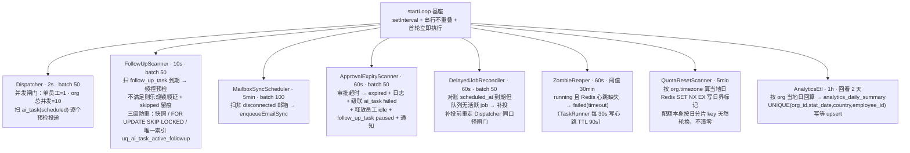

**多实例防重手法**：`FOR UPDATE SKIP LOCKED` + 乐观锁状态迁移（带 where 条件 `update ... returning`，不"先查后写"）+ 唯一索引 + BullMQ 同 jobId 幂等。

### 9.3 API ⇄ Worker 协作

| 方向 | 通道 | 细节 |
|---|---|---|
| API → Worker | BullMQ 队列 | API 仅做生产者（全仓 `new Worker(` 只在 worker 侧出现一次） |
| Worker → API（实时） | Redis Pub/Sub | 频道 `task:{taskId}:events`，事件 `log/progress/status/done`，`seq` 为雪花 Crockford（字典序=时间序，作去重游标） |
| 双向权威状态 | PostgreSQL | `ai_task` / `ai_task_log` / `approval_request` / `follow_up_task` / `notification` / `knowledge_document` |
| SSE 兜底 | API 侧 | `TERMINAL_POLL_MS = 5s` 终态轮询（覆盖 commit→PUBLISH 间崩溃）；`HEARTBEAT_MS = 15s`；`MAX_CONNECTIONS_PER_ORG = 200` |

---

## 十、Agent Runtime 执行引擎

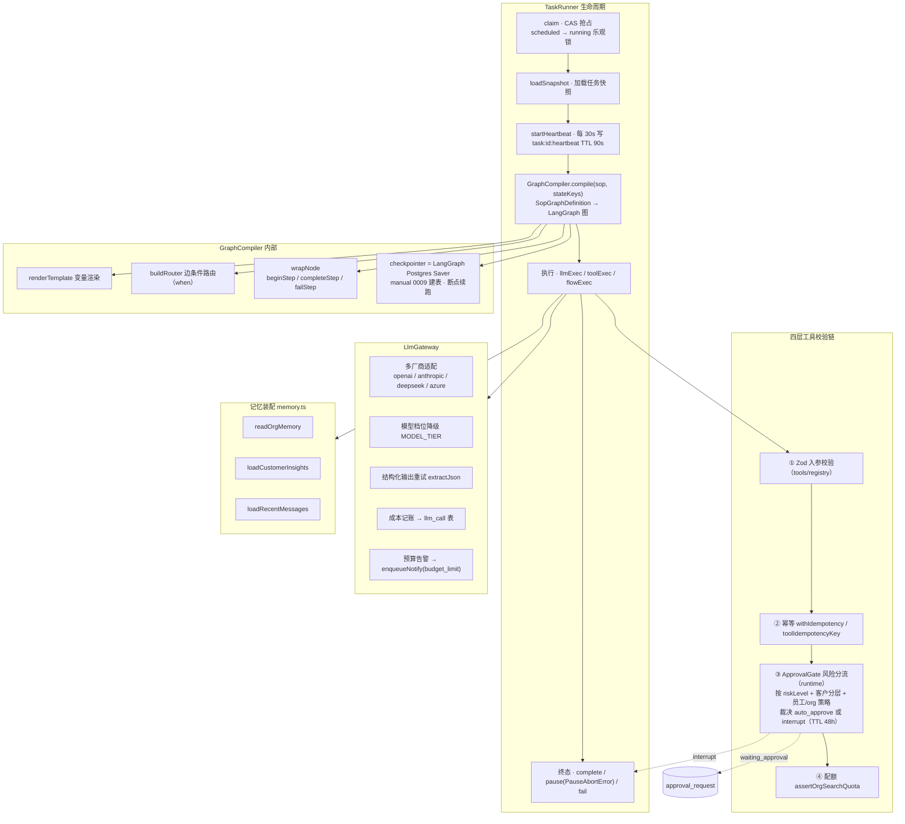

**内置工具集（10 个）**

| 类别 | 工具 |
|---|---|
| CRM / 邮件（P0） | `crm_read`、`crm_write`、`email_read`、`email_send`、`knowledge_search` |
| 获客 | `web_search`、`site_crawl`、`find_contact`、`lookup_contact`、`lead_scoring` |

**声明式资产（workflows 包）**：7 张 SOP 图 + 27 个确定性 flow 节点 + 9 个提示词模板 + 8 个结构化输出 schema。

---

## 十一、SOP 工作流图（7 张）

### 11.1 `lead_hunting` AI 获客（P0）

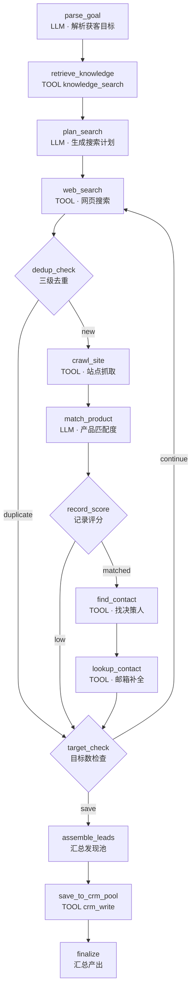

### 11.2 `email_reply` AI 销售工作台（P0）

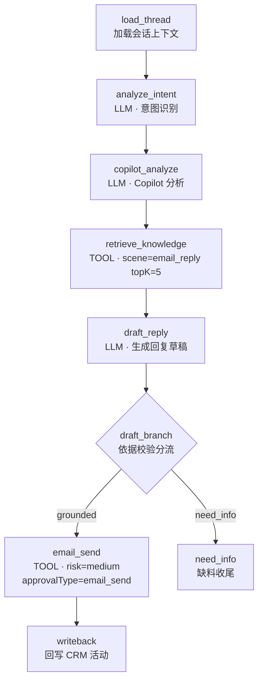

### 11.3 `follow_up` AI 自动跟进（P0）

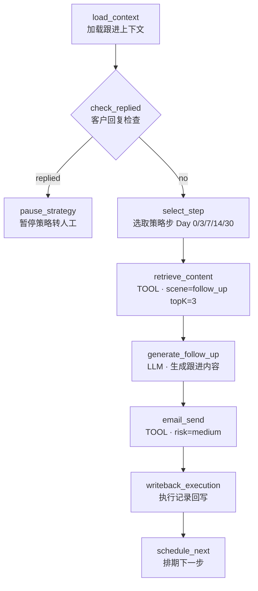

### 11.4 其余 4 张 P1 SOP

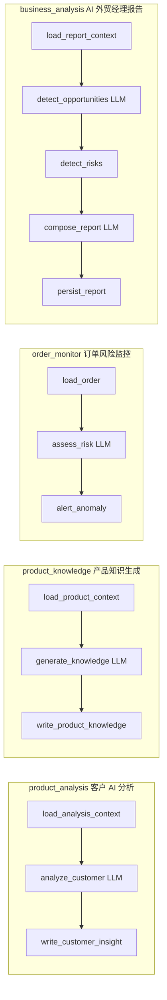

**SOP 注册**：`WORKFLOW_SOP_DEFINITIONS` + `workflowSopProvider`（含 `get` 与 `buildOutputs`）由 `apps/worker` 在启动时注入 `TaskRunner`，**apps/api 完全不需要 workflows 包**。

---

## 十二、任务全链路时序图

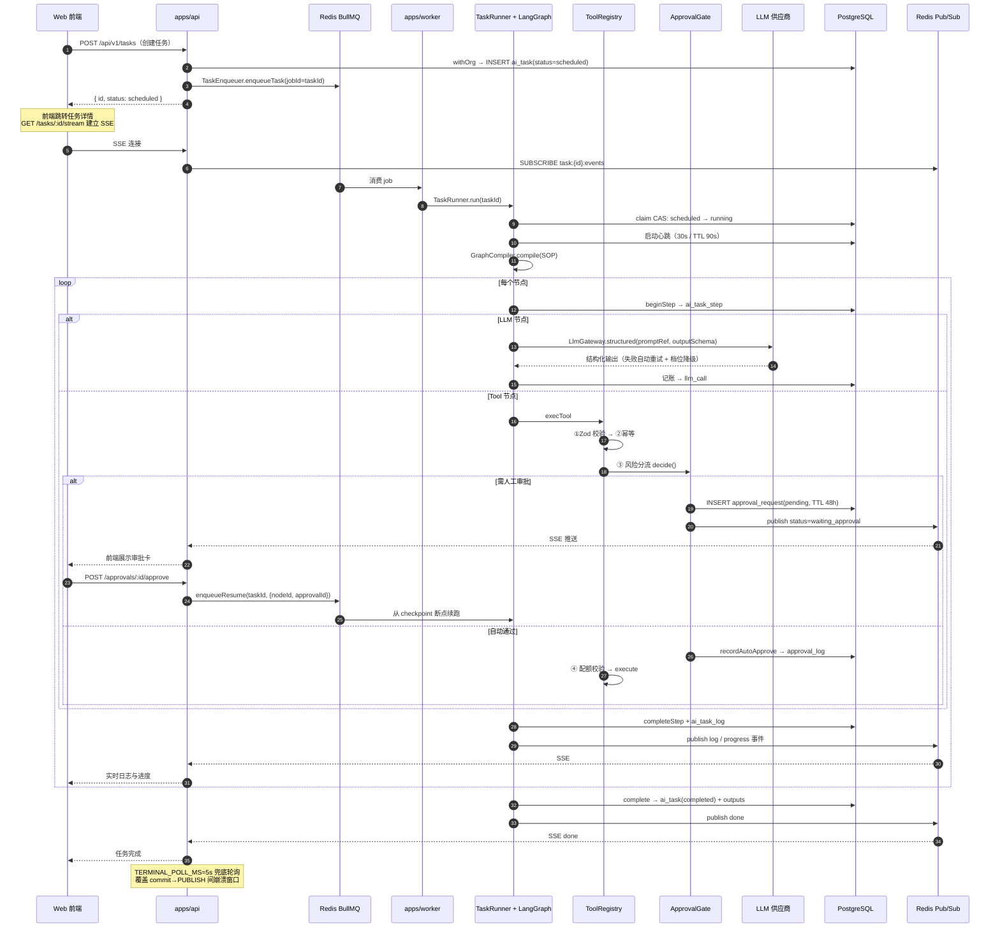

---

## 十三、数据层 ER 分组（49 张业务表）

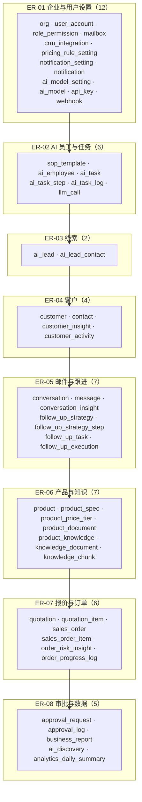

**核心实体关系（任务与审批主干）**

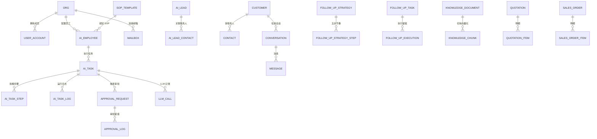

**数据约定**

| 项 | 约定 |
|---|---|
| 主键 | 应用层生成 `createId(...)`，形态 `{前缀}_{雪花}`，无 DB 默认值 |
| 金额 | `numeric` 存储，出入参十进制字符串（如 `"12500.00"`），`total 18,2` / `rate 18,8`，**禁用浮点** |
| 软删 | `deleted_at IS NULL`，由 `notDeleted()` 显式拼接 |
| 时间 | 一律 UTC 存储，业务语义按 `org.timezone` 解释 |
| 向量 | `knowledge_chunk.embedding = vector(1536)`，pgvector |
| 迁移 | `migrate.ts` 三步串行：扩展 `0000` → drizzle 产物（`_journal.json` 驱动）→ `manual/*.sql`（追踪表 `schema_manual_migrations` 防重放）；**禁止运行时自动迁移** |

**迁移流水线（实测已应用 15 个 manual 文件）**

```
0000_extensions → 0001_rls_roles → 0002_column_comments → 0003_langgraph
→ 0004_ai_task_active_followup_uq → 0005_ai_task_status_default
→ 0006_notification → 0007_msg_status_waiting_approval → 0008_kdoc_sched_scan
→ 0009_langgraph_checkpoint_tables → 0010_ai_model → 0011_ai_model_type_search
→ 0012_p1_check_constraints → 0013_api_key_lookup → 0014_task_type_product_knowledge
```

---

## 十四、外部集成与防腐层

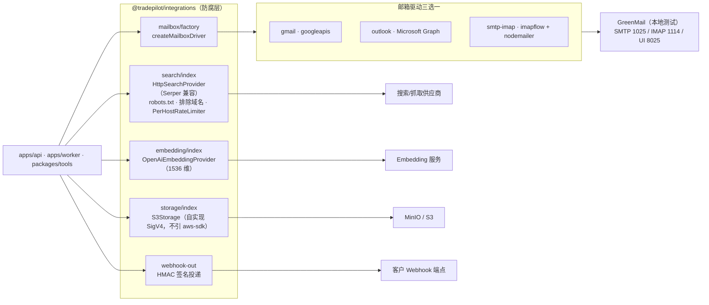

**统一手法：进程级工厂注入**（`setXxxFactory` / `configureXxx`）——未注入即**明确抛错，不回落 mock**。

| 注入点 | 工厂 |
|---|---|
| 邮件外发 | `configureEmailSend({ encryptionKey, oauth, db })` |
| 搜索 | `setSearchProviderFactory(orgId => resolveActiveModel(db, orgId, 'search'))` |
| Embedding | `setEmbeddingProviderFactory(orgId => resolveActiveModel(db, orgId, 'embedding'))` |
| 对象存储 | `createS3Storage(...) + configureObjectStorage(...)` |
| 搜索配额 | `configureOrgSearchQuota(ORG_SEARCH_DAILY_LIMIT)` |

> **重要**：LLM / Embedding / Search 的模型与供应商配置**不再走环境变量**，统一由「系统设置 → AI 模型台账」`ai_model` 表（仅 admin）读库解析。

---

## 十五、可观测性与运维

```mermaid
flowchart TB
    subgraph LOG["日志"]
        L1["pino JSON 结构化<br/>base: app=api|worker, env, workerIndex"]
        L2["ALS 自动绑定 traceId / orgId / userId"]
        L3["redact: authorization · cookie · *.password · *.token · *.secret"]
        L4["忽略 /metrics /healthz /readyz"]
    end

    subgraph MET["指标 prom-client"]
        M1["HTTP qps"]
        M2["p95 延迟"]
        M3["错误率"]
        M4["in-flight 请求数"]
        M5["路由模板 label 防基数爆炸<br/>如 /tasks/:id"]
    end

    subgraph PROBE2["探针"]
        H1["GET /healthz liveness"]
        H2["GET /readyz readiness"]
        H3["GET /metrics Prometheus 抓取"]
    end

    subgraph AUDIT["审计链（四表串联）"]
        A1["ai_task 任务"]
        A2["ai_task_step 步骤"]
        A3["ai_task_log 日志"]
        A4["approval_log + llm_call 审批与成本"]
    end

    subgraph BUS["业务可追溯"]
        B1["每任务 steps / logs / outputs 全留存"]
        B2["llm_call 全量 token 与成本记账"]
        B3["Insight 结构：理由 reasons + 引用 citations"]
    end

    LOG --> PROBE2
    MET --> PROBE2
```

**本地中间件（docker-compose）**

| 服务 | 镜像 | 端口 | 数据卷 |
|---|---|---|---|
| postgres | `pgvector/pgvector:pg16` | 5432 | `tradepilot-dev_pg_data` |
| redis | `redis:7-alpine` | 6379 | `tradepilot-dev_redis_data` |
| minio | `minio/minio:latest` | 9000 / 9001 | `tradepilot-dev_minio_data` |
| mailpit | `greenmail/standalone:2.1.3` | 1025 / 1114 / 8025 | 无（易失） |

---

## 十六、关键常量速查表

### 队列与并发

| 队列 | 并发 | 用途 |
|---|---|---|
| `q.lead_hunting` | 2 | AI 获客 |
| `q.email_reply` | 5 | 邮件回复 |
| `q.follow_up` | 5 | 自动跟进 |
| `q.knowledge_index` | 2 | 知识入库（混合语义） |
| `q.analysis` | 1 | 经营分析 / 订单监控 |
| `q.email_sync` | 3 | 邮箱收信同步 |
| `q.notify` | 5 | 通知分发 |
| `q.webhook` | 5 | 出站 Webhook（5 次重试） |

### 调度间隔

| 扫描器 | 间隔 | 批次 |
|---|---|---|
| Dispatcher | 2s | 50 |
| FollowUpScanner | 10s | 50 |
| MailboxSyncScheduler | 5min | 100 |
| ApprovalExpiryScanner | 60s | 50 |
| DelayedJobReconciler | 60s | 50 |
| ZombieReaper | 60s（僵尸阈值 30min） | 50 |
| QuotaResetScanner | 5min | 全量 |
| AnalyticsEtl | 1h（回看 2 天） | 全 org × 2 天 |

### 闸门与阈值

| 项 | 值 |
|---|---|
| 单员工并发 | 1 |
| org 总并发 | 10（`ORG_CONCURRENCY_LIMIT`） |
| BullMQ worker | `stalledInterval 60s`、`maxStalledCount 2` |
| 任务心跳 | 每 30s 写，TTL 90s |
| 审批 TTL | 48h（`APPROVAL_TTL_MS`） |
| API 限流 | 600 req/min / IP（`RATE_LIMIT_PER_MINUTE`，0=关闭） |
| 搜索日额度 | org 级 2000（`ORG_SEARCH_DAILY_LIMIT`） |
| PostgreSQL 池 | `max=20`、`idleTimeoutMillis=30s`、`statement_timeout=15s` |
| JWT | Access 2h / Refresh 14d，HS256 |
| Webhook | 超时 10s、最多 5 次、退避 60s、签名头 `x-tp-signature` |
| API Key 限流 | `API_KEY_RATE_LIMIT_PER_MINUTE` |

### 错误码

| Code | 含义 | | Code | 含义 |
|---|---|---|---|---|
| `0` | OK | | `42201` | 业务校验失败 |
| `40001` | 参数错误 | | `42901` | 限流 |
| `40101` | 未认证 | | `50001` | 内部错误 |
| `40301` | 无权限 | | `50301` | 依赖不可用 |
| `40401` | 不存在 | | `40901` | 冲突 |

---

## 附：架构要点速记

1. **双进程**：API 只入队与查询，Worker 唯一执行 AI 图，靠 Redis 队列解耦、PostgreSQL 作权威状态、Redis Pub/Sub 回传实时。
2. **租户隔离双保险**：应用层 `withOrg` 注入 `app.org_id` GUC + DB 层 RLS `FORCE`；fail-closed，漏包返回空集。
3. **依赖倒置**：`runtime` 定义引擎与注册表接口，`workflows` 提供声明式 SOP/提示词/节点，由 worker 注入 → 新增业务流只加资产不动引擎。
4. **防腐层无 mock**：所有外部供应商走进程级工厂注入，未配置明确抛错。
5. **可中断可恢复**：LangGraph + Postgres Checkpointer 实现审批挂起与断点续跑；心跳 + CAS 抢占 + 乐观锁保证多实例安全。
6. **成本与合规内建**：`llm_call` 全量记账与预算告警；Insight 强制「理由 + 引用」；提示词注入防护 `boundExternal` / `stripSensitiveFields`。
