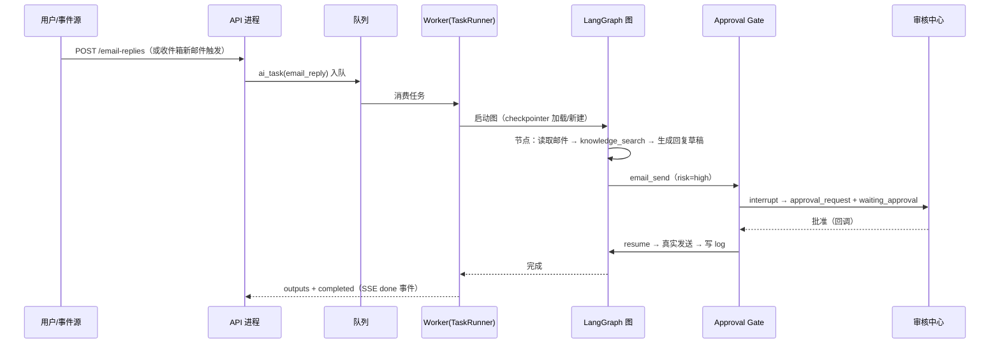

# Agent Runtime 架构 · 00 · 运行时架构总纲

| 项 | 内容 |
|---|---|
| 对应拆分项 | [00-产品总览与MVP规划 §9](../00-产品总览与MVP规划.md) 第 3 项「Agent Runtime 架构」；第 4 项「LangGraph 工作流」另文拆分 |
| 前置文档 | [PostgreSQL 数据库 ER 图/02-AI员工与任务模块](../PostgreSQL%20数据库%20ER%20图/02-AI员工与任务模块.md)、[页面级字段与接口文档/14-AI任务中心](../页面级字段与接口文档/14-AI任务中心.md)、[12-AI审核中心](../12-AI审核中心.md) |
| 技术栈决策 | Node.js 20+ / TypeScript / LangGraph.js / BullMQ + Redis / PostgreSQL(+pgvector)，与前端 Vue 3 同语言 |
| 版本 | v0.2（2026-09-05，§10 五项全部澄清：并发=1/org 上限 10（14 §7.1）、时区基准=企业当地（14 §7.2）、LLM 配置 org 级+成本记录不熔断、日志保留默认 180 天、LLM 节点重试 2 次确认）<br>v0.1（2026-09-05） |

---

## 1. 定位与设计原则

### 1.1 定位

Agent Runtime 是 TradePilot AI 的**任务执行内核**：接收统一任务（`ai_task`），按 AI 员工绑定的 SOP 编排执行，调用工具产生业务结果，并通过审批闸门控制高风险动作。它不是聊天系统，对应 00 §1.2 的核心形态：

```text
创建业务目标 → AI 创建任务 → Agent Runtime 按 SOP 执行
→ 调用业务工具 → 产生业务结果 → 人工审核 → Result
```

### 1.2 设计原则

| # | 原则 | 落地机制 |
|---|---|---|
| 1 | **SOP 优先，LLM 局部决策** | LangGraph 静态图定义骨架（步骤/顺序/边界），LLM 只在节点内做推理（生成、评分、总结），不做全局自由发挥 |
| 2 | **一切皆任务** | 所有异步 AI 操作统一落 `ai_task`（14 §0），Runtime 只认任务模型 |
| 3 | **最小权限 + 高风险闸门** | 工具调用前强制校验 `ai_employee.permissions`；6 类高风险动作必经 `approval_request`（12 §1.2），配置 `none` 返回 42201 |
| 4 | **全程可观测可审计** | 每步写 `ai_task_step`，动作写 `ai_task_log`，LLM 调用记 trace，审批全留痕 |
| 5 | **多租户隔离** | `org_id` 贯穿队列/图状态/工具查询，所有查询强制带租户过滤 |
| 6 | **断点可恢复** | LangGraph checkpointer 持久化到 PostgreSQL，进程崩溃/审批等待/手动暂停后均可恢复 |

---

## 2. 总体架构

```mermaid
flowchart TB
    subgraph 接入层
        API[REST API<br/>NestJS]
        SSE[SSE 网关<br/>/tasks/{id}/stream]
    end

    subgraph 调度层
        Q[Task Queue<br/>BullMQ + Redis]
        CRON[定时触发器<br/>scheduled_at delayed job]
    end

    subgraph 运行时层 apps/worker
        TR[TaskRunner<br/>任务执行器]
        EX[Workflow Executor<br/>LangGraph.js]
        PL[Planner<br/>节点内 LLM 推理]
        MM[Memory Manager<br/>三层记忆]
        TL[Tool Registry<br/>工具注册与权限校验]
        AG[Approval Gate<br/>审批闸门]
        LG[LLM Gateway<br/>模型路由/成本记账]
    end

    subgraph 数据层
        PG[(PostgreSQL<br/>业务表 + checkpointer)]
        RD[(Redis<br/>队列 + Pub/Sub)]
        VEC[(pgvector<br/>知识库索引)]
    end

    API --> Q
    CRON --> Q
    Q --> TR --> EX
    EX <--> PL
    EX <--> MM
    EX --> TL --> AG
    PL --> LG
    TL --> EXT[外部服务<br/>搜索/邮箱/定价]
    TR & EX -- 写 step/log/status --> PG
    PG & Q -- 变更 --> SSE
    MM --> PG
    MM --> VEC
    Q --- RD
```

- **API 进程**（`apps/api`）只做鉴权、参数校验、任务入队、SSE 推流，不执行图。
- **Worker 进程**（`apps/worker`）消费队列、驱动 LangGraph 图，可独立水平扩容。
- SSE 数据来源 = `ai_task_log` 增量 + `ai_task.status/progress_pct` 变更（Redis Pub/Sub 广播），事件契约见[接口文档 14 §3.4](../页面级字段与接口文档/14-AI任务中心.md)：`log / progress / status / done`。

---

## 3. 核心能力模型 → 运行时对象映射

00 §1.1 的 AI Employee 十二项能力在 Runtime 中的落点：

| 能力 | 存储 | 运行时消费方式 |
|---|---|---|
| Role | `ai_employee.role` | 决定可选 SOP 模板、默认 System Prompt、队列路由 |
| Goal | `ai_employee.goal` | 注入 Planner 的任务目标上下文 |
| SOP | `sop_template.content` (jsonb) | 编译为 LangGraph 图（本档案 §4.3），**结构由本文档定义** |
| Skills | `ai_employee.skills` | 技能标签，影响节点内 prompt 与检索策略 |
| Tools | `ai_employee.tools` + `permissions` | Tool Registry 白名单，越权 40301 |
| Knowledge | `ai_employee.knowledge_scope` | RAG 检索过滤条件（knowledge_category 子集） |
| Memory | `ai_employee.memory_config` | 三层记忆策略（§4.6） |
| Tasks | `ai_task` + `ai_task_step` + `ai_task_log` | 统一任务模型与执行痕迹 |
| Workflow | `ai_employee.workflow_id` | LangGraph 图注册表的主键 |
| Permissions | `ai_employee.permissions` (jsonb) | 工具执行前强制校验链（§4.5） |
| Approval | `ai_employee.approval_policy` | Approval Gate 分流规则（§4.7） |
| KPI | `ai_employee.kpi_config` | 不参与执行，仅从任务/业务表聚合展示 |

---

## 4. 组件设计

### 4.1 Task Scheduler（调度层）

- 队列按 `task_type` 划分（`lead_hunting / email_reply / follow_up / order_monitor / business_analysis / knowledge_index / product_analysis`），不同类型独立并发与重试策略。
- **并发控制**：同一 `ai_employee` 同时 `running` 任务数上限 **1**（员工卡片语义「当前任务」，LLM Agent 任务重资源、串行执行）；org 级总并发上限 MVP 内置常量 **10**（可配置列后续）。超限行为 = **排队**：新任务置 `scheduled` 按时间 FIFO，当前任务终态后调度器自动启动队首（14 §7.1 已澄清）。
- **定时任务**：`scheduled_at` 非空时入 BullMQ delayed job；触发前校验员工状态，`idle/working` 才投递，`paused` 则保留排队。
- **员工级暂停/恢复**（02 §2）：批量暂停其名下 `running` 任务 → 改 `ai_task.status='paused'` 并中断图执行；恢复时从 checkpointer resume。

### 4.2 TaskRunner（任务执行器）

任务生命周期骨架（状态枚举对齐 `task_status`）：

```text
入队 ──▶ running ──┬─▶ completed（写 outputs）
                   ├─▶ waiting_approval ──批准──▶ running（resume）
                   │         └────拒绝───▶ failed / completed(带反馈)
                   ├─▶ paused ──恢复──▶ running（resume）
                   ├─▶ canceled
                   └─▶ failed ──重试──▶ 新任务（retry_of 链，保留原 logs）
```

职责：领取任务 → 写 `started_at` → 创建 `ai_task_step` 占位 → 驱动图执行 → 收集产出写 `outputs` → 收尾（`finished_at`、员工状态回写 `idle/working`、KPI 触达计算）。自动重试仅 1 次（可配置），其余走手动重试。

### 4.3 SOP → LangGraph 图编译

`sop_template.content` 统一为如下 jsonb 结构（兑现 ER 图注释「结构由 Agent Runtime 细化」）：

```jsonc
{
  "version": 1,
  "entry": "parse_goal",
  "nodes": [
    { "id": "parse_goal",  "kind": "llm",     "promptRef": "leadHunting.parseGoal", "outputSchema": "TargetCriteria" },
    { "id": "search",      "kind": "tool",    "tool": "web_search", "logType": "search" },
    { "id": "crawl",       "kind": "tool",    "tool": "site_crawl", "logType": "crawl" },
    { "id": "score",       "kind": "llm",     "promptRef": "leadHunting.score", "outputSchema": "LeadScore", "logType": "match" },
    { "id": "save_leads",  "kind": "tool",    "tool": "crm_write",  "risk": "low" },
    { "id": "draft_email", "kind": "llm",     "promptRef": "sales.draft", "risk": "high", "approvalType": "email_send" }
  ],
  "edges": [ { "from": "parse_goal", "to": "search" }, "..." ]
}
```

- 节点三类 `kind`：`llm`（Planner 推理）/ `tool`（工具调用）/ `flow`（条件、并行、聚合等控制节点）。
- `risk: "high"` 的节点执行前自动进入 Approval Gate（§4.7），无需在图中手写 interrupt 逻辑。
- `workflow_id` 与图注册表对应；图编译结果按 `(sop_template.id, version)` 缓存，任务执行时锁定版本，SOP 修改不影响进行中的任务。
- 各 `task_type` 的具体图定义（节点细节、State schema、提示词）在拆分文档《LangGraph 工作流》中逐一定义。

### 4.4 Planner（LLM 推理）

双职责，不越界：

1. **任务理解**：入口节点将 `ai_task.input`（如获客任务 parsed 字段）结构化为图状态（目标国家/行业/数量等），供后续节点消费。
2. **节点内推理**：生成开发信、客户评分、跟进策略、经营分析等。强制结构化输出（Zod schema 校验），失败重试后仍不合法则节点失败。

### 4.5 Tool Registry（工具注册与校验链）

统一工具描述：

```typescript
interface ToolDefinition<I, O> {
  name: string;                    // web_search / site_crawl / email_send / crm_write / ...
  description: string;
  inputSchema: ZodSchema<I>;
  riskLevel: 'low' | 'high';       // high → Approval Gate
  approvalType?: 'email_send' | 'quote' | 'contract' | 'order_change'
               | 'bulk_marketing' | 'customer_delete';   // 12 §1.2 六类
  execute(ctx: ToolContext, input: I): Promise<O>;
}
```

执行前校验链（任一不过即失败，越权 40301）：

```text
员工 tools/permissions 白名单 → 数据 scope（org_id + knowledge_scope）
→ riskLevel 分流（low 直执行 / high → Approval Gate）
→ approval_policy 细化（"always" 必审；"high_value_only" 按阈值判断；autoExecute 白名单直通）
```

MVP 内置工具：`web_search / site_crawl / email_read / email_send / crm_read / crm_write / lead_scoring / knowledge_search / pricing_engine / report_generate`。所有工具调用写 `ai_task_log`（type 对齐 03 §1.5 枚举，如 `search/crawl/match/contact`）。

### 4.6 Memory Manager（三层记忆）

| 层 | 载体 | 生命周期 | 用途 |
|---|---|---|---|
| Working Memory | LangGraph State（checkpointer 持久化） | 任务内 | 当前任务中间产物（检索结果、评分、草稿） |
| Task Memory | `ai_task.outputs` (jsonb) | 长期 | 结构化产出，供后续任务与前端展示引用 |
| Org Memory | CRM 结构化数据 + 知识库(pgvector) + 审批拒绝反馈 | 长期 | 跨任务经验：客户偏好、历史报价、拒绝原因回流（12 §4「修正反馈闭环」） |

- 检索工具 `knowledge_search` 按 `knowledge_scope` 过滤分类，Top-K 注入节点上下文。
- `memory_config.retentionDays` 控制 Working Memory 检查点与日志的清理策略（`ai_task_log` 保留策略与审计要求平衡，**默认 180 天（已确认为决议值，§10.4）**）。

### 4.7 Approval Gate（审批闸门）

与 LangGraph `interrupt()` 机制对齐：

```text
high 工具节点 → Gate 校验 approval_policy
  ├─ policy 放行（autoExecute）→ 直接执行，日志标记 auto
  └─ 需审批 → interrupt(payload)            # 图挂起，state 已入 checkpointer
              → ai_task.status = waiting_approval
              → 创建 approval_request + ai_task.linked_approval_id
              → SSE event: status { waiting_approval, linkedApprovalId }
审批处置（12 §3.3）→ 回调 Worker → Command { resume }
  ├─ 批准     → 图恢复，工具真实执行
  ├─ 编辑批准 → 以编辑后内容替换工具入参执行，差异留痕
  └─ 拒绝     → 拒绝原因写入 Org Memory（反馈闭环），图走拒绝分支收尾
```

- **红线**：6 类高风险动作的 `approval_policy` 配置为 `none` 时任务创建即 42201（ER 图 §2.2 校验红线）。
- 审批超时提醒与升级（12 FR-05）由独立定时器扫描 `approval_request`，不影响任务图。

### 4.8 LLM Gateway

- **模型路由**：按节点配置选模型（分类/评分用轻量模型，写邮件/分析用强模型），配置源 = 16-系统设置「AI 模型」。**配置粒度（§10.3 已澄清）：org 级**——org 默认模型路由 + 按场景（对应员工档位 high/medium/low）覆盖（16 FR-10 / ER 01 `ai_model_setting`），不提供节点级配置。
- **统一能力**：超时、重试（LLM 节点自动重试 2 次、工具类按工具配置，§10.5 已确认为默认值）、降级（强模型不可用时降级并打日志标记）、结构化输出（Zod）。
- **成本记账**：每次调用记录 `org_id / task_id / node / tokens / cost`，用于任务成本归集与数据中心展示（15，P1）。`budgetLimit` 超限**仅告警不熔断**（硬熔断列后续，16 FR-10）。

### 4.9 事件总线与 SSE

- Worker 侧写库后向 Redis Pub/Sub 发布 `task:{id}:events`；API 侧 SSE 订阅并按接口契约推 `log/progress/status/done` 四类事件。
- 日志轮询（`after={logId}` 增量）与 SSE 并存，SSE 断线后以 logs 接口补齐。

---

## 5. 关键时序（以 email_reply 为例）



---

## 6. 工程结构

```text
tradepilot/
├── apps/
│   ├── api/              # NestJS：REST、SSE 网关、鉴权
│   └── worker/           # BullMQ Worker + TaskRunner + LangGraph 执行
├── packages/
│   ├── runtime/          # TaskRunner / Memory Manager / Approval Gate / LLM Gateway
│   ├── tools/            # Tool Registry 与内置工具实现
│   ├── workflows/        # 各 task_type 的图定义与提示词（→ 拆分文档 4）
│   ├── db/               # schema、迁移、checkpointer 表
│   └── shared/           # 枚举（task_status/employee_status）、SSE 事件契约、Zod schema
```

- API 与 Worker 分进程部署，Worker 按队列类型扩容；本地开发可用单进程 `docker compose`（PostgreSQL + Redis）。
- 依赖关键包：`@langchain/langgraph`、`@langchain/langgraph-checkpoint-postgres`、`bullmq`、`ioredis`、`zod`、`pgvector` 客户端。

---

## 7. 非功能设计

| 主题 | 策略 |
|---|---|
| 幂等 | 任务领取用 `SELECT ... FOR UPDATE SKIP LOCKED`；工具层带 `taskId+nodeId` 幂等键，重试不重复发信/写库 |
| 断点恢复 | checkpointer 持久化每节点后状态；Worker 崩溃重启后由队列重投 + checkpointer 续跑 |
| 失败处理 | 节点级自动重试（LLM 类 2 次、工具类按工具配置）；任务级失败写 `error`，手动重试走 `retry_of` 新任务 |
| 超时 | 节点级超时（LLM 60s / 工具按工具定义）；任务级总超时（默认 30min）防僵尸任务 |
| 外部限流 | web_search / site_crawl / email_send 按租户与员工双层令牌桶，防止配额击穿与外发滥用 |
| 审计 | `ai_task_step + ai_task_log + LLM trace + approval_request` 四表串联，支持 14 FR-04「每任务可追溯」 |
| 数据清理 | Working Memory 检查点按 `retentionDays` 清理；`ai_task_log` 长保留（审计） |

---

## 8. MVP 边界（P0）

| 范围 | 内容 |
|---|---|
| 任务类型 | `lead_hunting / email_reply / follow_up` 三种（覆盖 00 §6 主流程） |
| 工具 | §4.5 清单中与本流程相关的 8 个以内 |
| 审批闭环 | `email_send` 一类打通（interrupt → 审批 → resume），其余五类复用同机制 |
| 实时流 | 四类 SSE 事件 + 日志增量接口 |
| 暂缓至 P1 | `order_monitor / business_analysis / product_analysis`、员工级记忆精调、成本报表、复杂定时策略 |

---

## 9. 与其他拆分文档的边界

| 文档 | 负责内容 |
|---|---|
| 本文 | 运行时组件、执行模型、状态机、校验链、工程结构 |
| 《LangGraph 工作流》（拆分项 4） | 各 task_type 图的节点/边/State schema/提示词逐一定义 |
| ER 图文档 | 表结构与 DDL（`sop_template.content` 结构以本文 §4.3 为准） |
| 接口文档 | API 契约与 SSE 事件格式（本文不重复定义） |

---

## 10. 待澄清问题

> v0.2 以下五项全部澄清，对应决议已写入 §4.1 / §4.6 / §4.8。

1. ~~同一员工并发任务上限数值与超限行为（排队 vs 拒绝）~~ → **已澄清**（14 v0.2 §7.1）：单员工并发 = 1，org 级总上限内置常量 10，超限**排队**（scheduled FIFO）。
2. ~~`scheduled_at` 定时触发的时区基准（客户当地 vs 企业当地）~~ → **已澄清**（14 v0.2 §7.2）：`scheduled_at` 统一存 UTC，周期语义按 **`org.timezone`**（企业当地）解释。
3. ~~LLM 供应商与预算上限（16-系统设置「AI 模型」的配置粒度：org 级 or 节点级）~~ → **已澄清**（16 v0.4 FR-10）：**org 级**——默认模型路由 + 按场景（员工档位）覆盖；预算 MVP 仅记录成本、超限告警不熔断。
4. ~~`ai_task_log` 保留期限与合规审计要求的平衡~~ → **已澄清**：默认 **180 天**，`memory_config.retentionDays` 可配置（§4.6）。
5. ~~自动重试次数默认值（本文假设 LLM 节点 2 次）是否满足失败率目标~~ → **已澄清**：确认 LLM 节点自动重试 **2 次**、工具类按工具配置为 MVP 默认值（§4.8），上线后按失败率数据调优。
