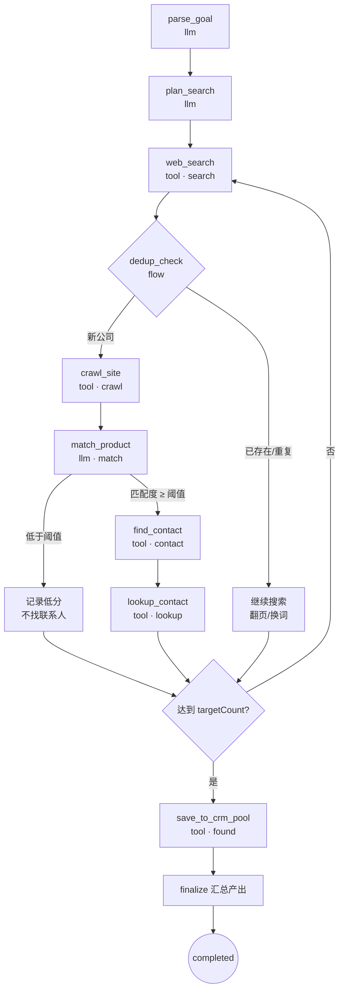
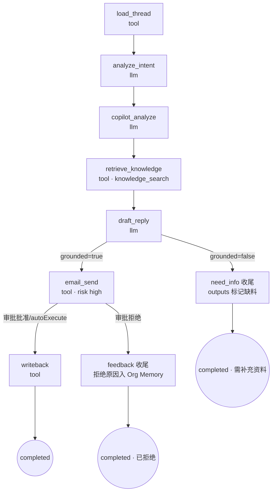
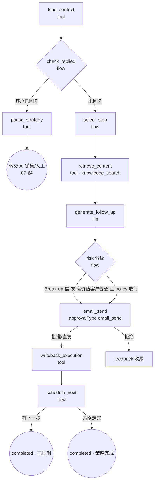

# LangGraph 工作流 · 00 · P0 任务工作流定义

| 项 | 内容 |
|---|---|
| 对应拆分项 | [00-产品总览与MVP规划 §9](../00-产品总览与MVP规划.md) 第 4 项「LangGraph 工作流」 |
| 前置文档 | [Agent Runtime 架构/00-运行时架构总纲](../Agent%20Runtime%20架构/00-运行时架构总纲.md)（图编译机制 §4.3、审批闸门 §4.7、工具校验链 §4.5） |
| 覆盖范围 | P0 三种任务类型：`lead_hunting / email_reply / follow_up`；P1 类型见 §8 占位 |
| 版本 | v0.1（2026-09-05） |

---

## 1. 范围与通用约定

- 本文档逐一定义每个 `task_type` 的图：**State schema、节点、边、日志与进度映射、审批接入点**；提示词只定义 I/O 契约（`promptRef`），文案在实现期编写。
- 节点 `kind` 分三类（对齐运行时总纲 §4.3）：`llm`（Planner 推理）/ `tool`（工具调用）/ `flow`（控制流）。
- 所有图继承 `BaseTaskState`；所有 `risk: high` 节点执行前自动进入 Approval Gate，图中不手写 interrupt 逻辑。
- 日志 `logType` 必须使用已定义枚举，获客类对齐 [接口文档 03 §1.5](../页面级字段与接口文档/03-AI获客.md)：`search / found / crawl / match / contact / lookup / error`。

### 1.1 BaseTaskState

```typescript
// packages/shared/workflow-state.ts
interface BaseTaskState {
  taskId: string;
  orgId: string;            // 多租户隔离：所有工具调用透传
  employeeId: string;
  taskType: string;
  input: Record<string, unknown>;   // ai_task.input 原样
  errors: { nodeId: string; message: string; retried: boolean }[];
}
```

### 1.2 通用语义

| 主题 | 约定 |
|---|---|
| 进度 | 各图定义 `progressOf(state)` 纯函数，节点完成后计算并随 SSE `progress` 事件推送 |
| 检查点 | 每节点完成后落 checkpointer；`paused` / `waiting_approval` / 崩溃恢复均从最近检查点续跑 |
| 失败 | 节点级自动重试（llm 2 次 / tool 按工具配置），仍失败 → `state.errors` 追加 → 图走 `fail` 收尾节点 |
| 目标可达提前结束 | 支持条件边提前进入 `finalize`（如获客达到目标数） |

---

## 2. lead_hunting · AI 获客工作流

### 2.1 State

```typescript
interface LeadHuntingState extends BaseTaskState {
  parsed: {                       // 对齐接口文档 03 §1.3
    targetMarket?: string;        // 目标市场，如 USA
    customerType?: string;        // 客户类型，如 Shoe Brand
    targetProduct?: string;       // 目标产品，如 Carbon Fiber Insoles
    companySize?: string;         // 公司规模区间，如 50-500+
  };
  searchQueries: string[];        // 生成的搜索策略
  discovered: CompanyLead[];      // 发现的公司（含去重标记）
  scored: ScoredLead[];           // 评分结果（Insight Schema）
  contacts: LeadContact[];        // 联系人发现结果
  targetCount: number;            // 目标数（默认 35，接口文档 foundCount/targetCount）
}
```

### 2.2 图结构



### 2.3 节点定义

| 节点 | kind | 职责 | 输出 / 日志 | 进度贡献 |
|---|---|---|---|---|
| `parse_goal` | llm | `goalText` → 结构化 `parsed`（FR-07）；输出不合法字段时回写任务供用户修正 | 结构化 TargetCriteria | 5% |
| `plan_search` | llm | 由 `parsed` + knowledge_search（`scene=lead_match`）生成 N 条搜索词与目标数校准 | searchQueries，log `search` | 10% |
| `web_search` | tool | 逐条执行搜索，产出公司候选 | log `search`/`found` | 循环累计 |
| `dedup_check` | flow | `crm_read` 查重 + 本次任务内去重（03 §7.3 待澄清，先按「公司名+域名」模糊判重） | 重复公司打标跳过 | — |
| `crawl_site` | tool | 抓取官网关键页（产品/About），入 Org Memory 索引 | log `crawl` | — |
| `match_product` | llm | 产品匹配度 + 评分等级，**必须输出 Insight Schema** `{ value, confidence, reasons[{ text, evidence, source }] }`（03 §4 可解释红线） | log `match`，scored | 循环累计 |
| `find_contact` | tool | 发现潜在采购负责人（职位/部门匹配） | log `contact` | — |
| `lookup_contact` | tool | 仅查找**公开商务渠道**联系方式（GDPR/CCPA 合规边界，03 §4） | log `lookup` | — |
| `save_to_crm_pool` | tool | 批量写入客户发现池（`inCrm=false`，不自动进 CRM；加入 CRM 是用户动作，03 §4） | log `found` | 95% |
| `finalize` | flow | 汇总 `outputs: [{ type: "leads", payload }]`，统计 found/analyzed/highValue | SSE `done` | 100% |

**边界说明**

- 图中**不含**发信节点：获客员工不自动触达客户（03 §4「开发信发送属销售中心流程」）。
- `match_product` 阈值（High/Medium/Low 分档线）入 sop_template 高级设置，默认 High ≥ 85。
- 外部数据源成本上限（03 §7.4）由运行时令牌桶控制，超限任务转 `paused` 并提示。

---

## 3. email_reply · AI 销售回复工作流

### 3.1 State

```typescript
interface EmailReplyState extends BaseTaskState {
  input: { inboxMessageId: string };      // 触发源：收件箱新邮件（或手动）
  thread: EmailMessage[];                 // 会话上下文（06 FR-03）
  intent: { label: string; confidence: number };       // 意图识别（FR-06）
  copilot: {
    purchaseProbability: number;          // 采购概率（FR-07）
    stage: string;                        // 客户阶段（FR-08）
    recommendedActions: string[];         // 推荐动作（FR-09）
  };
  knowledgeRefs: KnowledgeChunk[];        // 草稿引用的结构化依据
  draft: { subject: string; body: string; grounded: boolean; missingInfo?: string[] };
  sentMessageId?: string;
}
```

### 3.2 图结构



### 3.3 节点定义

| 节点 | kind | 职责 | 关键约束 |
|---|---|---|---|
| `load_thread` | tool | 拉取会话历史与客户/阶段数据（crm_read + email_read） | 只读本 org |
| `analyze_intent` | llm | 意图分类（RFQ / 比价 / 物流 / 其他），带 confidence | 轻量模型档 |
| `copilot_analyze` | llm | 采购概率、阶段更新、推荐动作 3~5 条 | 输出供右栏 Copilot 展示，即使不发送也落 `outputs` |
| `retrieve_knowledge` | tool | 检索产品参数 / MOQ / 交期 / FAQ（`scene=email_reply`） | 06 §4：业务参数只允许来自结构化数据 |
| `draft_reply` | llm | 生成回复草稿；引用 knowledgeRefs 生成；**无依据参数 → `grounded=false` + missingInfo**，禁止编造（06 §4） | 强模型档；语气/长度约束入 prompt |
| `email_send` | tool | `risk: high, approvalType: email_send` → Approval Gate；`approval_policy.autoExecute` 含 email_send 时直发并日志标记 auto | 拒绝/编辑语义见总纲 §4.7 |
| `writeback` | tool | 发送结果写 CRM 活动记录、更新首响时长指标 | — |

**边界说明**

- 用户在草稿上的编辑（[编辑] 后发送）作为反馈沉淀 Org Memory（06 §4），不回流本任务图（任务已完成）。
- 重新生成 = 以新 input 复跑 `retrieve_knowledge → draft_reply` 局部子图（同 task 内 resume 或新建任务，实现期定）。

---

## 4. follow_up · AI 自动跟进工作流

### 4.1 与数据模型的关系

跟进域有独立表：`follow_up_strategy / follow_up_strategy_step / follow_up_task（客户级实例）/ follow_up_execution`（ER 图模块 05）。**一个 `ai_task(type=follow_up)` = 某客户跟进任务的一次触达**：

- 调度源：`follow_up_task.next_run_at` 到期 → Scheduler 入队（对齐总纲 §4.1 delayed job）；
- 执行结束回写 `follow_up_execution` + 计算下一次 `next_run_at`（策略步 `day_offset`）；
- `follow_up_task.status`（ready/scheduled/waiting_approval/completed/paused）与 `ai_task.status` 双轨同步。

### 4.2 State

```typescript
interface FollowUpState extends BaseTaskState {
  followUpTaskId: string;
  strategyStep: { seq: number; dayOffset: number; contentKind: string }; // Initial/Value/Case/Break-up
  customer: { id: string; tier: 'high' | 'medium' | 'low'; stage: string };
  repliedSinceLast: boolean;              // 上次触达后客户是否回复
  content: { subject: string; body: string; grounded: boolean };
  nextStep?: { seq: number; runAt: string };  // 下一次排期；无 → 策略完成
}
```

### 4.3 图结构



### 4.4 节点定义

| 节点 | kind | 职责 | 关键约束 |
|---|---|---|---|
| `load_context` | tool | 读 follow_up_task + strategy_step + 客户分层（crm_read） | — |
| `check_replied` | flow | 扫描上次触达后的收件（email_read）：客户已回复 → 暂停策略并交接销售，**避免机器邮件与人工沟通撞车**（07 §4） | 暂停语义：follow_up_task.status=paused |
| `select_step` | flow | 取当前策略步（Day 0/3/7/14/30 → Initial Email / Product Value / Product Case / Customer Case / Break-up Email，07 FR-03） | 步骤来自 follow_up_strategy_step，不由 LLM 决定节奏 |
| `retrieve_content` | tool | 按内容类型取素材：Product Value / Case 来自知识中心（07 §5） | — |
| `generate_follow_up` | llm | 生成跟进邮件；禁止编造优惠/交期/价格承诺（07 §4） | 内容类型决定 prompt 模板 |
| `email_send` | tool | `approvalType: email_send`；**Break-up Email 一律强制人工审核**（07 §4）；高价值客户建议强制审核（按 approval_policy 配置） | — |
| `writeback_execution` | tool | 写 follow_up_execution + CRM 活动记录 | — |
| `pause_strategy` | tool | 暂停策略、生成交接 outputs（`type: "insight"`） | — |
| `schedule_next` | flow | 按 day_offset 计算下一次 `next_run_at`，`follow_up_task.status=scheduled`；频控上限校验失败则暂停并提示（07 §7.3） | 时区策略待澄清（07 §7.2），先统一 UTC 存储 |

---

## 5. 检查点与审批恢复语义（三图通用）

| 场景 | 机制 |
|---|---|
| 审批等待 | `risk: high` 节点 → Gate `interrupt()` → checkpointer 保存 → 审批回调 `Command{resume}`；resume payload 含处置结果（批准/编辑后内容/拒绝原因） |
| 手动暂停 | 图中断点即最近检查点；恢复时重跑**当前节点**（工具幂等键防重复外发） |
| 崩溃恢复 | 队列重投 + checkpointer 续跑；`email_send` 类节点以 `taskId+nodeId+messageHash` 幂等 |
| SOP 版本 | 任务启动时锁定图版本，中途 SOP 修改不影响进行中任务（总纲 §4.3） |

---

## 6. 提示词契约（promptRef 清单）

具体文案实现期编写，此处锁定输入/输出/模型档位：

| promptRef | 图·节点 | 输入 | 输出（Zod schema） | 模型档 |
|---|---|---|---|---|
| `leadHunting.parseGoal` | 获客·parse_goal | goalText、可选高级设置 | TargetCriteria | 轻 |
| `leadHunting.planSearch` | 获客·plan_search | parsed、产品知识摘要 | { queries[], targetCount } | 轻 |
| `leadHunting.matchProduct` | 获客·match_product | 官网摘要 + targetProduct + 产品知识 | InsightSchema（matchPct/scoreLevel/reasons） | 中 |
| `sales.analyzeIntent` | 回复·analyze_intent | 最新邮件 + 会话摘要 | { label, confidence } | 轻 |
| `sales.copilotAnalyze` | 回复·copilot_analyze | thread + crm 上下文 | { purchaseProbability, stage, recommendedActions[] } | 中 |
| `sales.draftReply` | 回复·draft_reply | thread + intent + knowledgeRefs + 员工语气约束 | { subject, body, grounded, missingInfo? } | 强 |
| `followUp.generate` | 跟进·generate_follow_up | strategyStep.contentKind + 素材 + 客户上下文 | { subject, body, grounded } | 中 |

> 模型档位映射到 LLM Gateway 的模型路由（总纲 §4.8），org 可在 16-系统设置覆盖。

---

## 7. 产出物契约（ai_task.outputs）

| task_type | outputs[].type | payload 要点 |
|---|---|---|
| lead_hunting | `leads` | 发现池列表（公司/国家/matchPct/scoreLevel/matchReasons/contacts），供客户发现列表渲染 |
| email_reply | `draft` / `insight` | 草稿内容 + Copilot 分析（意图/概率/阶段/推荐动作）；`need_info` 场景附 missingInfo |
| follow_up | `draft` / `insight` | 触达记录 + 下次跟进排期；pause 交接场景附客户回复摘要 |

---

## 8. P1 任务类型占位

| task_type | 图要点（P1 细化） |
|---|---|
| `product_analysis` | 产品资料解析 → 结构化入库 → 知识索引；纯内部，无高风险节点 |
| `knowledge_index` | 文档切分 → 向量化 → 入 pgvector；批处理型，进度按文档数 |
| `order_monitor` | 订单状态轮询 → 风险规则 → 异常告警 outputs；`order_change` 高风险动作 P1 接入审批 |
| `business_analysis` | 多源数据聚合 → 经理角色分析报告 → `report` outputs；长任务，检查点密集 |

---

## 9. 待澄清问题（影响图设计的部分）

1. 获客去重口径：公司名+域名模糊判重是否足够，是否引入外部企业库（03 §7.3）。
2. 跟进「今天待执行」时区基准（07 §7.2）——影响 `schedule_next` 与调度器。
3. 跟进频控规则（07 §7.3）——影响 `schedule_next` 的校验逻辑。
4. 「重新生成」草稿：同任务局部 resume 还是新建任务（影响 email_reply 幂等键设计）。
5. 低价值客户跟进是否允许全自动发送（approval_policy 的客户分层表达式语法）。
