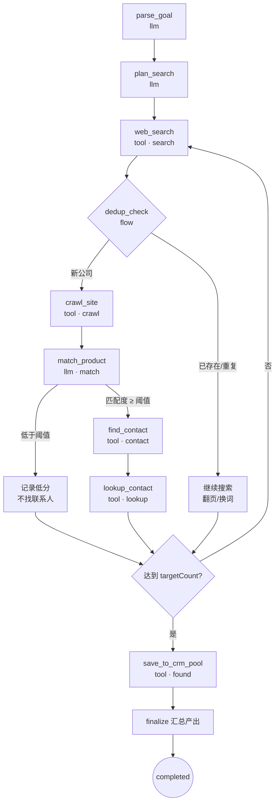
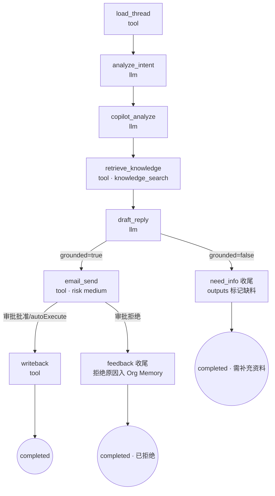
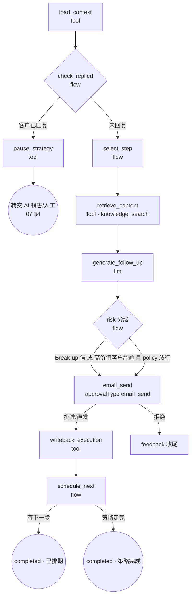

# LangGraph 工作流 · 00 · P0 任务工作流定义

| 项 | 内容 |
|---|---|
| 对应拆分项 | [00-产品总览与MVP规划 §9](../00-产品总览与MVP规划.md) 第 4 项「LangGraph 工作流」 |
| 前置文档 | [Agent Runtime 架构/00-运行时架构总纲](../Agent%20Runtime%20架构/00-运行时架构总纲.md)（图编译机制 §4.3、审批闸门 §4.7、工具校验链 §4.5） |
| 覆盖范围 | P0 三种任务类型：`lead_hunting / email_reply / follow_up`；P1 类型见 §8 占位 |
| 版本 | v0.6.1（2026-09-05，§4.1/§4.4/§9.3 补频控顺延目标公式（07 v0.2.1），Scheduler 与 `schedule_next` 共用窗口对齐口径）<br>v0.6（2026-09-05，email_send 节点风险级别统一为 medium（12 §7.1）：§1/§3.2/§3.3/§4.4/§5 标注修正，补 autoApprove 与强制人工例外口径，对齐总纲 §4.7）<br>v0.5（2026-09-05，§9 全部关闭：时区/频控标记 07 已澄清、「重新生成」=新建任务（regenerate_of）、不做客户分层表达式）<br>v0.4（2026-09-05，follow_up 调度补频控预检与时窗顺延口径，07 §7 已澄清）<br>v0.3（2026-09-05，`email_reply` State 增加 `detectedLanguage` 与草稿语言跟随规则，口径 06 需求 §7）<br>v0.2（2026-09-05，`find_contact` 补决策影响力规则基线产出，口径 04 需求 §3.2）<br>v0.1（2026-09-05） |

---

## 1. 范围与通用约定

- 本文档逐一定义每个 `task_type` 的图：**State schema、节点、边、日志与进度映射、审批接入点**；提示词只定义 I/O 契约（`promptRef`），文案在实现期编写。
- 节点 `kind` 分三类（对齐运行时总纲 §4.3）：`llm`（Planner 推理）/ `tool`（工具调用）/ `flow`（控制流）。
- 所有图继承 `BaseTaskState`；所有 `risk: medium / high` 节点执行前自动进入 Approval Gate（放行策略对齐总纲 §4.7），图中不手写 interrupt 逻辑。
- 日志 `logType` 必须使用已定义枚举，获客类对齐 [接口文档 03 §1.5](../页面级字段与接口文档/03-AI获客.md)：`search / found / crawl / match / contact / lookup / error`。

### 1.1 BaseTaskState

```typescript
// packages/shared/workflow-state.ts
interface BaseTaskState {
  taskId: string;
  orgId: string;            // 多租户隔离：所有工具调用透传
  employeeId: string;
  taskType: string;
  input: Record<string, unknown>;   // ai_task.input 原样
  errors: { nodeId: string; message: string; retried: boolean }[];
}
```

### 1.2 通用语义

| 主题 | 约定 |
|---|---|
| 进度 | 各图定义 `progressOf(state)` 纯函数，节点完成后计算并随 SSE `progress` 事件推送 |
| 检查点 | 每节点完成后落 checkpointer；`paused` / `waiting_approval` / 崩溃恢复均从最近检查点续跑 |
| 失败 | 节点级自动重试（llm 2 次 / tool 按工具配置），仍失败 → `state.errors` 追加 → 图走 `fail` 收尾节点 |
| 目标可达提前结束 | 支持条件边提前进入 `finalize`（如获客达到目标数） |

---

## 2. lead_hunting · AI 获客工作流

### 2.1 State

```typescript
interface LeadHuntingState extends BaseTaskState {
  parsed: {                       // 对齐接口文档 03 §1.3
    targetMarket?: string;        // 目标市场，如 USA
    customerType?: string;        // 客户类型，如 Shoe Brand
    targetProduct?: string;       // 目标产品，如 Carbon Fiber Insoles
    companySize?: string;         // 公司规模区间，如 50-500+
  };
  searchQueries: string[];        // 生成的搜索策略
  discovered: CompanyLead[];      // 发现的公司（含去重标记）
  scored: ScoredLead[];           // 评分结果（Insight Schema）
  contacts: LeadContact[];        // 联系人发现结果
  targetCount: number;            // 目标数（默认 35，接口文档 foundCount/targetCount）
}
```

### 2.2 图结构



### 2.3 节点定义

| 节点 | kind | 职责 | 输出 / 日志 | 进度贡献 |
|---|---|---|---|---|
| `parse_goal` | llm | `goalText` → 结构化 `parsed`（FR-07）；输出不合法字段时回写任务供用户修正 | 结构化 TargetCriteria | 5% |
| `plan_search` | llm | 由 `parsed` + knowledge_search（`scene=lead_match`）生成 N 条搜索词与目标数校准 | searchQueries，log `search` | 10% |
| `web_search` | tool | 逐条执行搜索，产出公司候选 | log `search`/`found` | 循环累计 |
| `dedup_check` | flow | `crm_read` 查重 + 本次任务内去重（口径已定 03 §3.6：归一化域名优先，无域名时 `lower(company_name)` 兜底；跨任务命中未转化 lead → 不新建、由 `save_to_crm_pool` 合并更新） | 重复公司打标跳过 | — |
| `crawl_site` | tool | 抓取官网关键页（产品/About），入 Org Memory 索引 | log `crawl` | — |
| `match_product` | llm | 产品匹配度 + 评分等级，**必须输出 Insight Schema** `{ value, confidence, reasons[{ text, evidence, source }] }`（03 §4 可解释红线） | log `match`，scored | 循环累计 |
| `find_contact` | tool | 发现潜在采购负责人（职位/部门匹配），并按职衔规则基线产出决策影响力 `decision_influence_pct`（90/75/40 档确定性映射，未命中 NULL，口径 04 需求 §3.2） | log `contact` | — |
| `lookup_contact` | tool | 仅查找**公开商务渠道**联系方式（GDPR/CCPA 合规边界，03 §4） | log `lookup` | — |
| `save_to_crm_pool` | tool | 批量写入客户发现池（`inCrm=false`，不自动进 CRM；加入 CRM 是用户动作，03 §4） | log `found` | 95% |
| `finalize` | flow | 汇总 `outputs: [{ type: "leads", payload }]`，统计 found/analyzed/highValue | SSE `done` | 100% |

**边界说明**

- 图中**不含**发信节点：获客员工不自动触达客户（03 §4「开发信发送属销售中心流程」）。
- `match_product` 阈值（High/Medium/Low 分档线）入 sop_template 高级设置，默认 High ≥ 85 / Medium ≥ 60（03 §3.5，scoreLevel 由 matchPct 确定性映射，不做二次 AI 判断）。
- 高级设置（03 §3.4，5 键结构）随 `ai_task.input.advancedSettings` 透传：`excludeDomains` 在 `dedup_check` 硬过滤；`annualImportRange` 仅作 `plan_search` 搜索策略权重；`jobTitles` 用于 `find_contact` 负责人排序。
- 外部数据源日额度（03 §3.7：员工级 `externalCallDailyLimit` 默认 200，工具计权 search ×1 / crawl ×2 / lookup ×1）由运行时令牌桶控制，超限任务转 `paused` 并提示，次日重置后手动 resume。

---

## 3. email_reply · AI 销售回复工作流

### 3.1 State

```typescript
interface EmailReplyState extends BaseTaskState {
  input: { inboxMessageId: string };      // 触发源：收件箱新邮件（或手动）
  thread: EmailMessage[];                 // 会话上下文（06 FR-03）
  detectedLanguage?: string;              // 来信语言：跟随最近一条 in 消息的 language，缺省英文（06 §7）
  intent: { label: string; confidence: number };       // 意图识别（FR-06）
  copilot: {
    purchaseProbability: number;          // 采购概率（FR-07）
    stage: string;                        // 客户阶段（FR-08）
    recommendedActions: string[];         // 推荐动作（FR-09）
  };
  knowledgeRefs: KnowledgeChunk[];        // 草稿引用的结构化依据
  draft: { subject: string; body: string; grounded: boolean; missingInfo?: string[] };
  sentMessageId?: string;
}
```

### 3.2 图结构



### 3.3 节点定义

| 节点 | kind | 职责 | 关键约束 |
|---|---|---|---|
| `load_thread` | tool | 拉取会话历史与客户/阶段数据（crm_read + email_read） | 只读本 org |
| `analyze_intent` | llm | 意图分类（RFQ / 比价 / 物流 / 其他），带 confidence | 轻量模型档 |
| `copilot_analyze` | llm | 采购概率、阶段更新、推荐动作 3~5 条 | 输出供右栏 Copilot 展示，即使不发送也落 `outputs` |
| `retrieve_knowledge` | tool | 检索产品参数 / MOQ / 交期 / FAQ（`scene=email_reply`） | 06 §4：业务参数只允许来自结构化数据 |
| `draft_reply` | llm | 生成回复草稿；引用 knowledgeRefs 生成；**无依据参数 → `grounded=false` + missingInfo**，禁止编造（06 §4） | 强模型档；语气/长度约束入 prompt |
| `email_send` | tool | `risk: medium（12 §7.1）, approvalType: email_send` → Approval Gate；未命中强制人工例外且（16 FR-08 已开 autoApprove + `approval_policy.autoExecute` 含 email_send）时直发并日志标记 auto | 拒绝/编辑语义见总纲 §4.7 |
| `writeback` | tool | 发送结果写 CRM 活动记录、更新首响时长指标 | — |

**边界说明**

- 用户在草稿上的编辑（[编辑] 后发送）作为反馈沉淀 Org Memory（06 §4），不回流本任务图（任务已完成）。
- 重新生成 = **新建任务**（`task_type` 不变，`regenerate_of` 关联原任务 id），以新 input 完整复跑 `retrieve_knowledge → draft_reply`（§9.4 已澄清：不做同 task 局部 resume，新 taskId 使 `taskId+nodeId` 幂等键天然隔离，审计链清晰）。
- 草稿语言跟随会话最近一条 in 消息的 `language`（State.`detectedLanguage`），无信号默认英文（06 §7 已澄清）。

---

## 4. follow_up · AI 自动跟进工作流

### 4.1 与数据模型的关系

跟进域有独立表：`follow_up_strategy / follow_up_strategy_step / follow_up_task（客户级实例）/ follow_up_execution`（ER 图模块 05）。**一个 `ai_task(type=follow_up)` = 某客户跟进任务的一次触达**：

- 调度源：`follow_up_task.next_run_at` 到期 → Scheduler 入队（对齐总纲 §4.1 delayed job）；
- 入队前频控预检：同一客户 `minTouchIntervalDays`（`org.send_rules`，默认 3 天）内已有 outbound 邮件（含人工）→ 顺延 `next_run_at` 并写 `follow_up_execution.skipped(frequency_capped)`，不入图（07 §7 已澄清）；**顺延目标公式（07 v0.2.1）**：`max(当前 next_run_at, 最近一次 outbound 时间 L + minTouchIntervalDays 天)` 后按 `org.timezone` 窗口对齐（< 09:00 → 当日起点，≥ 18:00 → 次日起点），落点必在窗口内、到期即可入队；
- 执行结束回写 `follow_up_execution` + 计算下一次 `next_run_at`（策略步 `day_offset`）；
- `follow_up_task.status`（ready/scheduled/waiting_approval/completed/paused）与 `ai_task.status` 双轨同步。

### 4.2 State

```typescript
interface FollowUpState extends BaseTaskState {
  followUpTaskId: string;
  strategyStep: { seq: number; dayOffset: number; contentKind: string }; // Initial/Value/Case/Break-up
  customer: { id: string; tier: 'high' | 'medium' | 'low'; stage: string };
  repliedSinceLast: boolean;              // 上次触达后客户是否回复
  content: { subject: string; body: string; grounded: boolean };
  nextStep?: { seq: number; runAt: string };  // 下一次排期；无 → 策略完成
}
```

### 4.3 图结构



### 4.4 节点定义

| 节点 | kind | 职责 | 关键约束 |
|---|---|---|---|
| `load_context` | tool | 读 follow_up_task + strategy_step + 客户分层（crm_read） | — |
| `check_replied` | flow | 扫描上次触达后的收件（email_read）：客户已回复 → 暂停策略并交接销售，**避免机器邮件与人工沟通撞车**（07 §4） | 暂停语义：follow_up_task.status=paused |
| `select_step` | flow | 取当前策略步（Day 0/3/7/14/30 → Initial Email / Product Value / Product Case / Customer Case / Break-up Email，07 FR-03） | 步骤来自 follow_up_strategy_step，不由 LLM 决定节奏 |
| `retrieve_content` | tool | 按内容类型取素材：Product Value / Case 来自知识中心（07 §5） | — |
| `generate_follow_up` | llm | 生成跟进邮件；禁止编造优惠/交期/价格承诺（07 §4） | 内容类型决定 prompt 模板 |
| `email_send` | tool | `risk: medium（12 §7.1）, approvalType: email_send`；**Break-up Email 一律强制人工审核**（07 §4，强制人工例外优先于 autoApprove，总纲 §4.7）；高价值客户强制审核（approval_policy `high_value_only`，02 §2） | — |
| `writeback_execution` | tool | 写 follow_up_execution + CRM 活动记录 | — |
| `pause_strategy` | tool | 暂停策略、生成交接 outputs（`type: "insight"`） | — |
| `schedule_next` | flow | 按 day_offset 计算下一次 `next_run_at`（统一 UTC 存储），落在企业发送时间窗（`org.send_rules.sendWindow`，默认 09:00–18:00，按 `org.timezone`）外则窗口对齐顺延（< 09:00 → 当日起点，≥ 18:00 → 次日起点；与 Scheduler 频控顺延共用同一公式，07 v0.2.1）；`follow_up_task.status=scheduled`（07 §7 已澄清） | 频控预检在 Scheduler 入队前完成，不在本节点 |

---

## 5. 检查点与审批恢复语义（三图通用）

| 场景 | 机制 |
|---|---|
| 审批等待 | `risk: medium / high` 节点 → Gate `interrupt()` → checkpointer 保存 → 审批回调 `Command{resume}`；resume payload 含处置结果（批准/编辑后内容/拒绝原因） |
| 审批挂起排期冻结 | follow_up 图挂起期间 `follow_up_task.status=waiting_approval`、`next_run_at` 保留原值冻结，Scheduler 不扫描（扫描仅命中 `ready/scheduled`）；排期单一写入口 = Scheduler 频控预检 + `schedule_next`（Runtime §4.7） |
| 审批超时 | `expires_at` 到期 → 审批 `expired`（终态）→ `ai_task.failed(approval_expired)`、`follow_up_task.paused` 转人工；已生成草稿写 `outputs` 留存；重新发起 = 「重新生成」新任务（Runtime §4.7） |
| 恢复新鲜度校验 | 批准 resume 后、发送前强制重跑：`email_reply` 重查会话是否已被人工回复/关闭（已处理 → 不发送转 `completed(insight)`）；`follow_up` 重跑 `check_replied`（已回复 → `pause_strategy`，07 §4） |
| 手动暂停 | 图中断点即最近检查点；恢复时重跑**当前节点**（工具幂等键防重复外发） |
| 崩溃恢复 | 队列重投 + checkpointer 续跑；`email_send` 类节点以 `taskId+nodeId+messageHash` 幂等 |
| SOP 版本 | 任务启动时锁定图版本，中途 SOP 修改不影响进行中任务（总纲 §4.3） |

---

## 6. 提示词契约（promptRef 清单）

具体文案实现期编写，此处锁定输入/输出/模型档位：

| promptRef | 图·节点 | 输入 | 输出（Zod schema） | 模型档 |
|---|---|---|---|---|
| `leadHunting.parseGoal` | 获客·parse_goal | goalText、可选高级设置 | TargetCriteria | 轻 |
| `leadHunting.planSearch` | 获客·plan_search | parsed、产品知识摘要 | { queries[], targetCount } | 轻 |
| `leadHunting.matchProduct` | 获客·match_product | 官网摘要 + targetProduct + 产品知识 | InsightSchema（matchPct/scoreLevel/reasons） | 中 |
| `sales.analyzeIntent` | 回复·analyze_intent | 最新邮件 + 会话摘要 | { label, confidence } | 轻 |
| `sales.copilotAnalyze` | 回复·copilot_analyze | thread + crm 上下文 | { purchaseProbability, stage, recommendedActions[] } | 中 |
| `sales.draftReply` | 回复·draft_reply | thread + intent + knowledgeRefs + 员工语气约束 | { subject, body, grounded, missingInfo? } | 强 |
| `followUp.generate` | 跟进·generate_follow_up | strategyStep.contentKind + 素材 + 客户上下文 | { subject, body, grounded } | 中 |

> 模型档位映射到 LLM Gateway 的模型路由（总纲 §4.8），org 可在 16-系统设置覆盖。

---

## 7. 产出物契约（ai_task.outputs）

| task_type | outputs[].type | payload 要点 |
|---|---|---|
| lead_hunting | `leads` | 发现池列表（公司/国家/matchPct/scoreLevel/matchReasons/contacts），供客户发现列表渲染 |
| email_reply | `draft` / `insight` | 草稿内容 + Copilot 分析（意图/概率/阶段/推荐动作）；`need_info` 场景附 missingInfo |
| follow_up | `draft` / `insight` | 触达记录 + 下次跟进排期；pause 交接场景附客户回复摘要 |

---

## 8. P1 任务类型占位

| task_type | 图要点（P1 细化） |
|---|---|
| `product_analysis` | 产品资料解析 → 结构化入库 → 知识索引；纯内部，无高风险节点 |
| `knowledge_index` | 文档切分 → 向量化 → 入 pgvector；批处理型，进度按文档数 |
| `order_monitor` | 订单状态轮询 → 风险规则 → 异常告警 outputs；`order_change` 高风险动作 P1 接入审批 |
| `business_analysis` | 多源数据聚合 → 经理角色分析报告 → `report` outputs；长任务，检查点密集 |

---

## 9. 待澄清问题（影响图设计的部分）

> v0.5 以下五项全部澄清，至此本文件待澄清问题全部关闭。

1. ~~获客去重口径：公司名+域名模糊判重是否足够，是否引入外部企业库（03 §7.3）~~ → **已澄清**（03 v0.2 §3.6）：归一化域名优先、`lower(company_name)` 兜底 + pg_trgm 辅助，三级去重；MVP 不引入外部企业库。
2. ~~跟进「今天待执行」时区基准（07 §7.2）~~ → **已澄清**（07 v0.2）：按 **`org.timezone`**（企业当地）解释「今天」与发送窗口（默认 09:00–18:00）；`next_run_at` / `scheduled_at` 统一存 UTC（14 §7.2 同口径）。
3. ~~跟进频控规则（07 §7.3）~~ → **已澄清**（07 v0.2）：`minTouchIntervalDays` 默认 3 天（含人工外发），Scheduler 入队前频控预检，不满足置 `skipped(skip_reason=frequency_capped)`；顺延目标公式（07 v0.2.1）= `max(当前 next_run_at, 最近 outbound 时间 L + minTouchIntervalDays 天)` 后窗口对齐，`schedule_next` 与 Scheduler 共用同一窗口对齐口径。
4. ~~「重新生成」草稿：同任务局部 resume 还是新建任务~~ → **已澄清**（v0.5）：**新建任务**（`regenerate_of` 关联，复用 `ai_task.retry_of` 溯源列，ER 02 v0.4），完整复跑 `retrieve_knowledge → draft_reply`；幂等键随新 taskId 天然隔离，见 §3 边界说明。
5. ~~低价值客户跟进是否允许全自动发送（approval_policy 的客户分层表达式语法）~~ → **已澄清**（v0.5）：MVP **不引入客户分层表达式语法**；发送审批统一沿用 12 规则（email_send = medium 风险，16 FR-08 可开 `autoApprove`；Break-up Email 一律强制人工审，07 §4）；按客户分层差异化自动化的表达式设计列后续增强。
