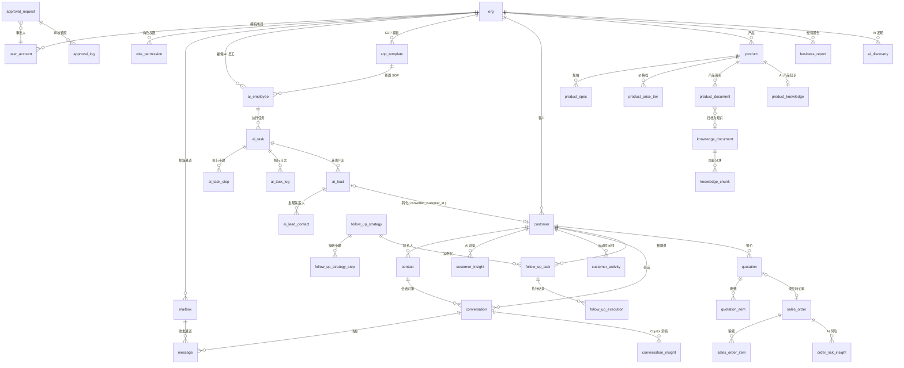

# 00 · PostgreSQL 数据库设计规范与总览

| 项 | 内容 |
|---|---|
| 来源 | [产品总览与MVP规划 §9 后续拆分建议](../00-产品总览与MVP规划.md) 第 2 项「PostgreSQL 数据库 ER 图」 |
| 依据 | 全部需求文档（01～16）+ [页面级字段与接口文档](../页面级字段与接口文档/00-总览与接口规范.md)（ID / 枚举 / Insight Schema 与本设计严格对齐） |
| 版本 | v0.5（2026-09-05，软删除约定扩展 `knowledge_document.deleted_at / deleted_by`（知识软删留痕 P1-5），见 §2.1）<br>v0.4（2026-09-05，`approval_status` 枚举新增 `expired`（审批超时终态，Runtime §4.7 / 12 §7.2），见 §4）<br>v0.3（2026-09-05，`approval_status` 枚举新增 `auto_approved`，见 12 §7）<br>v0.2（2026-09-05，`activity_type` 新增 `owner_change`，见 05 §7）<br>v0.1（2026-09-04） |
| 数据库 | PostgreSQL 16（可选扩展：pgvector 用于知识向量检索） |

---

## 1. 模块文档索引

| 编号 | 文档 | 覆盖需求模块 | 核心表 |
|---|---|---|---|
| 00 | 总览与设计规范（本文档） | 全局 | 共享枚举、通用约定 |
| 01 | [企业与用户设置模块](./01-企业与用户设置模块.md) | 16-系统设置（含登录/企业初始化） | org、user_account、mailbox 等 10 表 |
| 02 | [AI员工与任务模块](./02-AI员工与任务模块.md) | 02-AI数字员工中心、14-AI任务中心 | ai_employee、ai_task 等 5 表 |
| 03 | [AI获客模块](./03-AI获客模块.md) | 03-AI获客 | ai_lead、ai_lead_contact |
| 04 | [客户与CRM模块](./04-客户与CRM模块.md) | 04-客户360°、05-CRM客户中心 | customer、contact、customer_activity 等 4 表 |
| 05 | [销售邮件与自动跟进模块](./05-销售邮件与自动跟进模块.md) | 06-AI销售工作台、07-AI自动跟进 | conversation、message、follow_up_* 等 7 表 |
| 06 | [产品与知识模块](./06-产品与知识模块.md) | 08-产品中心、11-知识中心 | product、knowledge_document 等 7 表 |
| 07 | [报价与订单模块](./07-报价与订单模块.md) | 09-报价中心、10-订单中心 | quotation、sales_order 等 6 表 |
| 08 | [审核与数据中心模块](./08-审核与数据中心模块.md) | 12-AI审核中心、13-AI外贸经理、15-数据中心、01-Dashboard | approval_request、business_report 等 5 表 |

---

## 2. 全局设计约定

### 2.1 命名与基础

| 项 | 约定 |
|---|---|
| 库表命名 | 小写 snake_case，单数（`customer`、`ai_task`）；避开保留字（`order` → `sales_order`，`user` → `user_account`） |
| 主键 | `id text`，格式 `前缀 + 雪花 ID`，应用层生成（与接口文档 §2.4 ID 规范一致，前后端同值） |
| 多租户 | 所有业务表含 `org_id text NOT NULL REFERENCES org(id)`；建议配合 PostgreSQL RLS（`USING (org_id = current_setting('app.org_id')::text)`）做行级隔离兜底 |
| 时间 | `timestamptz`（UTC 存储，与接口 ISO 8601 UTC 约定一致）；纯日期字段用 `date` |
| 金额 | `numeric(18,2)` + `currency char(3)`（ISO 4217）；单价 `numeric(18,4)`；与接口「字符串十进制金额」约定对齐，序列化层转 string |
| 百分比 | 整数进度/占比 `smallint`（0–100）；可含小数的比率（利润率）`numeric(5,2)`；AI 置信度 `numeric(4,3)`（0–1） |
| 枚举 | PostgreSQL 原生 `CREATE TYPE`（见 §4）；取值与接口文档 §3 全局枚举一一对应，状态值即枚举字面量 |
| JSONB | 用于：AI 产出（reasons/citations/evidence/context）、配置对象、任务输入输出、多态结构。可查询、可聚合的高频字段一律落列，禁止整体塞 jsonb |
| 审计列 | 全部表含 `created_at / updated_at`；人工/变更敏感表另含 `created_by`（usr_）；软删除仅 `customer.deleted_at` 与 `knowledge_document.deleted_at / deleted_by`（软删留痕，供引用回溯，引用实时失效见 11 §7.2 / ER 06 §2.6），其余用状态或物理删除 |
| 外键 | 显式 `REFERENCES`；多态引用（审批 biz、活动 ref）不建 FK，靠 `biz_type + biz_id` 约定 + 应用层校验 |

### 2.2 ID 前缀规范

接口文档 §2.4 已定义部分前缀，此处补充全部实体（**加粗**为本文档新增）：

| 资源 | 前缀 | 资源 | 前缀 |
|---|---|---|---|
| 企业 / 用户 | `org_` / `usr_` | 报价 / 报价明细 | `quote_` / **`qitem_`** |
| AI 员工 / SOP 模板 | `emp_` / **`sop_`** | 订单 / 订单明细 | `order_` / **`oitem_`** |
| 任务 / 步骤 / 日志 | `task_` / **`step_`** / **`tlog_`** | 订单风险洞察 / 进度日志 | **`orisk_`** / **`oplog_`** |
| 发现客户 / 其联系人 | `lead_` / **`lcon_`** | 知识文档 / 分块 | `doc_` / `chk_` |
| 客户 / 联系人 | `cus_` / `con_` | 产品知识 / 产品文档 / 规格 / 价格档 | **`pknow_`** / **`pdoc_`** / **`pspec_`** / **`ptier_`** |
| 客户洞察 / 活动 | **`cins_`** / **`act_`** | 审批 / 审批留痕 | `appr_` / **`alog_`** |
| 会话 / 消息 / 会话洞察 | `conv_` / `msg_` / **`vins_`** | 经营报告 / AI 发现 | `rpt_` / **`disc_`** |
| 跟进策略 / 策略步骤 | `strat_` / **`sstep_`** | 邮箱 / 角色权限 / 其他设置 | **`mbx_`** / **`rperm_`** / 见各模块 |
| 跟进任务 / 执行记录 | `ftask_` / **`fexec_`** | API Key / Webhook / 集成 | **`key_`** / **`hook_`** / **`cint_`** |

### 2.3 通用列模板

除配置类单例表外，所有业务表包含：

```sql
id         text PRIMARY KEY,
org_id     text NOT NULL REFERENCES org(id),
created_at timestamptz NOT NULL DEFAULT now(),
updated_at timestamptz NOT NULL DEFAULT now()
```

---

## 3. 全库 ER 总图

> 只画实体与核心关系，字段见各模块文档。虚线语义（多态引用）用注释说明。



---

## 4. 全局枚举（先于各模块 DDL 执行）

> 与 [接口总览 §3](../页面级字段与接口文档/00-总览与接口规范.md) 严格一致。后续新增取值使用 `ALTER TYPE ... ADD VALUE`。

```sql
-- AI 员工与任务
CREATE TYPE employee_status   AS ENUM ('working','waiting_approval','scheduled','risk','failed','idle');
CREATE TYPE ai_employee_role  AS ENUM ('lead_hunter','customer_researcher','sales','follow_up','merchandiser','manager');
CREATE TYPE task_status       AS ENUM ('running','waiting_approval','scheduled','paused','completed','failed','canceled');
CREATE TYPE task_type         AS ENUM ('lead_hunting','email_reply','follow_up','order_monitor','business_analysis','knowledge_index','product_analysis');
CREATE TYPE task_log_type     AS ENUM ('search','found','crawl','match','contact','lookup','error');

-- 客户与获客
CREATE TYPE lead_value        AS ENUM ('high','medium','low');
CREATE TYPE customer_stage    AS ENUM ('new_lead','contacted','negotiation','cold');
CREATE TYPE customer_type     AS ENUM ('brand','distributor','factory','other');
CREATE TYPE activity_type     AS ENUM ('stage_change','owner_change','email','quote','follow_up','note','ai_action');
CREATE TYPE operator_type     AS ENUM ('ai','user');
CREATE TYPE insight_type      AS ENUM ('purchase_probability','reactivation','product_match','pricing','order_risk');

-- 销售与跟进
CREATE TYPE conversation_priority AS ENUM ('high','normal','pending');
CREATE TYPE ai_intent             AS ENUM ('rfq','price_compare','logistics','sample','other');
CREATE TYPE msg_direction         AS ENUM ('in','out');
CREATE TYPE msg_status            AS ENUM ('draft','sent','failed');
CREATE TYPE sender_type           AS ENUM ('ai','user','contact');
CREATE TYPE follow_up_stage       AS ENUM ('follow_up_1','follow_up_2','follow_up_3','quote_followup');
CREATE TYPE follow_up_task_status AS ENUM ('ready','scheduled','waiting_approval','completed','paused');
CREATE TYPE fexec_status          AS ENUM ('sent','waiting_approval','approved','rejected','failed','skipped');
CREATE TYPE auto_send_policy      AS ENUM ('manual_review','auto_send','value_based');

-- 产品与知识
CREATE TYPE product_status        AS ENUM ('active','draft','archived');
CREATE TYPE product_doc_type      AS ENUM ('catalog','certification','test_report','other');
CREATE TYPE knowledge_category    AS ENUM ('product','company','sales','customer','faq','process','other');
CREATE TYPE index_status          AS ENUM ('indexed','indexing','failed');
CREATE TYPE knowledge_search_scene AS ENUM ('lead_match','sales_reply','follow_up','pricing_basis','business_analysis');

-- 报价与订单
CREATE TYPE quote_status  AS ENUM ('draft','waiting_approval','sent','won','lost');
CREATE TYPE order_status  AS ENUM ('pending_payment','in_production','ready_to_ship','completed');
CREATE TYPE order_risk    AS ENUM ('normal','at_risk');

-- 审批
CREATE TYPE approval_type   AS ENUM ('quote','email_send','contract','order_change','bulk_marketing','customer_delete');
CREATE TYPE approval_status AS ENUM ('pending','auto_approved','approved','edited_approved','rejected','expired');
CREATE TYPE risk_level      AS ENUM ('high','medium','low');

-- 组织与设置
CREATE TYPE user_role        AS ENUM ('admin','manager','sales');
CREATE TYPE member_status    AS ENUM ('active','disabled','invited');
CREATE TYPE mailbox_provider AS ENUM ('gmail','outlook','smtp_imap');
CREATE TYPE mailbox_status   AS ENUM ('connected','error','disconnected');

-- 经理与报告
CREATE TYPE discovery_type AS ENUM ('opportunity','risk');
CREATE TYPE report_period  AS ENUM ('daily','weekly','monthly');
CREATE TYPE report_status  AS ENUM ('generating','ready','failed');
```

---

## 5. 跨模块设计要点

### 5.1 AI 产出统一 Insight Schema（JSONB）

凡 AI 生成结论（评分、概率、建议、风险、定价）的持久化字段统一命名与结构，对应接口总览 §4.1：

```json
{ "value": 92, "confidence": 0.92,
  "reasons":  [{ "text": "...", "evidence": "...", "source": "..." }],
  "citations":[{ "docId": "doc_3", "chunkId": "chk_12" }] }
```

落地方式分两类：

| 方式 | 适用场景 | 落地字段 |
|---|---|---|
| 独立洞察表 | 客户洞察（多类型、需按时间刷新） | `customer_insight` |
| 行内 jsonb | 单对象单份结论（lead 匹配、报价定价建议、Copilot） | `ai_lead.insight`、`quotation.ai_pricing`、`conversation_insight`、`sales_order` → `order_risk_insight` 表（结构复杂且需独立生命周期） |

> **可追溯红线**：所有 `citations` 指向 `knowledge_document / knowledge_chunk`；文档删除时必须同步失效引用（11 §3.4）。

### 5.2 高风险动作与审批（多态引用）

- `approval_request` 通过 `biz_type + biz_id` 引用业务对象（quote / message / sales_order / customer / follow_up_execution / bulk_marketing 任务），**不建外键**；
- 业务对象持有反向 `approval_id`（quotation、message、follow_up_execution 等），用于回显「变更审批中 / 待审锁定」状态；
- 审批 `approve` 后由服务端回调原业务动作并写 `result_ref`（12 §3.3）。

### 5.3 状态联动链

```text
lead.in_crm + converted_customer_id   → lead 转 customer（05 §3.4）
quotation.status = won                → sales_order.quotation_id（09 §3.5）
message.status = draft                → AI 草稿即消息行（draftId = msg_，06 §3.2）
客户回复到达（message in）             → 自动 pause follow_up_task + skipped 记录（07 §4）
approval.status 流转                  → 回写业务对象状态（waiting_approval 等）
```

### 5.4 AI 身份与权限

- `owner_id`（user_account）承载资源归属，支撑 `scope=self|team|all` 数据权限（00 接口总览 §4.4）；
- AI 触发的写操作以 `operator_type='ai'` + AI 员工 ID 记录于 `customer_activity` / `approval_log`；
- AI 身份禁止调用阶段推进（05 CRM §4）与订单变更（10 §3.2）接口，由服务层强制。

### 5.5 注册种子数据（16 §3.1）

`POST /auth/register` 事务内初始化：默认角色权限（role_permission ×3）、默认跟进策略及步骤（follow_up_strategy + steps，Day 0/3/7/14/30）、6 个预置 AI 员工（ai_employee + sop_template）。相关表见各模块文档。

---

## 6. 表清单汇总（40 表）

| 模块 | 表 |
|---|---|
| 01 企业与用户（10） | org、user_account、role_permission、mailbox、crm_integration、pricing_rule_setting、notification_setting、ai_model_setting、api_key、webhook |
| 02 AI 员工与任务（5） | sop_template、ai_employee、ai_task、ai_task_step、ai_task_log |
| 03 获客（2） | ai_lead、ai_lead_contact |
| 04 客户与 CRM（4） | customer、contact、customer_insight、customer_activity |
| 05 销售与跟进（7） | conversation、message、conversation_insight、follow_up_strategy、follow_up_strategy_step、follow_up_task、follow_up_execution |
| 06 产品与知识（7） | product、product_spec、product_price_tier、product_document、product_knowledge、knowledge_document、knowledge_chunk |
| 07 报价与订单（6） | quotation、quotation_item、sales_order、sales_order_item、order_risk_insight、order_progress_log |
| 08 审核与数据（5） | approval_request、approval_log、business_report、ai_discovery、analytics_daily_summary（可选预聚合） |
