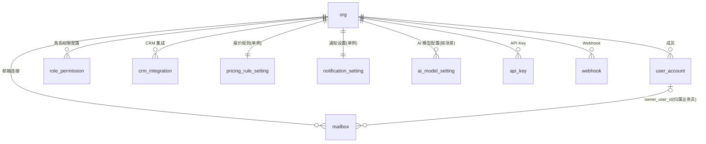

# 01 · 企业与用户设置模块 ER

| 项 | 内容 |
|---|---|
| 覆盖需求 | [16-系统设置](../16-系统设置.md)（登录/企业初始化 P0 主流程、企业信息、成员、邮箱连接、报价规则、权限、集成、通知、AI 模型、API/Webhook） |
| 字段依据 | [页面级字段与接口文档/16-系统设置](../页面级字段与接口文档/16-系统设置.md) |
| 版本 | v0.1（2026-09-04） |
| 前置 | 先执行 [00 §4 全局枚举](./00-数据库设计规范与总览.md) |

---

## 1. ER 图



---

## 2. 表定义

### 2.1 org（企业）

| 列 | 类型 | 约束 | 说明 |
|---|---|---|---|
| id | text | PK | `org_` 前缀 |
| name | text | NOT NULL | 企业名称（注册时 `companyName`） |
| logo_url | text | | 企业 Logo |
| country | text | | 国家 |
| timezone | text | | IANA 时区（如 `Asia/Shanghai`） |
| default_language | text | | 默认语言（默认 `zh-CN`） |
| default_currency | char(3) | | 默认币种（默认 `USD`） |
| industry | text | | 行业 |
| onboarding | jsonb | NOT NULL DEFAULT '{}' | 初始化向导：`{ currentStep: 1-4, steps: [{ key, done, completedAt }] }`（16 §1.2，支撑注册漏斗统计） |
| created_at / updated_at | timestamptz | NOT NULL | 通用列 |

### 2.2 user_account（用户账号，避开保留字 user）

| 列 | 类型 | 约束 | 说明 |
|---|---|---|---|
| id | text | PK | `usr_` 前缀 |
| org_id | text | NOT NULL FK→org | 租户 |
| email | text | NOT NULL | 登录邮箱 |
| password_hash | text | NOT NULL | 口令哈希（bcrypt/argon2） |
| name | text | NOT NULL | 姓名（注册 `contactName`） |
| role | user_role | NOT NULL | `admin / manager / sales` |
| status | member_status | NOT NULL DEFAULT 'invited' | `active / disabled / invited`（16 §1.4） |
| invited_by | text | FK→user_account，可空 | 邀请人 |
| invited_at / joined_at | timestamptz | 可空 | 邀请 / 加入时间 |
| last_login_at | timestamptz | 可空 | 最近登录 |
| created_at / updated_at | timestamptz | NOT NULL | 通用列 |

> v0.1 假设一邮箱单企业；多企业归属（如咨询顾问）待澄清后加 `org_membership` 关联表。

### 2.3 role_permission（角色权限）

| 列 | 类型 | 约束 | 说明 |
|---|---|---|---|
| id | text | PK | `rperm_` |
| org_id | text | NOT NULL FK→org | |
| role | user_role | NOT NULL | 角色 |
| permissions | jsonb | NOT NULL | `{ customers: "self|team|all", quotes: "approve|edit|view", approvals: [...], settings: "manage|view|none" }`（16 §1.7） |
| approval_rules | jsonb | NOT NULL DEFAULT '[]' | `[{ approvalType, approverRoles: ["manager"] }]` 审批人配置，供 12-审核中心使用 |
| updated_by | text | FK→user_account，可空 | |
| created_at / updated_at | timestamptz | NOT NULL | |

> 校验红线：`quote / email_send / contract / order_change / bulk_marketing / customer_delete` 的审批绑定不可配置为免审批（16 §3.6），应用层强制。

### 2.4 mailbox（邮箱连接，P0）

| 列 | 类型 | 约束 | 说明 |
|---|---|---|---|
| id | text | PK | `mbx_` |
| org_id | text | NOT NULL FK→org | |
| owner_user_id | text | FK→user_account，可空 | 归属业务员（发件人身份；空=企业公共邮箱） |
| provider | mailbox_provider | NOT NULL | `gmail / outlook / smtp_imap` |
| account | text | NOT NULL | 邮箱地址（接口层脱敏展示） |
| imap | jsonb | | `{ host, port, ssl, credential_enc }` |
| smtp | jsonb | | `{ host, port, ssl, credential_enc }` |
| sync_scope | jsonb | NOT NULL | `{ historyDays, folders: ["INBOX","Sent"] }` |
| status | mailbox_status | NOT NULL | `connected / error / disconnected` |
| last_sync_at | timestamptz | 可空 | 最近同步时间 |
| last_error | text | 可空 | 连接错误信息（test/status 用） |
| created_at / updated_at | timestamptz | NOT NULL | |

> **凭据加密**：`credential_enc` 为密文（KMS/信封加密），任何接口永不回显明文（16 §3.3）。

### 2.5 crm_integration（外部 CRM 集成）

| 列 | 类型 | 约束 | 说明 |
|---|---|---|---|
| id | text | PK | `cint_` |
| org_id | text | NOT NULL FK→org | |
| provider | text | NOT NULL | `小满 / 富通天下 …` |
| status | text | NOT NULL | `connected / disconnected` |
| sync_direction | text | NOT NULL | `pull / push / both` |
| mapping | jsonb | | 字段映射 |
| last_sync_at | timestamptz | 可空 | |
| created_at / updated_at | timestamptz | NOT NULL | |

### 2.6 pricing_rule_setting（产品与报价规则，org 单例）

| 列 | 类型 | 约束 | 说明 |
|---|---|---|---|
| id | text | PK | `prule_` |
| org_id | text | NOT NULL FK→org | UNIQUE |
| product_categories | text[] | NOT NULL | 产品分类清单 |
| cost_items | text[] | NOT NULL | 成本项：`[采购, 运费, 保费, 税费, 汇兑]` |
| profit_floor_pct | numeric(5,2) | NOT NULL | 利润红线（报价提交 100% 拦截，09 §3.2） |
| discount_ladder | smallint[] | NOT NULL | 让价梯度 `[3,2,1]` |
| default_incoterms | text | NOT NULL | 默认贸易条款 |
| default_currency | char(3) | NOT NULL | 默认币种 |
| exchange_rate_source | text | NOT NULL | 汇率源 |
| updated_by | text | FK→user_account，可空 | |
| created_at / updated_at | timestamptz | NOT NULL | |

### 2.7 notification_setting（通知设置，org 单例）

| 列 | 类型 | 约束 | 说明 |
|---|---|---|---|
| id | text | PK | `ntf_` |
| org_id | text | NOT NULL FK→org | UNIQUE |
| channels | jsonb | NOT NULL | `{ site: true, email: false }` |
| events | jsonb | NOT NULL | `{ approval_pending: true, risk_alert: true, task_failed: true }` |
| created_at / updated_at | timestamptz | NOT NULL | |

### 2.8 ai_model_setting（AI 模型配置，按场景多行）

| 列 | 类型 | 约束 | 说明 |
|---|---|---|---|
| id | text | PK | `amdl_` |
| org_id | text | NOT NULL FK→org | UNIQUE(org_id, scene) |
| scene | text | NOT NULL | 场景（对应 knowledge_search_scene / 任务 type 等，简单场景小模型、复杂场景大模型） |
| model | text | NOT NULL | 模型标识 |
| temperature | numeric(3,2) | NOT NULL DEFAULT 0.7 | |
| max_tokens | integer | NOT NULL | |
| budget_limit | numeric(12,2) | 可空 | 场景预算上限 |
| created_at / updated_at | timestamptz | NOT NULL | |

### 2.9 api_key

| 列 | 类型 | 约束 | 说明 |
|---|---|---|---|
| id | text | PK | `key_` |
| org_id | text | NOT NULL FK→org | |
| name | text | NOT NULL | 备注名 |
| key_prefix | text | NOT NULL | 明文前缀（列表识别用，如 `tpk_live_ab12…`） |
| key_hash | text | NOT NULL | 完整 Key 哈希（明文仅创建时返回一次） |
| scopes | text[] | NOT NULL | 授权范围 |
| status | text | NOT NULL DEFAULT 'active' | `active / revoked` |
| created_by | text | FK→user_account | |
| last_used_at | timestamptz | 可空 | |
| created_at / updated_at | timestamptz | NOT NULL | |

### 2.10 webhook

| 列 | 类型 | 约束 | 说明 |
|---|---|---|---|
| id | text | PK | `hook_` |
| org_id | text | NOT NULL FK→org | |
| url | text | NOT NULL | 回调地址 |
| events | text[] | NOT NULL | 订阅事件（approval_pending / risk_alert / task_failed …） |
| secret_enc | text | NOT NULL | 签名密钥（密文） |
| status | text | NOT NULL DEFAULT 'active' | `active / disabled` |
| created_at / updated_at | timestamptz | NOT NULL | |

---

## 3. DDL

```sql
CREATE TABLE org (
  id               text PRIMARY KEY,
  name             text NOT NULL,
  logo_url         text,
  country          text,
  timezone         text,
  default_language text,
  default_currency char(3),
  industry         text,
  onboarding       jsonb NOT NULL DEFAULT '{}',
  created_at       timestamptz NOT NULL DEFAULT now(),
  updated_at       timestamptz NOT NULL DEFAULT now()
);

CREATE TABLE user_account (
  id            text PRIMARY KEY,
  org_id        text NOT NULL REFERENCES org(id),
  email         text NOT NULL,
  password_hash text NOT NULL,
  name          text NOT NULL,
  role          user_role NOT NULL,
  status        member_status NOT NULL DEFAULT 'invited',
  invited_by    text REFERENCES user_account(id),
  invited_at    timestamptz,
  joined_at     timestamptz,
  last_login_at timestamptz,
  created_at    timestamptz NOT NULL DEFAULT now(),
  updated_at    timestamptz NOT NULL DEFAULT now(),
  UNIQUE (org_id, email)
);
CREATE INDEX idx_user_org_status ON user_account (org_id, status);

CREATE TABLE role_permission (
  id             text PRIMARY KEY,
  org_id         text NOT NULL REFERENCES org(id),
  role           user_role NOT NULL,
  permissions    jsonb NOT NULL,
  approval_rules jsonb NOT NULL DEFAULT '[]',
  updated_by     text REFERENCES user_account(id),
  created_at     timestamptz NOT NULL DEFAULT now(),
  updated_at     timestamptz NOT NULL DEFAULT now(),
  UNIQUE (org_id, role)
);

CREATE TABLE mailbox (
  id            text PRIMARY KEY,
  org_id        text NOT NULL REFERENCES org(id),
  owner_user_id text REFERENCES user_account(id),
  provider      mailbox_provider NOT NULL,
  account       text NOT NULL,
  imap          jsonb,
  smtp          jsonb,
  sync_scope    jsonb NOT NULL,
  status        mailbox_status NOT NULL,
  last_sync_at  timestamptz,
  last_error    text,
  created_at    timestamptz NOT NULL DEFAULT now(),
  updated_at    timestamptz NOT NULL DEFAULT now()
);
CREATE UNIQUE INDEX uq_mailbox_org_account ON mailbox (org_id, lower(account));

CREATE TABLE crm_integration (
  id             text PRIMARY KEY,
  org_id         text NOT NULL REFERENCES org(id),
  provider       text NOT NULL,
  status         text NOT NULL,
  sync_direction text NOT NULL,
  mapping        jsonb,
  last_sync_at   timestamptz,
  created_at     timestamptz NOT NULL DEFAULT now(),
  updated_at     timestamptz NOT NULL DEFAULT now()
);

CREATE TABLE pricing_rule_setting (
  id                   text PRIMARY KEY,
  org_id               text NOT NULL REFERENCES org(id),
  product_categories   text[] NOT NULL,
  cost_items           text[] NOT NULL,
  profit_floor_pct     numeric(5,2) NOT NULL,
  discount_ladder      smallint[] NOT NULL,
  default_incoterms    text NOT NULL,
  default_currency     char(3) NOT NULL,
  exchange_rate_source text NOT NULL,
  updated_by           text REFERENCES user_account(id),
  created_at           timestamptz NOT NULL DEFAULT now(),
  updated_at           timestamptz NOT NULL DEFAULT now(),
  UNIQUE (org_id)
);

CREATE TABLE notification_setting (
  id         text PRIMARY KEY,
  org_id     text NOT NULL REFERENCES org(id),
  channels   jsonb NOT NULL,
  events     jsonb NOT NULL,
  created_at timestamptz NOT NULL DEFAULT now(),
  updated_at timestamptz NOT NULL DEFAULT now(),
  UNIQUE (org_id)
);

CREATE TABLE ai_model_setting (
  id           text PRIMARY KEY,
  org_id       text NOT NULL REFERENCES org(id),
  scene        text NOT NULL,
  model        text NOT NULL,
  temperature  numeric(3,2) NOT NULL DEFAULT 0.7,
  max_tokens   integer NOT NULL,
  budget_limit numeric(12,2),
  created_at   timestamptz NOT NULL DEFAULT now(),
  updated_at   timestamptz NOT NULL DEFAULT now(),
  UNIQUE (org_id, scene)
);

CREATE TABLE api_key (
  id           text PRIMARY KEY,
  org_id       text NOT NULL REFERENCES org(id),
  name         text NOT NULL,
  key_prefix   text NOT NULL,
  key_hash     text NOT NULL,
  scopes       text[] NOT NULL,
  status       text NOT NULL DEFAULT 'active',
  created_by   text REFERENCES user_account(id),
  last_used_at timestamptz,
  created_at   timestamptz NOT NULL DEFAULT now(),
  updated_at   timestamptz NOT NULL DEFAULT now()
);
CREATE UNIQUE INDEX uq_api_key_hash ON api_key (key_hash);

CREATE TABLE webhook (
  id         text PRIMARY KEY,
  org_id     text NOT NULL REFERENCES org(id),
  url        text NOT NULL,
  events     text[] NOT NULL,
  secret_enc text NOT NULL,
  status     text NOT NULL DEFAULT 'active',
  created_at timestamptz NOT NULL DEFAULT now(),
  updated_at timestamptz NOT NULL DEFAULT now()
);
```

---

## 4. 设计说明与边界

- **注册事务**：`POST /auth/register` 在同一事务内创建 org + admin 用户 + 3 行 role_permission 种子；默认跟进策略与 6 个 AI 员工种子见 02/05 模块（16 §3.1）。
- **初始化向导**：`onboarding` 四步（注册企业 → 上传产品资料 → 连接邮箱 → 首个获客任务）由各模块写入 `steps.done`，`GET /org/onboarding` 直接读此 jsonb。
- **邮箱凭据**：永不回显；`POST /settings/mailboxes/{id}/test` 结果写 `status / last_error`。
- **权限兜底**：`role_permission.permissions` 是应用层裁剪依据，JWT 内 `role` 为快速通道；两者不一致时以 DB 为准。
