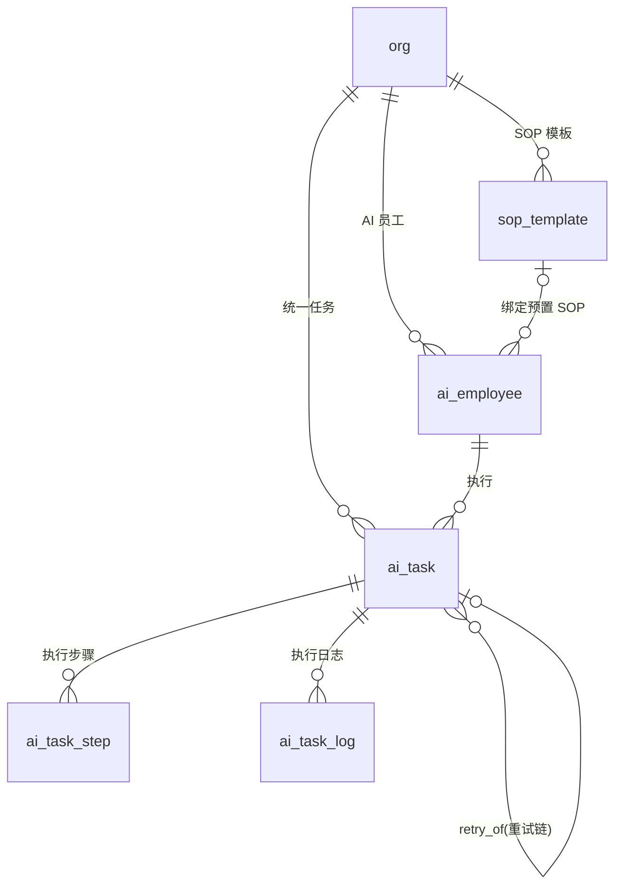

# 02 · AI 员工与任务模块 ER

| 项 | 内容 |
|---|---|
| 覆盖需求 | [02-AI数字员工中心](../02-AI数字员工中心.md)、[14-AI任务中心](../14-AI任务中心.md)（统一任务模型） |
| 字段依据 | [页面级字段与接口文档/02](../页面级字段与接口文档/02-AI数字员工中心.md)、[14](../页面级字段与接口文档/14-AI任务中心.md) |
| 版本 | v0.4.1（2026-09-05，`currentTask` 派生字段说明对齐接口 02 v0.2.1 轻量对象口径，无 DDL 变更）<br>v0.4（2026-09-05，`retry_of` 说明扩展为重试/重新生成共用溯源链（LangGraph v0.5 §9.4），无 DDL 变更）<br>v0.3（2026-09-05，任务并发排队与定时触发口径澄清（14 §7），见 §2.3/§4，无 DDL 变更）<br>v0.2（2026-09-05，对齐需求 02 v0.3 / 接口文档 02 v0.2：SOP 副本派生 / KPI metric 枚举）<br>v0.1（2026-09-04） |
| 前置 | 先执行 [00 §4 全局枚举](./00-数据库设计规范与总览.md) |

---

## 1. ER 图



> `ai_employee` 卡片的 `currentTask`（接口 02 v0.2.1 轻量对象，含 taskId/title/taskType/status/progressPct/currentStep）为**派生字段**（`ai_task` 中该员工最新一条非终态任务，MVP 取 `status='running'`），不落列，避免与 `ai_task.employee_id` 形成环。

---

## 2. 表定义

### 2.1 sop_template（SOP 模板）

| 列 | 类型 | 约束 | 说明 |
|---|---|---|---|
| id | text | PK | `sop_` |
| org_id | text | NOT NULL FK→org | 注册时按角色种子化 |
| role | ai_employee_role | NOT NULL | 适用角色（决定可选模板，02 §1.2） |
| name | text | NOT NULL | 模板名 |
| content | jsonb | NOT NULL | SOP 定义（步骤/提示词/工具编排 + 高级设置参数，结构由 Agent Runtime 细化，总纲 §4.3）；MVP 不开放结构/富文本编辑（02 需求 §3.1 v0.3） |
| is_preset | boolean | NOT NULL DEFAULT true | 是否预置模板；false = 向导传入 sopParams 时派生的 org 级副本（见 §4） |
| created_at / updated_at | timestamptz | NOT NULL | |

> 高级设置参数（如 `match_product` 分档阈值，默认 High ≥ 85）位于 `content` 高级设置区；可用参数键与默认值由角色模板定义（接口文档 02 §1.2 v0.2）。

### 2.2 ai_employee（AI 员工）

| 列 | 类型 | 约束 | 说明 |
|---|---|---|---|
| id | text | PK | `emp_` |
| org_id | text | NOT NULL FK→org | |
| role | ai_employee_role | NOT NULL | `lead_hunter / customer_researcher / sales / follow_up / merchandiser / manager` |
| name | text | NOT NULL | 员工名称 |
| avatar | text | | 图标/头像 |
| status | employee_status | NOT NULL DEFAULT 'idle' | 语义色状态（00 接口总览 §3.1） |
| status_detail | text | | 状态说明（如「正在处理 6 个询盘」，派生可缓存） |
| goal | text | NOT NULL | 目标描述（能力模型 Goal） |
| sop_template_id | text | FK→sop_template，可空 | 绑定 SOP（预置模板或 org 级副本，见 §2.1 / §4） |
| skills | text[] | NOT NULL DEFAULT '{}' | 技能标签 |
| tools | text[] | NOT NULL DEFAULT '{}' | 允许工具：`web_search / site_crawl / email_send / crm_write / pricing_engine …` |
| knowledge_scope | text[] | NOT NULL DEFAULT '{}' | 可检索知识分类（knowledge_category 子集，联动 11） |
| memory_config | jsonb | | `{ retentionDays, scope }` |
| workflow_id | text | | 绑定工作流（LangGraph 定义 ID，见 Agent Runtime 拆分文档） |
| permissions | jsonb | NOT NULL | 工具/数据权限白名单（越权调用任务层返回 40301） |
| approval_policy | jsonb | NOT NULL | `{ email_send: "always"|"high_value_only", quote: "always", autoExecute: [...] }` |
| kpi_config | jsonb | NOT NULL | `{ metric, target, period }`（KPI 进度数据源）；metric 按角色枚举：`lead_hunter=daily_leads / customer_researcher=daily_profiles / sales=daily_replies / follow_up=daily_followups / merchandiser=active_orders(P1) / manager=daily_reports`，period 固定 `daily`；target 建议值由角色模板预填（接口文档 02 §1.1 v0.2） |
| created_by | text | FK→user_account，可空 | 创建人（非 admin/manager 返回 40301，02 需求 §3.1） |
| created_at / updated_at | timestamptz | NOT NULL | |

> 校验红线：`approval_policy` 中 6 类高风险动作必须绑定审批，配置 `none` 返回 `42201`（02 §1.2）；`kpi_config.metric` 必须与 `role` 匹配（枚举见上），不匹配返回 `42201`。KPI 实际达成（`todayStats / achieved`）从任务与业务表实时聚合，不落列。

### 2.3 ai_task（统一任务模型）

03（获客）、08（产品分析）、11（索引）、13（报告）、01（每日报告）等异步操作均落此表（14 §0）。

| 列 | 类型 | 约束 | 说明 |
|---|---|---|---|
| id | text | PK | `task_` |
| org_id | text | NOT NULL FK→org | |
| employee_id | text | NOT NULL FK→ai_employee | 执行员工 |
| type | task_type | NOT NULL | `lead_hunting / email_reply / follow_up / order_monitor / business_analysis / knowledge_index / product_analysis` |
| title | text | NOT NULL | 任务名（如「寻找美国跑鞋品牌」） |
| status | task_status | NOT NULL DEFAULT 'running' | 状态机见 14 §1.1 |
| progress_pct | smallint | NOT NULL DEFAULT 0 CHECK (progress_pct BETWEEN 0 AND 100) | 进度 |
| current_step | text | | 当前步骤文案（SSE progress 事件） |
| input | jsonb | NOT NULL DEFAULT '{}' | 任务输入（获客 parsed 字段、报告 period 等） |
| outputs | jsonb | | 产出物 `[{ type: "leads"|"report"|"draft"|"insight", payload }]` |
| error | text | | 失败原因 |
| linked_approval_id | text | 可空（FK 见 08 模块，加迁移时补建） | 等待审核关联审批 |
| retry_of | text | FK→ai_task，可空 | 溯源链：手动重试与「重新生成」（LangGraph v0.5：新建任务复用本列关联，`task_type` 不变）均写此字段（保留原 logs，14 §3.5） |
| scheduled_at | timestamptz | 可空 | 定时触发时点（UTC 存储；周期语义按 org.timezone 解释，14 §7） |
| started_at / finished_at | timestamptz | 可空 | 起止时间 |
| created_by | text | FK→user_account，可空 | 人工创建时记录 |
| created_at / updated_at | timestamptz | NOT NULL | |

### 2.4 ai_task_step（执行步骤）

| 列 | 类型 | 约束 | 说明 |
|---|---|---|---|
| id | text | PK | `step_` |
| org_id | text | NOT NULL FK→org | |
| task_id | text | NOT NULL FK→ai_task | UNIQUE(task_id, seq) |
| seq | smallint | NOT NULL | 步骤序号 |
| name | text | NOT NULL | 步骤名（如「搜索潜在公司」） |
| status | task_status | NOT NULL | 步骤级状态 |
| started_at / finished_at | timestamptz | 可空 | |

### 2.5 ai_task_log（执行日志，支持增量拉取与 SSE）

| 列 | 类型 | 约束 | 说明 |
|---|---|---|---|
| id | text | PK | `tlog_`（增量拉取 `after={logId}` 依赖雪花时序） |
| org_id | text | NOT NULL FK→org | |
| task_id | text | NOT NULL FK→ai_task | |
| occurred_at | timestamptz | NOT NULL | 发生时间 |
| type | task_log_type | NOT NULL | `search / found / crawl / match / contact / lookup / error`（03 §1.5） |
| content | text | NOT NULL | 日志文案 |
| lead_id | text | 可空 | 关联发现客户（可点击跳转） |
| created_at | timestamptz | NOT NULL DEFAULT now() | |

---

## 3. DDL

```sql
CREATE TABLE sop_template (
  id         text PRIMARY KEY,
  org_id     text NOT NULL REFERENCES org(id),
  role       ai_employee_role NOT NULL,
  name       text NOT NULL,
  content    jsonb NOT NULL,
  is_preset  boolean NOT NULL DEFAULT true,
  created_at timestamptz NOT NULL DEFAULT now(),
  updated_at timestamptz NOT NULL DEFAULT now()
);

CREATE TABLE ai_employee (
  id               text PRIMARY KEY,
  org_id           text NOT NULL REFERENCES org(id),
  role             ai_employee_role NOT NULL,
  name             text NOT NULL,
  avatar           text,
  status           employee_status NOT NULL DEFAULT 'idle',
  status_detail    text,
  goal             text NOT NULL,
  sop_template_id  text REFERENCES sop_template(id),
  skills           text[] NOT NULL DEFAULT '{}',
  tools            text[] NOT NULL DEFAULT '{}',
  knowledge_scope  text[] NOT NULL DEFAULT '{}',
  memory_config    jsonb,
  workflow_id      text,
  permissions      jsonb NOT NULL,
  approval_policy  jsonb NOT NULL,
  kpi_config       jsonb NOT NULL,
  created_by       text REFERENCES user_account(id),
  created_at       timestamptz NOT NULL DEFAULT now(),
  updated_at       timestamptz NOT NULL DEFAULT now()
);
CREATE INDEX idx_ai_employee_org_role ON ai_employee (org_id, role, status);

CREATE TABLE ai_task (
  id                 text PRIMARY KEY,
  org_id             text NOT NULL REFERENCES org(id),
  employee_id        text NOT NULL REFERENCES ai_employee(id),
  type               task_type NOT NULL,
  title              text NOT NULL,
  status             task_status NOT NULL DEFAULT 'running',
  progress_pct       smallint NOT NULL DEFAULT 0 CHECK (progress_pct BETWEEN 0 AND 100),
  current_step       text,
  input              jsonb NOT NULL DEFAULT '{}',
  outputs            jsonb,
  error              text,
  linked_approval_id text,
  retry_of           text REFERENCES ai_task(id),
  scheduled_at       timestamptz,
  started_at         timestamptz,
  finished_at        timestamptz,
  created_by         text REFERENCES user_account(id),
  created_at         timestamptz NOT NULL DEFAULT now(),
  updated_at         timestamptz NOT NULL DEFAULT now()
);
CREATE INDEX idx_ai_task_org_status   ON ai_task (org_id, status, created_at DESC);
CREATE INDEX idx_ai_task_org_employee ON ai_task (org_id, employee_id, created_at DESC);
CREATE INDEX idx_ai_task_org_type     ON ai_task (org_id, type);

CREATE TABLE ai_task_step (
  id          text PRIMARY KEY,
  org_id      text NOT NULL REFERENCES org(id),
  task_id     text NOT NULL REFERENCES ai_task(id),
  seq         smallint NOT NULL,
  name        text NOT NULL,
  status      task_status NOT NULL,
  started_at  timestamptz,
  finished_at timestamptz,
  UNIQUE (task_id, seq)
);

CREATE TABLE ai_task_log (
  id          text PRIMARY KEY,
  org_id      text NOT NULL REFERENCES org(id),
  task_id     text NOT NULL REFERENCES ai_task(id),
  occurred_at timestamptz NOT NULL,
  type        task_log_type NOT NULL,
  content     text NOT NULL,
  lead_id     text,
  created_at  timestamptz NOT NULL DEFAULT now()
);
CREATE INDEX idx_ai_task_log_task ON ai_task_log (task_id, occurred_at);
```

> `ai_task.linked_approval_id` 的 FK 在 08 模块建表后补齐：
> `ALTER TABLE ai_task ADD CONSTRAINT fk_task_approval FOREIGN KEY (linked_approval_id) REFERENCES approval_request(id);`

---

## 4. 设计说明与边界

- **任务并发与排队（14 §7 已澄清）**：单员工并发 = 1（AI 员工 = 一个数字人，串行执行），org 级总并发上限内置常量 10；队列 = `scheduled` 状态按 `created_at` / `scheduled_at` FIFO，无新增字段；`scheduled_at` 存 UTC，周期语义按 `org.timezone` 解释；业务调度（follow_up 时窗 / 频控预检）与运行时队列职责分离。

- **统一任务入口**：业务化入口（`POST /lead-tasks`）内部落到 `ai_task`；`type` 决定 SOP 与工具权限（14 §3.2）。
- **实时流**：`GET /tasks/{id}/stream` 由 `ai_task_log` 增量 + `ai_task.status/progress_pct` 变更驱动 SSE（log / progress / status / done 四类事件）。
- **暂停/恢复/取消/重试**：只改 `ai_task.status`（retry 另写 `retry_of`）；员工级 pause/resume（02 §2）批量更新其名下 `running` 任务。
- **SOP 参数微调副本派生（v0.2）**：创建/编辑员工传入 `sopParams` 时，后端基于所选预置模板复制生成 org 级副本（`is_preset=false`，覆盖高级设置参数值）并改绑 `sop_template_id`；预置模板本身不可变。未知参数键返回 `42201`（接口文档 02 §3.2）。
- **KPI 聚合**：员工卡片 `todayStats / kpi.achieved` 按 `type + created_at` 聚合任务产出与业务表（leads / messages / quotes / orders（P1））计算，不冗余存储。
- **审批联动**：任务进入 `waiting_approval` 时写 `linked_approval_id`；审批处置后由回调推进任务状态（12 §3.3）。
