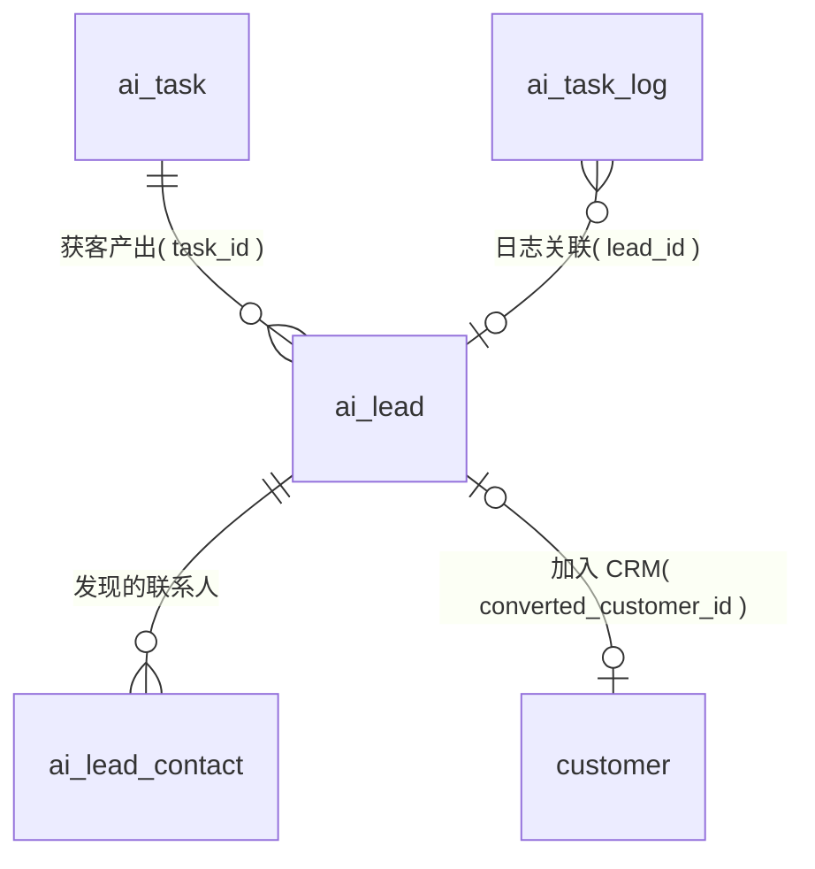

# 03 · AI 获客模块 ER

| 项 | 内容 |
|---|---|
| 覆盖需求 | [03-AI获客](../03-AI获客.md)（获客工作台 / 创建获客任务 / 客户发现列表） |
| 字段依据 | [页面级字段与接口文档/03-AI获客](../页面级字段与接口文档/03-AI获客.md) |
| 版本 | v0.4（2026-09-05，补充 lead 共享池与 add-to-crm 负责人归属口径，见 §4，无 DDL 变更）<br>v0.3（2026-09-05，同步需求 04 v0.2：`ai_lead_contact.decision_influence_pct` 口径说明，无 DDL 变更）<br>v0.2（2026-09-05，同步需求 v0.2：ai_lead 增加 company_domain 去重列与唯一索引，去重/限额口径落定）<br>v0.1（2026-09-04） |
| 前置 | 先执行 [00 §4 全局枚举](./00-数据库设计规范与总览.md)；任务模型复用 [02 模块](./02-AI员工与任务模块.md) |

---

## 1. ER 图



> 获客任务本身即 `ai_task(type='lead_hunting')`，输入存于 `ai_task.input`（goalText / parsed / targetCount），本模块不另设任务表（03 §0）。

---

## 2. 表定义

### 2.1 ai_lead（发现客户）

| 列 | 类型 | 约束 | 说明 |
|---|---|---|---|
| id | text | PK | `lead_` |
| org_id | text | NOT NULL FK→org | |
| task_id | text | FK→ai_task，可空 | 来源获客任务（列表可按 `taskId` 筛选） |
| company_name | text | NOT NULL | 公司名 |
| country | text | NOT NULL | 国家代码（如 `US`，前端国旗展示） |
| industry | text | | 行业 |
| website | text | | 官网（爬取来源，亦用于与 CRM 去重比对） |
| company_domain | text | | 归一化域名（小写、去 `www.` 前缀，应用层写入）；三级去重主键口径（需求 §3.6），org 级部分唯一索引兜底 |
| match_pct | smallint | NOT NULL CHECK (match_pct BETWEEN 0 AND 100) | 产品匹配度 |
| score_level | lead_value | NOT NULL | `high / medium / low` |
| insight | jsonb | NOT NULL | 匹配理由 Insight Schema：`{ value, confidence, reasons[] }`（03 §1.6，禁止纯数字） |
| overview | jsonb | | 公司画像：`{ companySize, foundedYear, customerType, mainProducts[] }`（客户 360° Overview 数据源） |
| analyzed_at | timestamptz | 可空 | 最近一次 AI 分析时间（batch-analyze 产出洞察后写入） |
| in_crm | boolean | NOT NULL DEFAULT false | 是否已加入 CRM（列表置灰/过滤） |
| converted_customer_id | text | 可空（FK 在 04 模块建表后补齐） | 转化后的客户 |
| created_at / updated_at | timestamptz | NOT NULL | |

### 2.2 ai_lead_contact（发现的联系人）

| 列 | 类型 | 约束 | 说明 |
|---|---|---|---|
| id | text | PK | `lcon_` |
| org_id | text | NOT NULL FK→org | |
| lead_id | text | NOT NULL FK→ai_lead | |
| name | text | NOT NULL | 姓名 |
| title | text | | 职位（如 Purchasing Manager） |
| email | text | | 公开商务邮箱（合规来源，接口不做隐私抓取，03 §4） |
| decision_influence_pct | smallint | CHECK (0–100) | 决策影响力（职衔规则基线，口径见需求 [04 §3.2](../04-客户360°.md)：90/75/40 档，未命中 NULL） |
| source | text | | 来源渠道（如 `official_site` / `linkedin_public`） |
| created_at / updated_at | timestamptz | NOT NULL | |

> 加入 CRM 时：`ai_lead_contact` 随 `convert` 接口复制为 `contact`（04 模块），原记录保留用于溯源。

---

## 3. DDL

```sql
CREATE TABLE ai_lead (
  id                    text PRIMARY KEY,
  org_id                text NOT NULL REFERENCES org(id),
  task_id               text REFERENCES ai_task(id),
  company_name          text NOT NULL,
  country               text NOT NULL,
  industry              text,
  website               text,
  company_domain        text,
  match_pct             smallint NOT NULL CHECK (match_pct BETWEEN 0 AND 100),
  score_level           lead_value NOT NULL,
  insight               jsonb NOT NULL,
  overview              jsonb,
  analyzed_at           timestamptz,
  in_crm                boolean NOT NULL DEFAULT false,
  converted_customer_id text,
  created_at            timestamptz NOT NULL DEFAULT now(),
  updated_at            timestamptz NOT NULL DEFAULT now()
);
CREATE INDEX idx_ai_lead_org_level    ON ai_lead (org_id, score_level) WHERE in_crm = false;
CREATE INDEX idx_ai_lead_org_task     ON ai_lead (org_id, task_id);
CREATE INDEX idx_ai_lead_org_country  ON ai_lead (org_id, country);
CREATE INDEX idx_ai_lead_name_trgm    ON ai_lead USING gin (company_name gin_trgm_ops);  -- keyword 模糊搜索（需 pg_trgm）
CREATE UNIQUE INDEX uq_ai_lead_org_domain ON ai_lead (org_id, company_domain) WHERE company_domain IS NOT NULL;  -- 跨任务去重兜底（需求 §3.6）

CREATE TABLE ai_lead_contact (
  id                     text PRIMARY KEY,
  org_id                 text NOT NULL REFERENCES org(id),
  lead_id                text NOT NULL REFERENCES ai_lead(id),
  name                   text NOT NULL,
  title                  text,
  email                  text,
  decision_influence_pct smallint CHECK (decision_influence_pct BETWEEN 0 AND 100),
  source                 text,
  created_at             timestamptz NOT NULL DEFAULT now(),
  updated_at             timestamptz NOT NULL DEFAULT now()
);
CREATE INDEX idx_ai_lead_contact_lead ON ai_lead_contact (lead_id);
```

> 跨模块 FK 在 04 模块建表后补齐：
> `ALTER TABLE ai_lead ADD CONSTRAINT fk_lead_customer FOREIGN KEY (converted_customer_id) REFERENCES customer(id);`

---

## 4. 设计说明与边界

- **创建任务**：`POST /lead-tasks` 先经 `POST /lead-tasks/parse`（AI 解析），最终写 `ai_task(input = { goalText, parsed, advancedSettings, targetCount })`；解析置信度随响应返回，不落库（03 §3.1）。`advancedSettings` 为 5 键结构（03 §3.4），jsonb 存储，不做列展开。
- **去重（v0.2 口径，03 §3.6）**：主键为 `company_domain`（归一化域名，`uq_ai_lead_org_domain` 部分唯一索引兜底）；无域名时 `lower(company_name)` 兜底 + pg_trgm 相似度辅助。任务内重复跳过爬取；跨任务命中未转化 lead → **不新建**，合并更新 `match_pct / insight / overview / analyzed_at`；`add-to-crm` 命中已有 customer → 不新建 customer，置 `in_crm=true` + `converted_customer_id` 指向已有客户，接口返回 `mapped`。
- **负责人归属（05 §7 已澄清）**：`ai_lead` 为 org 级共享池（无个人归属字段，按 `task_id` 溯源）；`add-to-crm` 由人工触发，新建 customer 的 `owner_id` 默认为操作人，可选 `ownerId` 仅经理/管理员可指定他人（业务员传他人 id `40301`）；命中已有客户（`mapped`）不改归属。
- **批量分析**：`POST /leads/batch-analyze` 返回 `taskId`，完成后逐 lead 更新 `insight / analyzed_at`（并供客户 360° AI 洞察引用）。
- **价值分档统计**：`GET /leads/summary` 按 `score_level` 聚合，走 `idx_ai_lead_org_level` 部分索引。
- **评分可解释红线**：`match_pct / score_level` 必须伴随 `insight.reasons`（证据来自 web_crawl / 知识检索），纯数字不给前端（03 §4）。
- **限额不新增设置表**：员工级外部调用日额度 `externalCallDailyLimit` 为员工 SOP 高级设置参数（存 `sop_template.content` 高级设置区，02 模块 §2.1）；LLM 成本日预算复用 `ai_model_setting.budget_limit`（01 模块 §2.8）；额度消耗为运行时状态，不落业务表（03 §3.7）。
