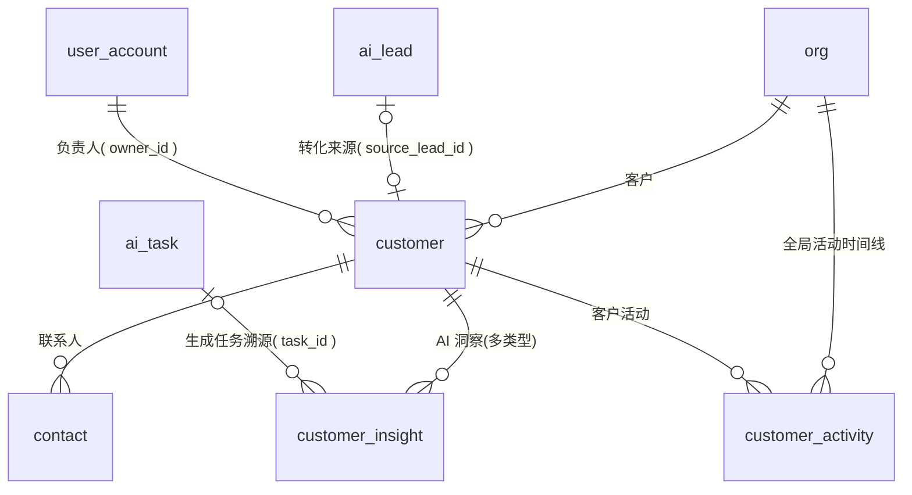

# 04 · 客户与 CRM 模块 ER

| 项 | 内容 |
|---|---|
| 覆盖需求 | [04-客户360°](../04-客户360°.md)、[05-CRM客户中心](../05-CRM客户中心.md) |
| 字段依据 | [页面级字段与接口文档/04](../页面级字段与接口文档/04-客户360°.md)、[05](../页面级字段与接口文档/05-CRM客户中心.md) |
| 版本 | v0.5（2026-09-05，补充联系人删除口径备注，无 DDL 变更，见 §2.2）<br>v0.4（2026-09-05，owner_id 转交规则与 `owner_change` 活动类型，见 05 §7）<br>v0.3（2026-09-05，customer 新增 `is_formal` 身份列，潜在/正式判定规则已澄清，见 §2.1 注）<br>v0.2（2026-09-05，contact 增加决策影响力证据链字段 `decision_influence_reasons`，口径见需求 04 §3.2）<br>v0.1（2026-09-04） |
| 前置 | 先执行 [00 §4 全局枚举](./00-数据库设计规范与总览.md) |

> 客户 360° 的各页签（Conversations / Quotes / Orders / Activities）均为其他模块数据的客户维度查询，本模块只落客户主数据、联系人、洞察与活动。

---

## 1. ER 图



---

## 2. 表定义

### 2.1 customer（客户）

| 列 | 类型 | 约束 | 说明 |
|---|---|---|---|
| id | text | PK | `cus_` |
| org_id | text | NOT NULL FK→org | |
| company_name | text | NOT NULL | 公司名 |
| country | text | NOT NULL | 国家 |
| website | text | | 官网 |
| industry | text | | 行业 |
| industry_tags | text[] | | 行业标签（如 `["Running","Sports"]`） |
| customer_type | customer_type | | `brand / distributor / factory / other` |
| stage | customer_stage | NOT NULL DEFAULT 'new_lead' | `new_lead / contacted / negotiation / cold` |
| is_formal | boolean | NOT NULL DEFAULT false | 客户身份：false 潜在（默认）/ true 正式；首次成交（quote `won`）自动置 true，负责人可手工改，不自动降级（05 §7） |
| score | smallint | CHECK (0–100) | 客户评分（🔥 Score 92%，来自 AI 分析） |
| owner_id | text | NOT NULL FK→user_account | 负责人（数据权限 scope 依据）；新建默认操作人，转交仅经理/管理员可改，写 `owner_change` 活动（05 §7） |
| source_lead_id | text | 可空（FK 见 03 模块补齐） | 获客转化来源 |
| next_action | jsonb | | 建议动作 `{ type, label }`（AI 建议/规则生成，05 §1.1） |
| remark | text | | 备注 |
| delete_locked | boolean | NOT NULL DEFAULT false | 删除待审锁定态（审批拒绝后自动解锁，05 §3.3） |
| created_by | text | FK→user_account，可空 | |
| created_at / updated_at | timestamptz | NOT NULL | |
| deleted_at | timestamptz | 可空 | 软删除（仅审批通过的客户删除写入） |

> 潜在/正式客户判定（已澄清，v0.3）：潜在/正式为**客户身份**（`is_formal`），与 `stage` 解耦。默认 `false`（潜在），负责人可在添加/编辑客户时手工归属；P1 起报价标记成交（09 `mark-won`，人工动作）触发首次成交自动升级为 `true` 并写活动流水，不自动降级；AI 不得变更身份（05 §7）。

### 2.2 contact（联系人）

| 列 | 类型 | 约束 | 说明 |
|---|---|---|---|
| id | text | PK | `con_` |
| org_id | text | NOT NULL FK→org | |
| customer_id | text | NOT NULL FK→customer | |
| name | text | NOT NULL | 姓名 |
| title | text | NOT NULL | 职位 |
| email | text | | 公开商务邮箱 |
| phone | text | | 电话 |
| decision_influence_pct | smallint | CHECK (0–100) | 决策影响力进度条数据源；`find_contact` 职衔规则基线（需求 04 §3.2：90/75/40 档），未命中 NULL；加入 CRM 时自 `ai_lead_contact` 复制 |
| decision_influence_reasons | jsonb | NOT NULL DEFAULT '[]' | AI 精化证据链 `[{ text, evidence, source }]`（Insight Schema，需求 04 §3.2；前端 Tooltip 展示，只读） |
| is_primary | boolean | NOT NULL DEFAULT false | 主联系人 |
| created_at / updated_at | timestamptz | NOT NULL | |

> 联系人删除为**硬删**（无软删列），单条普通写操作，不走审批、不写客户活动（05 接口 §3.5）；批量删除联系人不做（05 §7）。

### 2.3 customer_insight（客户 AI 洞察，Insight Schema）

| 列 | 类型 | 约束 | 说明 |
|---|---|---|---|
| id | text | PK | `cins_` |
| org_id | text | NOT NULL FK→org | |
| customer_id | text | NOT NULL FK→customer | UNIQUE(customer_id, insight_type) 同类型保留最新 |
| insight_type | insight_type | NOT NULL | `purchase_probability / reactivation / product_match …` |
| value | numeric | 可空 | 结论值（采购概率 % 等） |
| confidence | numeric(4,3) | CHECK (0–1) | 置信度 |
| reasons | jsonb | NOT NULL DEFAULT '[]' | 逐条证据 `[{ text, evidence, source }]`（04 §3.2 必须展示） |
| citations | jsonb | | 知识引用 `[{ docId, chunkId }]` |
| next_action | jsonb | | `{ type: contact_decision_maker|generate_outreach|send_quote, label, targetId }` |
| task_id | text | 可空 | 生成该洞察的 AI 分析任务 |
| generated_at | timestamptz | NOT NULL | 生成时间（前端刷新判断） |
| created_at / updated_at | timestamptz | NOT NULL | |

### 2.4 customer_activity（客户活动时间线）

| 列 | 类型 | 约束 | 说明 |
|---|---|---|---|
| id | text | PK | `act_` |
| org_id | text | NOT NULL FK→org | |
| customer_id | text | NOT NULL FK→customer | |
| type | activity_type | NOT NULL | `stage_change / owner_change / email / quote / follow_up / note / ai_action` |
| summary | text | NOT NULL | 活动摘要 |
| operator_type | operator_type | NOT NULL | `ai / user` |
| operator_id | text | 可空 | AI 员工（emp_）或用户（usr_）ID，多态 |
| operator_name | text | | 展示名快照 |
| ref_type | text | 可空 | 关联业务类型：`message / quote / sales_order / follow_up_execution / ai_task` |
| ref_id | text | 可空 | 关联业务 ID（多态，不建 FK） |
| created_at | timestamptz | NOT NULL DEFAULT now() | |

---

## 3. DDL

```sql
CREATE TABLE customer (
  id             text PRIMARY KEY,
  org_id         text NOT NULL REFERENCES org(id),
  company_name   text NOT NULL,
  country        text NOT NULL,
  website        text,
  industry       text,
  industry_tags  text[],
  customer_type  customer_type,
  stage          customer_stage NOT NULL DEFAULT 'new_lead',
  is_formal      boolean NOT NULL DEFAULT false,
  score          smallint CHECK (score BETWEEN 0 AND 100),
  owner_id       text NOT NULL REFERENCES user_account(id),
  source_lead_id text,
  next_action    jsonb,
  remark         text,
  delete_locked  boolean NOT NULL DEFAULT false,
  created_by     text REFERENCES user_account(id),
  created_at     timestamptz NOT NULL DEFAULT now(),
  updated_at     timestamptz NOT NULL DEFAULT now(),
  deleted_at     timestamptz
);
CREATE UNIQUE INDEX uq_customer_org_name ON customer (org_id, lower(company_name)) WHERE deleted_at IS NULL;
CREATE INDEX idx_customer_org_stage      ON customer (org_id, stage, updated_at DESC);
CREATE INDEX idx_customer_org_owner      ON customer (org_id, owner_id);
CREATE INDEX idx_customer_org_score      ON customer (org_id, score DESC) WHERE deleted_at IS NULL;
CREATE INDEX idx_customer_org_country    ON customer (org_id, country);
CREATE INDEX idx_customer_name_trgm      ON customer USING gin (company_name gin_trgm_ops);

ALTER TABLE ai_lead
  ADD CONSTRAINT fk_lead_customer FOREIGN KEY (converted_customer_id) REFERENCES customer(id);

CREATE TABLE contact (
  id                     text PRIMARY KEY,
  org_id                 text NOT NULL REFERENCES org(id),
  customer_id            text NOT NULL REFERENCES customer(id),
  name                   text NOT NULL,
  title                  text NOT NULL,
  email                  text,
  phone                  text,
  decision_influence_pct smallint CHECK (decision_influence_pct BETWEEN 0 AND 100),
  decision_influence_reasons jsonb NOT NULL DEFAULT '[]',
  is_primary             boolean NOT NULL DEFAULT false,
  created_at             timestamptz NOT NULL DEFAULT now(),
  updated_at             timestamptz NOT NULL DEFAULT now()
);
CREATE UNIQUE INDEX uq_contact_org_email ON contact (org_id, lower(email)) WHERE email IS NOT NULL;
CREATE INDEX idx_contact_customer ON contact (customer_id);

CREATE TABLE customer_insight (
  id           text PRIMARY KEY,
  org_id       text NOT NULL REFERENCES org(id),
  customer_id  text NOT NULL REFERENCES customer(id),
  insight_type insight_type NOT NULL,
  value        numeric,
  confidence   numeric(4,3) CHECK (confidence BETWEEN 0 AND 1),
  reasons      jsonb NOT NULL DEFAULT '[]',
  citations    jsonb,
  next_action  jsonb,
  task_id      text REFERENCES ai_task(id),
  generated_at timestamptz NOT NULL,
  created_at   timestamptz NOT NULL DEFAULT now(),
  updated_at   timestamptz NOT NULL DEFAULT now(),
  UNIQUE (customer_id, insight_type)
);
CREATE INDEX idx_customer_insight_generated ON customer_insight (customer_id, generated_at DESC);

CREATE TABLE customer_activity (
  id            text PRIMARY KEY,
  org_id        text NOT NULL REFERENCES org(id),
  customer_id   text NOT NULL REFERENCES customer(id),
  type          activity_type NOT NULL,
  summary       text NOT NULL,
  operator_type operator_type NOT NULL,
  operator_id   text,
  operator_name text,
  ref_type      text,
  ref_id        text,
  created_at    timestamptz NOT NULL DEFAULT now()
);
CREATE INDEX idx_activity_customer ON customer_activity (customer_id, created_at DESC);
CREATE INDEX idx_activity_org      ON customer_activity (org_id, created_at DESC);
CREATE INDEX idx_activity_type     ON customer_activity (org_id, type, created_at DESC);
```

---

## 4. 设计说明与边界

- **阶段流转**：仅沿阶段机正向流转或回退到 `contacted`（05 §3.2），每次流转自动写 `stage_change` 活动；**AI 身份禁止调用 stage 接口**（服务层按 operator 校验）。
- **客户删除**：`DELETE /customers/{id}` 不直接删除，置 `delete_locked=true` 并生成 `customer_delete` 审批；审批拒绝解锁，批准后写 `deleted_at`（软删除保留报价/订单追溯）。
- **超期未联系**：`overdueDays` 筛选基于 `customer_activity` 最近时间计算（`lastActivityAt` 为派生值），高价值超期是 Dashboard 待办来源之一。
- **重新激活**：Cold 客户的 `reactivateSuggestion` 落在 `customer_insight(insight_type='reactivation')`；执行时创建跟进策略（07），不自动发信。
- **决策影响力（v0.2 口径，需求 04 §3.2）**：两级产出——`find_contact` 职衔规则基线（确定性映射 90/75/40，未命中 NULL）随 convert 复制；「AI 分析 full」以 Insight Schema 精化，`confidence < 0.5` 不覆盖基线值，`reasons` 写入 `decision_influence_reasons`。MVP 前端只读，不设人工覆盖。
- **开发信草稿**：`generate-outreach` 为无会话联系人自动创建 outbound 会话并落草稿（06 模块表，`status=draft`）；发送走 06 人工确认 → 12 邮件发送审批。本模块不因此新增表。
- **360° 页签复用**：Conversations/Quotes/Orders 分别由 05/07 模块表按 `customer_id` 查询；产品匹配来自 `customer_insight(insight_type='product_match')` 或 lead.overview。
