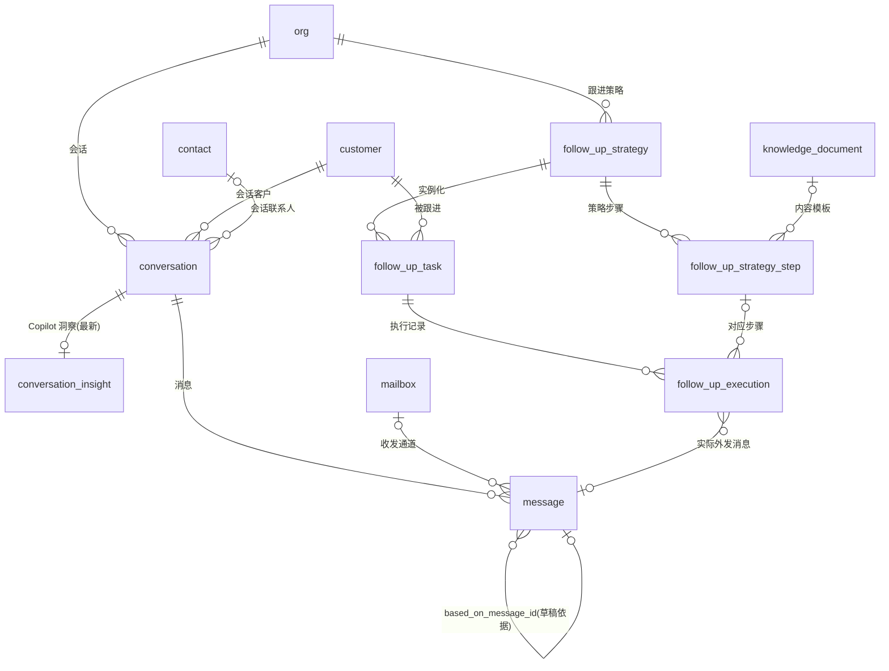

# 05 · 销售邮件与自动跟进模块 ER

| 项 | 内容 |
|---|---|
| 覆盖需求 | [06-AI销售工作台](../06-AI销售工作台.md)（收件箱/会话/AI Copilot）、[07-AI自动跟进](../07-AI自动跟进.md)（策略/跟进任务/执行记录） |
| 字段依据 | [页面级字段与接口文档/06](../页面级字段与接口文档/06-AI销售工作台.md)、[07](../页面级字段与接口文档/07-AI自动跟进.md) |
| 版本 | v0.4（2026-09-05，时区说明收口：「今天」/发送窗口按 org.timezone 企业当地解释，待澄清标记关闭，无 DDL 变更）<br>v0.3（2026-09-05，跟进挂载/时区/频控口径澄清：next_run_at 时窗顺延、skip_reason 增 frequency_capped、每客户单进行中任务约束，见 §2.6/§2.7，无 DDL 变更）<br>v0.2（2026-09-05，message 新增 `language` 列（可空），多语言回复口径见 06 §7）<br>v0.1（2026-09-04） |
| 前置 | 先执行 [00 §4 全局枚举](./00-数据库设计规范与总览.md) |

---

## 1. ER 图



---

## 2. 表定义

### 2.1 conversation（会话，06 左栏列表）

| 列 | 类型 | 约束 | 说明 |
|---|---|---|---|
| id | text | PK | `conv_` |
| org_id | text | NOT NULL FK→org | |
| customer_id | text | NOT NULL FK→customer | |
| contact_id | text | FK→contact，可空 | 会话联系人 |
| channel | text | NOT NULL DEFAULT 'email' | 渠道（v0.1 仅 email） |
| subject | text | | 主题（归一化后，用于会话聚合） |
| priority | conversation_priority | NOT NULL DEFAULT 'pending' | `high 🔥 / normal 🟢 / pending 🟡`（AI 排序，可人工调整） |
| unread_count | integer | NOT NULL DEFAULT 0 | 未读数 |
| last_message_at | timestamptz | | 最近消息时间（列表排序） |
| last_message_preview | text | | 最近消息摘要 |
| mailbox_id | text | 可空 | 归属邮箱通道 |
| created_at / updated_at | timestamptz | NOT NULL | |

### 2.2 message（消息；AI 草稿即 `status='draft'` 的行）

| 列 | 类型 | 约束 | 说明 |
|---|---|---|---|
| id | text | PK | `msg_`（API 的 draftId 即 msg_，06 §3.2） |
| org_id | text | NOT NULL FK→org | |
| conversation_id | text | NOT NULL FK→conversation | |
| direction | msg_direction | NOT NULL | `in（客户）/ out（我方）` |
| sender_type | sender_type | NOT NULL | `ai / user / contact` |
| sender_name | text | NOT NULL | 发送者展示名 |
| mailbox_id | text | FK→mailbox，可空 | 实际收发通道 |
| content | text | NOT NULL | 正文 |
| language | text | 可空 | 消息语言（来信检测 / 草稿生成语言）；草稿跟随最近一条 in 消息，无信号默认英文（06 §7） |
| status | msg_status | NOT NULL DEFAULT 'draft' | `draft / sent / failed` |
| citations | jsonb | | AI 草稿知识引用 `[{ docId, docName, chunkId }]`；空=知识库无依据（06 §3.2 红线） |
| based_on_message_id | text | FK→message，可空 | 草稿针对的客户消息 |
| edited_diff | jsonb | | 人工编辑差异 `[{ field, before, after }]`（采纳率统计，06 §4） |
| external_message_id | text | | 邮箱同步幂等键（Message-ID） |
| sent_at | timestamptz | 可空 | 发送时间 |
| created_at / updated_at | timestamptz | NOT NULL | |

### 2.3 conversation_insight（Copilot 洞察，每会话保留最新）

| 列 | 类型 | 约束 | 说明 |
|---|---|---|---|
| id | text | PK | `vins_` |
| org_id | text | NOT NULL FK→org | |
| conversation_id | text | NOT NULL FK→conversation | UNIQUE |
| intent | ai_intent | NOT NULL | `rfq / price_compare / logistics / sample / other` |
| purchase_probability | smallint | CHECK (0–100) | 采购概率 |
| suggestions | jsonb | NOT NULL DEFAULT '[]' | 勾选式建议 `[{ suggestionId, label }]`（apply 接口按 id 执行） |
| citations | jsonb | | Ask AI 引用 |
| generated_at | timestamptz | NOT NULL | |
| created_at / updated_at | timestamptz | NOT NULL | |

### 2.4 follow_up_strategy（跟进策略）

| 列 | 类型 | 约束 | 说明 |
|---|---|---|---|
| id | text | PK | `strat_` |
| org_id | text | NOT NULL FK→org | |
| name | text | NOT NULL | 策略名（默认策略「默认跟进策略」注册时种子化） |
| target_scope | jsonb | NOT NULL | `{ customerValue: ["high","medium"], industry?: [], tags?: [] }` |
| auto_send_policy | auto_send_policy | NOT NULL | `manual_review / auto_send / value_based`（高价值强制人工审核） |
| enabled | boolean | NOT NULL DEFAULT true | 启用状态 |
| is_default | boolean | NOT NULL DEFAULT false | 默认策略标记 |
| created_by | text | FK→user_account，可空 | |
| created_at / updated_at | timestamptz | NOT NULL | |

### 2.5 follow_up_strategy_step（策略步骤时间线）

| 列 | 类型 | 约束 | 说明 |
|---|---|---|---|
| id | text | PK | `sstep_` |
| org_id | text | NOT NULL FK→org | |
| strategy_id | text | NOT NULL FK→follow_up_strategy | |
| seq | smallint | NOT NULL | UNIQUE(strategy_id, seq) |
| day_offset | smallint | NOT NULL | 天偏移（默认策略 0/3/7/14/30；UNIQUE(strategy_id, day_offset)，重复天数 42201） |
| title | text | NOT NULL | 步骤名（如 Initial Email / Break-up Email） |
| template_id | text | FK→knowledge_document，可空 | 内容模板（知识中心） |
| content | text | | 内联内容（与 template 二选一） |
| channel | text | NOT NULL DEFAULT 'email' | 渠道 |
| is_breakup | boolean | NOT NULL DEFAULT false | Break-up 节点：`auto_send_policy` 强制 manual_review（07 §3.3） |
| created_at / updated_at | timestamptz | NOT NULL | |

### 2.6 follow_up_task（客户级跟进任务）

| 列 | 类型 | 约束 | 说明 |
|---|---|---|---|
| id | text | PK | `ftask_` |
| org_id | text | NOT NULL FK→org | |
| customer_id | text | NOT NULL FK→customer | |
| strategy_id | text | NOT NULL FK→follow_up_strategy | UNIQUE(org_id, customer_id, strategy_id) 一客户一策略单实例 |
| current_stage | follow_up_stage | NOT NULL DEFAULT 'follow_up_1' | `follow_up_1/2/3 / quote_followup` |
| next_run_at | timestamptz | | 下次跟进时间（调度依据，统一 UTC 存储）；触发按企业时区（`org.timezone`）换算，落在发送时间窗（`org.send_rules.sendWindow`，默认 09:00–18:00）外顺延至下一窗口起点（07 §7） |
| status | follow_up_task_status | NOT NULL DEFAULT 'ready' | `ready / scheduled / waiting_approval / completed / paused` |
| last_executed_at | timestamptz | 可空 | |
| created_at / updated_at | timestamptz | NOT NULL | |

> 挂载与运行约束（07 §7 已澄清）：每客户同时仅 **1 个进行中**（非 completed/paused）任务（应用层校验）；策略通过 `apply` 接口手动应用到客户（07 FR-07），按 `target_scope` 自动匹配挂载为 P1。

### 2.7 follow_up_execution（执行记录）

| 列 | 类型 | 约束 | 说明 |
|---|---|---|---|
| id | text | PK | `fexec_` |
| org_id | text | NOT NULL FK→org | |
| follow_up_task_id | text | NOT NULL FK→follow_up_task | |
| strategy_step_id | text | FK→follow_up_strategy_step，可空 | 对应步骤 |
| step_title | text | NOT NULL | 步骤名快照 |
| status | fexec_status | NOT NULL | `sent / waiting_approval / approved / rejected / failed / skipped` |
| content | text | | 实际发送内容 |
| message_id | text | FK→message，可空 | 实际外发消息 |
| approval_id | text | 可空（FK 见 08 模块补齐） | waiting_approval 时的 email_send 审批 |
| approved_by | text | FK→user_account，可空 | 审批人 |
| skip_reason | text | 可空 | `customer_replied`（客户回复自动暂停，07 §4）/ `frequency_capped`（频控顺延留痕，07 §7） |
| sent_at | timestamptz | 可空 | |
| created_at | timestamptz | NOT NULL DEFAULT now() | |

---

## 3. DDL

```sql
CREATE TABLE conversation (
  id                   text PRIMARY KEY,
  org_id               text NOT NULL REFERENCES org(id),
  customer_id          text NOT NULL REFERENCES customer(id),
  contact_id           text REFERENCES contact(id),
  channel              text NOT NULL DEFAULT 'email',
  subject              text,
  priority             conversation_priority NOT NULL DEFAULT 'pending',
  unread_count         integer NOT NULL DEFAULT 0,
  last_message_at      timestamptz,
  last_message_preview text,
  mailbox_id           text REFERENCES mailbox(id),
  created_at           timestamptz NOT NULL DEFAULT now(),
  updated_at           timestamptz NOT NULL DEFAULT now()
);
CREATE INDEX idx_conversation_org_recent   ON conversation (org_id, last_message_at DESC);
CREATE INDEX idx_conversation_org_priority ON conversation (org_id, priority);
CREATE INDEX idx_conversation_customer     ON conversation (customer_id);

CREATE TABLE message (
  id                  text PRIMARY KEY,
  org_id              text NOT NULL REFERENCES org(id),
  conversation_id     text NOT NULL REFERENCES conversation(id),
  direction           msg_direction NOT NULL,
  sender_type         sender_type NOT NULL,
  sender_name         text NOT NULL,
  mailbox_id          text REFERENCES mailbox(id),
  content             text NOT NULL,
  language            text,
  status              msg_status NOT NULL DEFAULT 'draft',
  citations           jsonb,
  based_on_message_id text REFERENCES message(id),
  edited_diff         jsonb,
  external_message_id text,
  sent_at             timestamptz,
  created_at          timestamptz NOT NULL DEFAULT now(),
  updated_at          timestamptz NOT NULL DEFAULT now()
);
CREATE INDEX idx_message_conversation ON message (conversation_id, created_at);
CREATE UNIQUE INDEX uq_message_external ON message (mailbox_id, external_message_id)
  WHERE external_message_id IS NOT NULL;
CREATE INDEX idx_message_draft ON message (org_id, status) WHERE status = 'draft';

CREATE TABLE conversation_insight (
  id                   text PRIMARY KEY,
  org_id               text NOT NULL REFERENCES org(id),
  conversation_id      text NOT NULL REFERENCES conversation(id),
  intent               ai_intent NOT NULL,
  purchase_probability smallint CHECK (purchase_probability BETWEEN 0 AND 100),
  suggestions          jsonb NOT NULL DEFAULT '[]',
  citations            jsonb,
  generated_at         timestamptz NOT NULL,
  created_at           timestamptz NOT NULL DEFAULT now(),
  updated_at           timestamptz NOT NULL DEFAULT now(),
  UNIQUE (conversation_id)
);

CREATE TABLE follow_up_strategy (
  id               text PRIMARY KEY,
  org_id           text NOT NULL REFERENCES org(id),
  name             text NOT NULL,
  target_scope     jsonb NOT NULL,
  auto_send_policy auto_send_policy NOT NULL,
  enabled          boolean NOT NULL DEFAULT true,
  is_default       boolean NOT NULL DEFAULT false,
  created_by       text REFERENCES user_account(id),
  created_at       timestamptz NOT NULL DEFAULT now(),
  updated_at       timestamptz NOT NULL DEFAULT now()
);

CREATE TABLE follow_up_strategy_step (
  id           text PRIMARY KEY,
  org_id       text NOT NULL REFERENCES org(id),
  strategy_id  text NOT NULL REFERENCES follow_up_strategy(id),
  seq          smallint NOT NULL,
  day_offset   smallint NOT NULL,
  title        text NOT NULL,
  template_id  text REFERENCES knowledge_document(id),
  content      text,
  channel      text NOT NULL DEFAULT 'email',
  is_breakup   boolean NOT NULL DEFAULT false,
  created_at   timestamptz NOT NULL DEFAULT now(),
  updated_at   timestamptz NOT NULL DEFAULT now(),
  UNIQUE (strategy_id, seq),
  UNIQUE (strategy_id, day_offset)
);

CREATE TABLE follow_up_task (
  id               text PRIMARY KEY,
  org_id           text NOT NULL REFERENCES org(id),
  customer_id      text NOT NULL REFERENCES customer(id),
  strategy_id      text NOT NULL REFERENCES follow_up_strategy(id),
  current_stage    follow_up_stage NOT NULL DEFAULT 'follow_up_1',
  next_run_at      timestamptz,
  status           follow_up_task_status NOT NULL DEFAULT 'ready',
  last_executed_at timestamptz,
  created_at       timestamptz NOT NULL DEFAULT now(),
  updated_at       timestamptz NOT NULL DEFAULT now(),
  UNIQUE (org_id, customer_id, strategy_id)
);
CREATE INDEX idx_ftask_schedule ON follow_up_task (org_id, status, next_run_at);

CREATE TABLE follow_up_execution (
  id                text PRIMARY KEY,
  org_id            text NOT NULL REFERENCES org(id),
  follow_up_task_id text NOT NULL REFERENCES follow_up_task(id),
  strategy_step_id  text REFERENCES follow_up_strategy_step(id),
  step_title        text NOT NULL,
  status            fexec_status NOT NULL,
  content           text,
  message_id        text REFERENCES message(id),
  approval_id       text,
  approved_by       text REFERENCES user_account(id),
  skip_reason       text,
  sent_at           timestamptz,
  created_at        timestamptz NOT NULL DEFAULT now()
);
CREATE INDEX idx_fexec_task   ON follow_up_execution (follow_up_task_id, created_at DESC);
CREATE INDEX idx_fexec_status ON follow_up_execution (org_id, status);
```

> 跨模块 FK 在 08 模块建表后补齐：
> `ALTER TABLE follow_up_execution ADD CONSTRAINT fk_fexec_approval FOREIGN KEY (approval_id) REFERENCES approval_request(id);`

---

## 4. 设计说明与边界

- **AI 只起草，人决定发送**：草稿 = `message(status='draft', sender_type='ai')`；`send` 接口按企业 `approval_policy` 分流：直发（`sent`）或生成 `email_send` 审批并把消息保持 `draft`（06 §3.3）。
- **邮箱同步**：收件由 mailbox 同步任务幂等写入（`external_message_id` 唯一）；新客户来信触发：会话 `unread_count +1`、`priority` 评估、**自动 pause 该客户进行中的 follow_up_task 并写 skipped 执行记录**（07 §4）。
- **发送频控**：`auto_send` 策略仍受同客户触达频率限制（配置在 16 通知/规则设置），服务端限流后才写 `sent`。
- **Ask AI / Copilot**：`conversation_insight` 每会话 UPSERT 最新一份；suggestions 以 `suggestionId` 支撑 apply 接口的 `insert_draft / create_tasks` 两种模式。
- **活动回写**：每次执行/发送均向 `customer_activity` 写 `follow_up / email` 活动（07 §4）。
- **时区**：`next_run_at` 统一存 UTC；「今天」与发送窗口按 **`org.timezone`**（企业当地）解释（07 v0.2 已澄清，默认 09:00–18:00）；按客户当地时间触发列后续增强。
