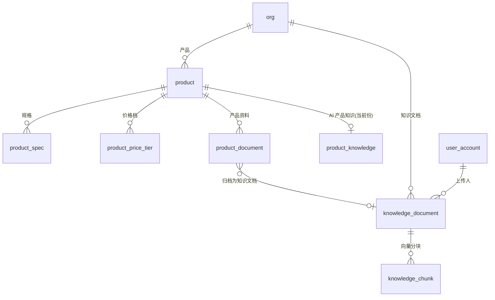

# 06 · 产品与知识模块 ER

| 项 | 内容 |
|---|---|
| 覆盖需求 | [08-产品中心](../08-产品中心.md)、[11-知识中心](../11-知识中心.md) |
| 字段依据 | [页面级字段与接口文档/08](../页面级字段与接口文档/08-产品中心.md)、[11](../页面级字段与接口文档/11-知识中心.md) |
| 版本 | v0.4（2026-09-05，知识软删留痕（P1-5）：`knowledge_document` 增 `deleted_at / deleted_by` 列、分块随删动物理清除、DDL `source` CHECK 补 `email_attachment`（修正 v0.3 「无 DDL 变更」笔误），见 §2.6）<br>v0.3（2026-09-05，知识 source 枚举扩展 email_attachment、覆盖式更新与权限口径澄清（11 §7），见 §2.6/§4，无 DDL 变更）<br>v0.2（2026-09-05，AI 知识生成输入边界（cost_price 隔离）与变体建模口径，见 §4，无 DDL 变更）<br>v0.1（2026-09-04） |
| 前置 | 先执行 [00 §4 全局枚举](./00-数据库设计规范与总览.md)；向量列依赖 pgvector 扩展 |

---

## 1. ER 图



---

## 2. 表定义

### 2.1 product（产品）

| 列 | 类型 | 约束 | 说明 |
|---|---|---|---|
| id | text | PK | `prod_` |
| org_id | text | NOT NULL FK→org | UNIQUE(org_id, sku) |
| sku | text | NOT NULL | SKU（如 `CF-001`，展示编号） |
| name | text | NOT NULL | 产品名 |
| category | text | | 分类（联动 pricing_rule_setting.product_categories） |
| image_url | text | | 主图 |
| moq | integer | NOT NULL | 最小起订量（报价校验 `quantity < MOQ` → 42201） |
| moq_unit | text | NOT NULL DEFAULT 'pcs' | 单位（如 pairs） |
| lead_time_days | smallint | NOT NULL | 交期（天） |
| material | text | | 材质 |
| description | text | | 描述 |
| cost_price | numeric(18,2) | NOT NULL | 采购成本（定价引擎输入，AI 无改价接口） |
| currency | char(3) | NOT NULL DEFAULT 'USD' | |
| suggested_price | numeric(18,2) | | 建议售价（报价规则计算输出，仅展示） |
| status | product_status | NOT NULL DEFAULT 'draft' | `active 🟢 / draft 🟡 / archived` |
| created_by | text | FK→user_account，可空 | |
| created_at / updated_at | timestamptz | NOT NULL | |

### 2.2 product_spec（规格，有序）

| 列 | 类型 | 约束 | 说明 |
|---|---|---|---|
| id | text | PK | `pspec_` |
| product_id | text | NOT NULL FK→product | UNIQUE(product_id, seq) |
| seq | smallint | NOT NULL | 顺序 |
| name | text | NOT NULL | 规格名（如 厚度） |
| value | text | NOT NULL | 规格值（如 2.5） |
| unit | text | | 单位（如 mm） |

### 2.3 product_price_tier（阶梯价格档）

| 列 | 类型 | 约束 | 说明 |
|---|---|---|---|
| id | text | PK | `ptier_` |
| product_id | text | NOT NULL FK→product | UNIQUE(product_id, min_qty) |
| min_qty | integer | NOT NULL CHECK (min_qty > 0) | 起始数量（如 500 / 5000） |
| unit_price | numeric(18,4) | NOT NULL | 档位单价 |

### 2.4 product_document（产品资料附件）

| 列 | 类型 | 约束 | 说明 |
|---|---|---|---|
| id | text | PK | `pdoc_` |
| org_id | text | NOT NULL FK→org | |
| product_id | text | NOT NULL FK→product | |
| file_name | text | NOT NULL | 文件名 |
| file_url | text | NOT NULL | 存储地址（对象存储） |
| size | bigint | | 字节数 |
| doc_type | product_doc_type | NOT NULL | `catalog / certification / test_report / other` |
| indexed | boolean | NOT NULL DEFAULT false | 是否已入知识中心索引 |
| knowledge_doc_id | text | 可空（FK 在下方补齐） | 归档的知识文档 |
| uploaded_by | text | FK→user_account，可空 | |
| created_at / updated_at | timestamptz | NOT NULL | |

### 2.5 product_knowledge（AI 产品知识，每产品当前一份）

| 列 | 类型 | 约束 | 说明 |
|---|---|---|---|
| id | text | PK | `pknow_` |
| org_id | text | NOT NULL FK→org | UNIQUE(product_id) |
| product_id | text | NOT NULL FK→product | |
| advantages | text[] | | 产品优势 |
| faqs | jsonb | | `[{ question, answer }]` |
| scenarios | text[] | | 推荐应用场景 |
| sales_scripts | text[] | | 销售话术 |
| status | text | NOT NULL DEFAULT 'draft' | `draft（AI 生成待确认）/ approved（人工确认启用）`，CHECK 约束 |
| citations | jsonb | | 生成引用（指向文档） |
| task_id | text | FK→ai_task，可空 | 生成任务溯源 |
| generated_at | timestamptz | 可空 | |
| confirmed_by | text | FK→user_account，可空 | 确认人 |
| confirmed_at | timestamptz | 可空 | |
| created_at / updated_at | timestamptz | NOT NULL | |

> 重新生成覆盖当前行（保留 `generated_at` 历史；如需多版本再加版本表，v0.1 不做）。`status='approved'` 后才对 AI 销售/报价场景可见（08 §3.2）。

### 2.6 knowledge_document（知识文档）

| 列 | 类型 | 约束 | 说明 |
|---|---|---|---|
| id | text | PK | `doc_` |
| org_id | text | NOT NULL FK→org | |
| file_name | text | NOT NULL | 文件名 |
| category | knowledge_category | NOT NULL | `product / company / sales / customer / faq / process / other` |
| file_type | text | | 格式（pdf/docx/md/txt，白名单校验，暂定 ≤50MB） |
| size | bigint | | 字节数 |
| file_url | text | NOT NULL | 存储地址 |
| status | index_status | NOT NULL DEFAULT 'indexing' | `indexed ✓ / indexing ⏳ / failed` |
| error | text | | 失败原因（连续失败明确提示，11 §3.2） |
| retry_count | smallint | NOT NULL DEFAULT 0 | 重试次数 |
| source | text | NOT NULL DEFAULT 'upload' | `upload / product`（产品资料自动归档）/ `email_attachment`（06 会话附件一键入库，11 §7） |
| product_id | text | FK→product，可空 | 来源产品 |
| uploaded_by | text | FK→user_account，可空 | |
| indexed_at | timestamptz | 可空 | 最近索引完成时间 |
| deleted_at | timestamptz | 可空 | 软删标记（非空 = 已删除；检索 / 列表强制 `deleted_at IS NULL`，引用实时失效） |
| deleted_by | text | FK→user_account，可空 | 删除人（仅经理 / 管理员，11 §7.3） |
| created_at / updated_at | timestamptz | NOT NULL | |

> 删除为**软删留痕（v0.4 收口，11 §7.2）**：置 `deleted_at / deleted_by`，文档行保留——报价依据 / 草稿 / 审批 outputs 中引用的 docId 仍可回溯标题、分类、来源、上传人（展示标记「已删除」），审计可重建引用现场；`knowledge_chunk`（含向量）随删动物理清除，检索天然不可命中（「引用实时失效」语义不变：检索直查、无长缓存）。覆盖式更新 = 软删旧文档 + 上传新文档（新文档新 ID，引用不迁移）。

### 2.7 knowledge_chunk（知识分块 + 向量）

| 列 | 类型 | 约束 | 说明 |
|---|---|---|---|
| id | text | PK | `chk_`（引用溯源三元组 docId/docName/chunkId） |
| org_id | text | NOT NULL FK→org | |
| document_id | text | NOT NULL FK→knowledge_document | UNIQUE(document_id, chunk_index) |
| chunk_index | integer | NOT NULL | 块序号 |
| content | text | NOT NULL | 文本片段 |
| token_count | integer | | token 数 |
| embedding | vector(1536) | | pgvector 向量（维度按嵌入模型定，随 ai_model_setting 配置） |
| metadata | jsonb | | 页码/标题等检索元数据 |
| created_at | timestamptz | NOT NULL DEFAULT now() | |

---

## 3. DDL

```sql
CREATE EXTENSION IF NOT EXISTS vector;      -- pgvector
CREATE EXTENSION IF NOT EXISTS pg_trgm;     -- 模糊搜索（03/04 模块亦用）

CREATE TABLE product (
  id              text PRIMARY KEY,
  org_id          text NOT NULL REFERENCES org(id),
  sku             text NOT NULL,
  name            text NOT NULL,
  category        text,
  image_url       text,
  moq             integer NOT NULL,
  moq_unit        text NOT NULL DEFAULT 'pcs',
  lead_time_days  smallint NOT NULL,
  material        text,
  description     text,
  cost_price      numeric(18,2) NOT NULL,
  currency        char(3) NOT NULL DEFAULT 'USD',
  suggested_price numeric(18,2),
  status          product_status NOT NULL DEFAULT 'draft',
  created_by      text REFERENCES user_account(id),
  created_at      timestamptz NOT NULL DEFAULT now(),
  updated_at      timestamptz NOT NULL DEFAULT now(),
  UNIQUE (org_id, sku)
);
CREATE INDEX idx_product_org_status   ON product (org_id, status);
CREATE INDEX idx_product_org_category ON product (org_id, category);
CREATE INDEX idx_product_name_trgm    ON product USING gin (name gin_trgm_ops);

CREATE TABLE product_spec (
  id         text PRIMARY KEY,
  product_id text NOT NULL REFERENCES product(id),
  seq        smallint NOT NULL,
  name       text NOT NULL,
  value      text NOT NULL,
  unit       text,
  UNIQUE (product_id, seq)
);

CREATE TABLE product_price_tier (
  id         text PRIMARY KEY,
  product_id text NOT NULL REFERENCES product(id),
  min_qty    integer NOT NULL CHECK (min_qty > 0),
  unit_price numeric(18,4) NOT NULL,
  UNIQUE (product_id, min_qty)
);

CREATE TABLE product_document (
  id               text PRIMARY KEY,
  org_id           text NOT NULL REFERENCES org(id),
  product_id       text NOT NULL REFERENCES product(id),
  file_name        text NOT NULL,
  file_url         text NOT NULL,
  size             bigint,
  doc_type         product_doc_type NOT NULL,
  indexed          boolean NOT NULL DEFAULT false,
  knowledge_doc_id text,
  uploaded_by      text REFERENCES user_account(id),
  created_at       timestamptz NOT NULL DEFAULT now(),
  updated_at       timestamptz NOT NULL DEFAULT now()
);
CREATE INDEX idx_pdoc_product ON product_document (product_id);

CREATE TABLE product_knowledge (
  id            text PRIMARY KEY,
  org_id        text NOT NULL REFERENCES org(id),
  product_id    text NOT NULL REFERENCES product(id),
  advantages    text[],
  faqs          jsonb,
  scenarios     text[],
  sales_scripts text[],
  status        text NOT NULL DEFAULT 'draft' CHECK (status IN ('draft','approved')),
  citations     jsonb,
  task_id       text REFERENCES ai_task(id),
  generated_at  timestamptz,
  confirmed_by  text REFERENCES user_account(id),
  confirmed_at  timestamptz,
  created_at    timestamptz NOT NULL DEFAULT now(),
  updated_at    timestamptz NOT NULL DEFAULT now(),
  UNIQUE (product_id)
);

CREATE TABLE knowledge_document (
  id          text PRIMARY KEY,
  org_id      text NOT NULL REFERENCES org(id),
  file_name   text NOT NULL,
  category    knowledge_category NOT NULL,
  file_type   text,
  size        bigint,
  file_url    text NOT NULL,
  status      index_status NOT NULL DEFAULT 'indexing',
  error       text,
  retry_count smallint NOT NULL DEFAULT 0,
  source      text NOT NULL DEFAULT 'upload' CHECK (source IN ('upload','product','email_attachment')),
  product_id  text REFERENCES product(id),
  uploaded_by text REFERENCES user_account(id),
  indexed_at  timestamptz,
  deleted_at  timestamptz,
  deleted_by  text REFERENCES user_account(id),
  created_at  timestamptz NOT NULL DEFAULT now(),
  updated_at  timestamptz NOT NULL DEFAULT now()
);
CREATE INDEX idx_kdoc_org_category ON knowledge_document (org_id, category);
CREATE INDEX idx_kdoc_org_status   ON knowledge_document (org_id, status);

ALTER TABLE product_document
  ADD CONSTRAINT fk_pdoc_kdoc FOREIGN KEY (knowledge_doc_id) REFERENCES knowledge_document(id);

CREATE TABLE knowledge_chunk (
  id           text PRIMARY KEY,
  org_id       text NOT NULL REFERENCES org(id),
  document_id  text NOT NULL REFERENCES knowledge_document(id),
  chunk_index  integer NOT NULL,
  content      text NOT NULL,
  token_count  integer,
  embedding    vector(1536),
  metadata     jsonb,
  created_at   timestamptz NOT NULL DEFAULT now(),
  UNIQUE (document_id, chunk_index)
);
CREATE INDEX idx_kchunk_doc ON knowledge_chunk (document_id);
-- 向量索引（数据量上来后启用，按实际维度/距离度量调整）：
-- CREATE INDEX idx_kchunk_embedding ON knowledge_chunk USING hnsw (embedding vector_cosine_ops);
```

---

## 4. 设计说明与边界

- **知识库是 AI 事实唯一来源**：06 草稿、03 匹配、09 报价依据、13 经营分析的 `citations` 必须可回溯 `docId/chunkId`；`POST /knowledge/search` 按 `scene` 与调用方权限过滤（11 §4）。
- **检索流程**：`query → embedding → hnsw 近邻 → knowledge_chunk → join knowledge_document` 返回三元组 + `score`；`noResult=true` 时调用方必须明示「知识库无相关信息」，禁止编造（11 §3.3）。
- **产品资料归档**：`POST /products/{id}/documents` 同时创建 `knowledge_document(source='product', category='product')` 并回写 `knowledge_doc_id / indexed`。
- **价格红线**：`product.cost_price / price_tiers` 为结构化数据，报价引擎（09 模块）读取；`suggested_price` 仅展示；AI 无任何改价接口（08 §4）。
- **AI 知识生成输入边界（08 §7 已澄清）**：输入 = 产品结构化数据（Overview / Specifications / Pricing）+ 已索引产品资料（`product_document.indexed=true` 且 `source='product'`）；**`cost_price` 不进入生成 prompt**（AI Knowledge 会被 06 草稿 / 09 报价场景引用，防成本泄漏进产出）；产出四类条目（advantages/faqs/scenarios/sales_scripts），`citations` 必须可回溯。
- **变体建模（08 §7 已澄清）**：多变体产品以**独立产品行**承载（各自 SKU / MOQ / cost_price / price_tiers / spec），命名规范区分（如 "Carbon Fiber Insoles - 2.5mm"）；下游报价 / AI 均按单 SKU 粒度；列表聚合视图 v0.1 不做，P1 交付时视体验评估加 `parent_id` 自引用列。
- **知识权限与版本（11 §7 已澄清）**：检索 / 引用 org 级全量共享（AI 员工需全量知识），不按角色过滤；上传全员（`uploaded_by` 记录贡献人），删除 / 重试仅经理与管理员（`40301`）；覆盖式更新（删旧传新：旧文档**软删留痕**、分块物理清除，引用实时失效），不做多版本共存；敏感分类列后续增强。
- **索引状态机**：`indexing → indexed | failed`；失败可 retry（`retry_count+1`），不允许静默丢失知识（11 §3.2）。
