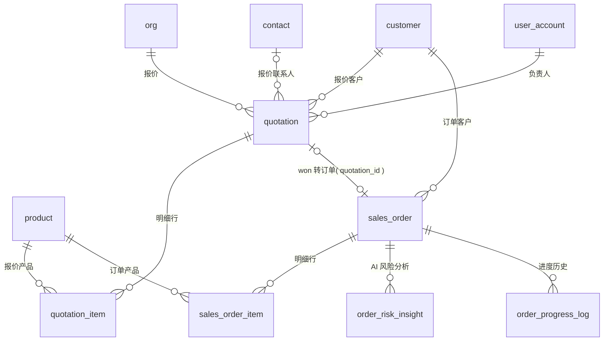

# 07 · 报价与订单模块 ER

| 项 | 内容 |
|---|---|
| 覆盖需求 | [09-报价中心](../09-报价中心.md)、[10-订单中心](../10-订单中心.md) |
| 字段依据 | [页面级字段与接口文档/09](../页面级字段与接口文档/09-报价中心.md)、[10](../页面级字段与接口文档/10-订单中心.md) |
| 版本 | v0.1（2026-09-04） |
| 前置 | 先执行 [00 §4 全局枚举](./00-数据库设计规范与总览.md)；定价输入依赖 [06 模块产品表](./06-产品与知识模块.md) |

---

## 1. ER 图



---

## 2. 表定义

### 2.1 quotation（报价单）

| 列 | 类型 | 约束 | 说明 |
|---|---|---|---|
| id | text | PK | `quote_` |
| org_id | text | NOT NULL FK→org | UNIQUE(org_id, quote_no) |
| quote_no | text | NOT NULL | 展示编号 `QT-20260904-001`（服务端生成） |
| customer_id | text | NOT NULL FK→customer | |
| contact_id | text | FK→contact，可空 | 收件联系人 |
| currency | char(3) | NOT NULL | 币种（ISO 4217） |
| incoterms | text | NOT NULL | 贸易条款 `FOB / CIF / EXW / DDP …`（法律效力，必填结构化） |
| valid_until | date | NOT NULL | Offer 有效期（`<= 今天` 拒绝，09 §3.1） |
| exchange_rate | numeric(18,8) | NOT NULL | 汇率时点值 |
| exchange_rate_date | date | NOT NULL | 汇率日期 |
| exchange_rate_source | text | NOT NULL | 汇率源（org 设置） |
| payment_terms | text | NOT NULL | 付款条款（如 T/T 30% deposit） |
| total_amount | numeric(18,2) | NOT NULL | 总金额（明细 `line_total` 汇总，服务端核算） |
| status | quote_status | NOT NULL DEFAULT 'draft' | `draft → waiting_approval → sent → won / lost`；仅 draft 可编辑 |
| ai_pricing | jsonb | | AI 定价建议 Insight：`{ suggestedUnitPrice, profitMarginPct, costBreakdown, reasons[], generatedAt }`（定价引擎输出，非 LLM 报价） |
| profit_margin_pct | numeric(5,2) | | 当前利润率（红线 100% 拦截的核算结果） |
| approval_id | text | 可空（FK 见 08 模块补齐） | 当前关联 quote 审批 |
| owner_id | text | NOT NULL FK→user_account | 负责人 |
| sent_at / won_at | timestamptz | 可空 | 发送 / 成交时间 |
| lost_reason | text | | 失效原因 |
| created_by | text | FK→user_account，可空 | |
| created_at / updated_at | timestamptz | NOT NULL | |

### 2.2 quotation_item（报价明细）

| 列 | 类型 | 约束 | 说明 |
|---|---|---|---|
| id | text | PK | `qitem_` |
| quotation_id | text | NOT NULL FK→quotation | UNIQUE(quotation_id, seq) |
| seq | smallint | NOT NULL | 行号 |
| product_id | text | NOT NULL FK→product | |
| product_name | text | NOT NULL | 产品名快照（防产品改名影响历史单据） |
| quantity | integer | NOT NULL CHECK (quantity > 0) | 数量（≥ 产品 MOQ） |
| unit_price | numeric(18,4) | NOT NULL | 单价 |
| line_total | numeric(18,2) | NOT NULL | 行总价（服务端核算） |

### 2.3 sales_order（订单，避开保留字 order）

| 列 | 类型 | 约束 | 说明 |
|---|---|---|---|
| id | text | PK | `order_` |
| org_id | text | NOT NULL FK→org | UNIQUE(org_id, order_no) |
| order_no | text | NOT NULL | 展示编号 `SO-20260904-001` |
| customer_id | text | NOT NULL FK→customer | |
| contact_id | text | FK→contact，可空 | |
| quotation_id | text | FK→quotation，可空 | 来源报价（须 `won`，10 §3.1） |
| delivery_date | date | NOT NULL | 交期 |
| payment_terms | text | | 付款条款/尾款节点 |
| amount | numeric(18,2) | NOT NULL | 订单金额 |
| currency | char(3) | NOT NULL | |
| status | order_status | NOT NULL DEFAULT 'pending_payment' | `pending_payment / in_production / ready_to_ship / completed` |
| risk | order_risk | NOT NULL DEFAULT 'normal' | `normal / at_risk`（无证据不给风险标记，10 §4） |
| progress_po_confirmed | boolean | NOT NULL DEFAULT false | 进度：PO 确认 |
| progress_payment | boolean | NOT NULL DEFAULT false | 进度：已付款 |
| production_pct | smallint | NOT NULL DEFAULT 0 CHECK (0–100) | 进度：生产百分比 |
| progress_shipping | boolean | NOT NULL DEFAULT false | 进度：已发货 |
| owner_id | text | NOT NULL FK→user_account | 负责人 |
| created_by | text | FK→user_account，可空 | |
| created_at / updated_at | timestamptz | NOT NULL | |

> **订单变更**：`PUT /orders/{id}` 不直接改列，变更内容（deliveryDate/amount/items）写入 `approval_request.context.changes`，`approve` 回调后一次性落列并写 `order_progress_log`（10 §3.2，AI 身份直接 40301）。

### 2.4 sales_order_item（订单明细）

结构同 quotation_item：`id(oitem_) / org_id / sales_order_id FK / seq / product_id / product_name / quantity / unit_price / line_total`，`UNIQUE(sales_order_id, seq)`。

### 2.5 order_risk_insight（AI 风险分析，Insight Schema）

| 列 | 类型 | 约束 | 说明 |
|---|---|---|---|
| id | text | PK | `orisk_` |
| org_id | text | NOT NULL FK→org | |
| sales_order_id | text | NOT NULL FK→sales_order | |
| delay_days | smallint | NOT NULL | 预计延期天数（**估算值**，前端必须标注） |
| reason | text | NOT NULL | 可核查原因（如「生产进度低于计划」） |
| evidence | jsonb | NOT NULL | `{ plannedPct, actualPct, planSource }`（必填，缺数据不出风险） |
| suggestions | jsonb | NOT NULL DEFAULT '[]' | `[{ suggestionId, type: internal|customer, label }]`；execute 时 internal→建任务、customer→建审批（10 §3.4） |
| confidence | numeric(4,3) | CHECK (0–1) | 置信度 |
| status | text | NOT NULL DEFAULT 'active' | `active / resolved`，CHECK |
| generated_at | timestamptz | NOT NULL | |
| resolved_at | timestamptz | 可空 | |
| created_at / updated_at | timestamptz | NOT NULL | |

### 2.6 order_progress_log（进度变更历史，可选）

| 列 | 类型 | 约束 | 说明 |
|---|---|---|---|
| id | text | PK | `oplog_` |
| org_id | text | NOT NULL FK→org | |
| sales_order_id | text | NOT NULL FK→sales_order | |
| production_pct | smallint | NOT NULL | 变更后生产进度 |
| note | text | | 说明 |
| updated_by | text | FK→user_account，可空 | 手工填报人（v0.1 入口；ERP/MES 对接待澄清） |
| created_at | timestamptz | NOT NULL DEFAULT now() | |

---

## 3. DDL

```sql
CREATE TABLE quotation (
  id                   text PRIMARY KEY,
  org_id               text NOT NULL REFERENCES org(id),
  quote_no             text NOT NULL,
  customer_id          text NOT NULL REFERENCES customer(id),
  contact_id           text REFERENCES contact(id),
  currency             char(3) NOT NULL,
  incoterms            text NOT NULL,
  valid_until          date NOT NULL,
  exchange_rate        numeric(18,8) NOT NULL,
  exchange_rate_date   date NOT NULL,
  exchange_rate_source text NOT NULL,
  payment_terms        text NOT NULL,
  total_amount         numeric(18,2) NOT NULL,
  status               quote_status NOT NULL DEFAULT 'draft',
  ai_pricing           jsonb,
  profit_margin_pct    numeric(5,2),
  approval_id          text,
  owner_id             text NOT NULL REFERENCES user_account(id),
  sent_at              timestamptz,
  won_at               timestamptz,
  lost_reason          text,
  created_by           text REFERENCES user_account(id),
  created_at           timestamptz NOT NULL DEFAULT now(),
  updated_at           timestamptz NOT NULL DEFAULT now(),
  UNIQUE (org_id, quote_no)
);
CREATE INDEX idx_quote_org_status ON quotation (org_id, status, created_at DESC);
CREATE INDEX idx_quote_customer   ON quotation (customer_id);
CREATE INDEX idx_quote_owner      ON quotation (org_id, owner_id);

CREATE TABLE quotation_item (
  id            text PRIMARY KEY,
  org_id        text NOT NULL REFERENCES org(id),
  quotation_id  text NOT NULL REFERENCES quotation(id),
  seq           smallint NOT NULL,
  product_id    text NOT NULL REFERENCES product(id),
  product_name  text NOT NULL,
  quantity      integer NOT NULL CHECK (quantity > 0),
  unit_price    numeric(18,4) NOT NULL,
  line_total    numeric(18,2) NOT NULL,
  UNIQUE (quotation_id, seq)
);

CREATE TABLE sales_order (
  id                     text PRIMARY KEY,
  org_id                 text NOT NULL REFERENCES org(id),
  order_no               text NOT NULL,
  customer_id            text NOT NULL REFERENCES customer(id),
  contact_id             text REFERENCES contact(id),
  quotation_id           text REFERENCES quotation(id),
  delivery_date          date NOT NULL,
  payment_terms          text,
  amount                 numeric(18,2) NOT NULL,
  currency               char(3) NOT NULL,
  status                 order_status NOT NULL DEFAULT 'pending_payment',
  risk                   order_risk NOT NULL DEFAULT 'normal',
  progress_po_confirmed  boolean NOT NULL DEFAULT false,
  progress_payment       boolean NOT NULL DEFAULT false,
  production_pct         smallint NOT NULL DEFAULT 0 CHECK (production_pct BETWEEN 0 AND 100),
  progress_shipping      boolean NOT NULL DEFAULT false,
  owner_id               text NOT NULL REFERENCES user_account(id),
  created_by             text REFERENCES user_account(id),
  created_at             timestamptz NOT NULL DEFAULT now(),
  updated_at             timestamptz NOT NULL DEFAULT now(),
  UNIQUE (org_id, order_no)
);
CREATE INDEX idx_order_org_status ON sales_order (org_id, status, created_at DESC);
CREATE INDEX idx_order_org_risk   ON sales_order (org_id, risk) WHERE risk = 'at_risk';
CREATE INDEX idx_order_customer   ON sales_order (customer_id);
CREATE INDEX idx_order_delivery   ON sales_order (org_id, delivery_date);

CREATE TABLE sales_order_item (
  id            text PRIMARY KEY,
  org_id        text NOT NULL REFERENCES org(id),
  sales_order_id text NOT NULL REFERENCES sales_order(id),
  seq           smallint NOT NULL,
  product_id    text NOT NULL REFERENCES product(id),
  product_name  text NOT NULL,
  quantity      integer NOT NULL CHECK (quantity > 0),
  unit_price    numeric(18,4) NOT NULL,
  line_total    numeric(18,2) NOT NULL,
  UNIQUE (sales_order_id, seq)
);

CREATE TABLE order_risk_insight (
  id             text PRIMARY KEY,
  org_id         text NOT NULL REFERENCES org(id),
  sales_order_id text NOT NULL REFERENCES sales_order(id),
  delay_days     smallint NOT NULL,
  reason         text NOT NULL,
  evidence       jsonb NOT NULL,
  suggestions    jsonb NOT NULL DEFAULT '[]',
  confidence     numeric(4,3) CHECK (confidence BETWEEN 0 AND 1),
  status         text NOT NULL DEFAULT 'active' CHECK (status IN ('active','resolved')),
  generated_at   timestamptz NOT NULL,
  resolved_at    timestamptz,
  created_at     timestamptz NOT NULL DEFAULT now(),
  updated_at     timestamptz NOT NULL DEFAULT now()
);
CREATE INDEX idx_orisk_order ON order_risk_insight (sales_order_id, generated_at DESC);

CREATE TABLE order_progress_log (
  id             text PRIMARY KEY,
  org_id         text NOT NULL REFERENCES org(id),
  sales_order_id text NOT NULL REFERENCES sales_order(id),
  production_pct smallint NOT NULL,
  note           text,
  updated_by     text REFERENCES user_account(id),
  created_at     timestamptz NOT NULL DEFAULT now()
);
CREATE INDEX idx_oplog_order ON order_progress_log (sales_order_id, created_at DESC);

-- 跨模块 FK（08 模块建表后补齐）
-- ALTER TABLE quotation ADD CONSTRAINT fk_quote_approval FOREIGN KEY (approval_id) REFERENCES approval_request(id);
```

---

## 4. 设计说明与边界

- **价格不许 LLM 自由生成**：`ai-pricing` 由结构化定价引擎（成本 + 价格档 + 历史成交）计算，LLM 仅产出 `reasons` 表达；`unit_price` 低于 `profit_floor_pct` 红线时保存/提交被 100% 拦截（09 §3.2）。
- **状态机**：报价 `draft → waiting_approval → sent → won | lost`，编辑仅限 draft（非法流转 `40901`）；提交/发送分别产生并消费 quote 审批。
- **转订单**：`POST /orders/from-quote` 校验 `quotation.status='won'`，复制明细进 `sales_order_item` 并记 `quotation_id` 溯源。
- **风险预警**：每次进度更新后评估；`plannedPct` 来自 `order_progress_log`/计划口径，缺证据则保持 `risk='normal'`；`delayDays` 一律视为估算（10 §4）。
- **客户维度回写**：客户 360° 的 Quotes / Orders 页签直接按 `customer_id` 查询本模块两表。
- **审批驳回回流**：quote / order_change 审批拒绝的 `reason` 写入对应 AI 员工反馈队列（12 §3.4），用于修正闭环。
