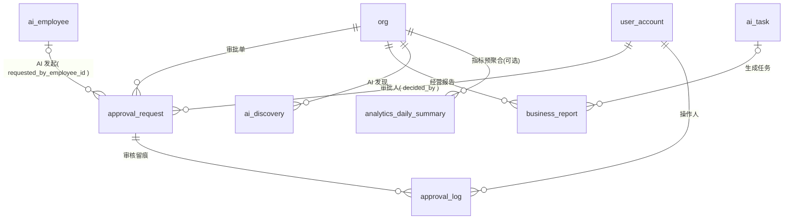

# 08 · 审核与数据中心模块 ER

| 项 | 内容 |
|---|---|
| 覆盖需求 | [12-AI审核中心](../12-AI审核中心.md)、[13-AI外贸经理](../13-AI外贸经理.md)、[15-数据中心](../15-数据中心.md)、[01-Dashboard工作台](../01-Dashboard工作台.md)（数据源） |
| 字段依据 | [页面级字段与接口文档/12](../页面级字段与接口文档/12-AI审核中心.md)、[13](../页面级字段与接口文档/13-AI外贸经理.md)、[15](../页面级字段与接口文档/15-数据中心.md)、[01](../页面级字段与接口文档/01-Dashboard工作台.md) |
| 版本 | v0.6（2026-09-05，`approval_status` 枚举新增 `expired`（§2.1 status / §2.2 approval_log.action，超时终态级联语义对齐 Runtime §4.7 / 12 §7.2，P0-3），DDL 变更见 00 §4）<br>v0.5（2026-09-05，`promoted_inquiries` 归因说明收口（15 v0.2 已澄清：14 天窗口最后触点），无 DDL 变更）<br>v0.4（2026-09-05，AI 贡献指标口径与导出口径澄清（15 §7），见 §4，无 DDL 变更）<br>v0.3（2026-09-05，经营报告结构模板与一键动作边界澄清（13 §7），见 §4，无 DDL 变更）<br>v0.2（2026-09-05，`approval_status` 枚举新增 `auto_approved`（自动通过留痕，12 §7），见 §2.1/§2.2/§4，DDL 变更见 00 §4）<br>v0.1（2026-09-04） |
| 前置 | 先执行 [00 §4 全局枚举](./00-数据库设计规范与总览.md) |

---

## 1. ER 图



> **多态引用**：`approval_request.biz_type + biz_id` 指向业务对象（`quotation / message / sales_order / customer / follow_up_execution / ai_task`），不建外键；业务表反向持有 `approval_id`（见 05/07 模块）。

---

## 2. 表定义

### 2.1 approval_request（审批单）

| 列 | 类型 | 约束 | 说明 |
|---|---|---|---|
| id | text | PK | `appr_` |
| org_id | text | NOT NULL FK→org | |
| approval_type | approval_type | NOT NULL | `quote / email_send / contract / order_change / bulk_marketing / customer_delete` |
| risk_level | risk_level | NOT NULL | `high（报价/合同/删除）/ medium / low` |
| title | text | NOT NULL | 卡片标题（如「报价审核」） |
| biz_type | text | NOT NULL | 业务对象类型：`quotation / message / sales_order / customer / follow_up_execution / ai_task` |
| biz_id | text | NOT NULL | 业务对象 ID（多态引用） |
| context | jsonb | NOT NULL | 按类型差异化上下文（12 §1.3：quote 带 customerId/quantity…；order_change 带 `changes[{field,before,after}]`…） |
| ai_proposal | jsonb | NOT NULL | AI 建议内容（如 `{ suggestedUnitPrice }` / `{ emailContent }` / `{ changes }`） |
| confidence | numeric(4,3) | CHECK (0–1) | 置信度（禁止虚构） |
| reasons | jsonb | NOT NULL DEFAULT '[]' | Insight Schema 证据链 |
| status | approval_status | NOT NULL DEFAULT 'pending' | `pending / auto_approved（自动通过留痕，仅 medium 类型 + 16 autoApprove 开启）/ approved / edited_approved / rejected / expired（超时未处理系统关闭，终态，12 §7.2 / Runtime §4.7）`（12 §7） |
| requested_by_employee_id | text | FK→ai_employee，可空 | AI 发起人 |
| requested_by_user_id | text | FK→user_account，可空 | 用户发起人（如客户删除） |
| linked_task_id | text | 可空 | 关联 AI 任务（waiting_approval 溯源） |
| expires_at | timestamptz | 可空 | 超时时间（按类型默认 48h，16 可配；超时邮件提醒经理一次，12 §7） |
| decided_by | text | FK→user_account，可空 | 审批人（按 approval_rules 角色绑定） |
| decided_at | timestamptz | 可空 | |
| result_ref | jsonb | | 批准后回调执行结果 `{ quoteId, status: "sent" }`（12 §3.3） |
| created_at / updated_at | timestamptz | NOT NULL | |

### 2.2 approval_log（审核留痕）

| 列 | 类型 | 约束 | 说明 |
|---|---|---|---|
| id | text | PK | `alog_` |
| org_id | text | NOT NULL FK→org | |
| approval_id | text | NOT NULL FK→approval_request | |
| action | approval_status | NOT NULL | `approved / edited_approved / rejected / auto_approved（自动放行留痕，12 §7）` |
| approver_id | text | NOT NULL FK→user_account | |
| approver_name | text | NOT NULL | 展示名快照 |
| edited_diff | jsonb | | 编辑留痕 `[{ field, before, after }]` |
| reject_reason | text | | 拒绝原因（必填校验在应用层；回流 AI 员工反馈队列） |
| decided_at | timestamptz | NOT NULL | |

### 2.3 business_report（经营报告；Dashboard「AI 每日报告」复用 `period=daily`）

| 列 | 类型 | 约束 | 说明 |
|---|---|---|---|
| id | text | PK | `rpt_` |
| org_id | text | NOT NULL FK→org | |
| period | report_period | NOT NULL | `daily / weekly / monthly` |
| period_start / period_end | date | NOT NULL | 报告区间 |
| status | report_status | NOT NULL DEFAULT 'generating' | `generating / ready / failed` |
| content | text | | Markdown 正文；预测内容标注 `estimated: true` |
| citations | jsonb | | 数据/知识引用（可下钻 ref） |
| task_id | text | FK→ai_task，可空 | 生成任务（异步） |
| generated_at | timestamptz | 可空 | |
| created_at / updated_at | timestamptz | NOT NULL | |

### 2.4 ai_discovery（AI 发现：机会/风险）

| 列 | 类型 | 约束 | 说明 |
|---|---|---|---|
| id | text | PK | `disc_` |
| org_id | text | NOT NULL FK→org | |
| type | discovery_type | NOT NULL | `opportunity 🔥 / risk ⚠️` |
| title | text | NOT NULL | 如「美国市场机会」「5 个高价值客户超 14 天未联系」 |
| detail | text | NOT NULL | 数据结论 |
| evidence | jsonb | NOT NULL DEFAULT '[]' | 可回溯明细 `[{ text, source, ref }]`（ref 指向数据中心下钻） |
| suggestion | jsonb | NOT NULL | `{ label, action: start_lead_task|enable_reactivation_strategy, payload }` |
| status | text | NOT NULL DEFAULT 'new' | `new / executed / dismissed`，CHECK |
| executed_ref | jsonb | | 一键执行结果 `{ taskId }` 或 `{ strategyId }`（13 §3.3） |
| executed_at | timestamptz | 可空 | |
| created_at / updated_at | timestamptz | NOT NULL | |

### 2.5 analytics_daily_summary（指标日汇总，**可选预聚合**）

> v0.1 可直接实时聚合业务表（customer / message / quotation / ai_lead …）；数据量增长后由 ETL/定时任务写入本表加速看板与下钻。

| 列 | 类型 | 约束 | 说明 |
|---|---|---|---|
| id | text | PK | `asum_` |
| org_id | text | NOT NULL FK→org | UNIQUE(org_id, stat_date, country, employee_id) |
| stat_date | date | NOT NULL | 统计日 |
| country | text | NOT NULL DEFAULT 'ALL' | 市场（`ALL`=合计） |
| employee_id | text | NOT NULL DEFAULT 'ALL' | AI 员工维度（`ALL`=合计；供 AI 贡献归因） |
| new_customers | integer | NOT NULL DEFAULT 0 | 新客户 |
| new_inquiries | integer | NOT NULL DEFAULT 0 | 新询盘 |
| new_quotes | integer | NOT NULL DEFAULT 0 | 新报价 |
| found_customers | integer | NOT NULL DEFAULT 0 | AI 找到客户 |
| replied_emails | integer | NOT NULL DEFAULT 0 | AI 回复邮件 |
| promoted_inquiries | integer | NOT NULL DEFAULT 0 | AI 促成询盘（归因规则 15 v0.2 已澄清：AI 外联后 14 天内首条来信询盘，最后触点归因） |
| saved_hours | numeric(10,1) | NOT NULL DEFAULT 0 | AI 节省工时（估算口径：动作数×人工基准时长，页面必须展示 caliberNote） |
| created_at / updated_at | timestamptz | NOT NULL | |

---

## 3. DDL

```sql
CREATE TABLE approval_request (
  id                       text PRIMARY KEY,
  org_id                   text NOT NULL REFERENCES org(id),
  approval_type            approval_type NOT NULL,
  risk_level               risk_level NOT NULL,
  title                    text NOT NULL,
  biz_type                 text NOT NULL,
  biz_id                   text NOT NULL,
  context                  jsonb NOT NULL,
  ai_proposal              jsonb NOT NULL,
  confidence               numeric(4,3) CHECK (confidence BETWEEN 0 AND 1),
  reasons                  jsonb NOT NULL DEFAULT '[]',
  status                   approval_status NOT NULL DEFAULT 'pending',
  requested_by_employee_id text REFERENCES ai_employee(id),
  requested_by_user_id     text REFERENCES user_account(id),
  linked_task_id           text,
  expires_at               timestamptz,
  decided_by               text REFERENCES user_account(id),
  decided_at               timestamptz,
  result_ref               jsonb,
  created_at               timestamptz NOT NULL DEFAULT now(),
  updated_at               timestamptz NOT NULL DEFAULT now()
);
CREATE INDEX idx_approval_org_status ON approval_request (org_id, status, approval_type, created_at DESC);
CREATE INDEX idx_approval_biz        ON approval_request (biz_type, biz_id);
CREATE INDEX idx_approval_pending    ON approval_request (org_id, expires_at) WHERE status = 'pending';

CREATE TABLE approval_log (
  id            text PRIMARY KEY,
  org_id        text NOT NULL REFERENCES org(id),
  approval_id   text NOT NULL REFERENCES approval_request(id),
  action        approval_status NOT NULL,
  approver_id   text NOT NULL REFERENCES user_account(id),
  approver_name text NOT NULL,
  edited_diff   jsonb,
  reject_reason text,
  decided_at    timestamptz NOT NULL
);
CREATE INDEX idx_alog_approval ON approval_log (approval_id, decided_at DESC);

-- 补齐各模块对审批的引用（00 §5.2 状态联动链）
ALTER TABLE ai_task             ADD CONSTRAINT fk_task_approval   FOREIGN KEY (linked_approval_id) REFERENCES approval_request(id);
ALTER TABLE quotation           ADD CONSTRAINT fk_quote_approval  FOREIGN KEY (approval_id)        REFERENCES approval_request(id);
ALTER TABLE follow_up_execution ADD CONSTRAINT fk_fexec_approval  FOREIGN KEY (approval_id)        REFERENCES approval_request(id);
-- ai_task ← approval 的反向关联由 approval_request.linked_task_id（text，应用层保证）承担，见说明①

CREATE TABLE business_report (
  id           text PRIMARY KEY,
  org_id       text NOT NULL REFERENCES org(id),
  period       report_period NOT NULL,
  period_start date NOT NULL,
  period_end   date NOT NULL,
  status       report_status NOT NULL DEFAULT 'generating',
  content      text,
  citations    jsonb,
  task_id      text REFERENCES ai_task(id),
  generated_at timestamptz,
  created_at   timestamptz NOT NULL DEFAULT now(),
  updated_at   timestamptz NOT NULL DEFAULT now()
);
CREATE INDEX idx_report_org ON business_report (org_id, period, created_at DESC);

CREATE TABLE ai_discovery (
  id          text PRIMARY KEY,
  org_id      text NOT NULL REFERENCES org(id),
  type        discovery_type NOT NULL,
  title       text NOT NULL,
  detail      text NOT NULL,
  evidence    jsonb NOT NULL DEFAULT '[]',
  suggestion  jsonb NOT NULL,
  status      text NOT NULL DEFAULT 'new' CHECK (status IN ('new','executed','dismissed')),
  executed_ref jsonb,
  executed_at timestamptz,
  created_at  timestamptz NOT NULL DEFAULT now(),
  updated_at  timestamptz NOT NULL DEFAULT now()
);
CREATE INDEX idx_discovery_org ON ai_discovery (org_id, type, created_at DESC);

CREATE TABLE analytics_daily_summary (
  id                 text PRIMARY KEY,
  org_id             text NOT NULL REFERENCES org(id),
  stat_date          date NOT NULL,
  country            text NOT NULL DEFAULT 'ALL',
  employee_id        text NOT NULL DEFAULT 'ALL',
  new_customers      integer NOT NULL DEFAULT 0,
  new_inquiries      integer NOT NULL DEFAULT 0,
  new_quotes         integer NOT NULL DEFAULT 0,
  found_customers    integer NOT NULL DEFAULT 0,
  replied_emails     integer NOT NULL DEFAULT 0,
  promoted_inquiries integer NOT NULL DEFAULT 0,
  saved_hours        numeric(10,1) NOT NULL DEFAULT 0,
  created_at         timestamptz NOT NULL DEFAULT now(),
  updated_at         timestamptz NOT NULL DEFAULT now(),
  UNIQUE (org_id, stat_date, country, employee_id)
);
```

> 说明①：`ai_task.linked_task_id` 为笔误占位，`ai_task` 表无此列；审批→任务的关联由 `approval_request.linked_task_id`（text，应用层保证）承担，v0.1 不建 FK 以避免跨模块建表顺序耦合。

---

## 4. 设计说明与边界

- **风险分级与自动通过（12 §7 已澄清）**：静态分级映射——`high`（quote/contract/customer_delete）永远人工审、不可配置自动通过；`medium`（email_send/order_change/bulk_marketing）可在 16 FR-08 审批规则配置 `autoApprove`（仅 medium 可开），自动放行写 `status='auto_approved'` 留痕（`approval_log.action` 同步支持）；通知 = 站内徽标轮询（`GET /approvals/summary`）+ 邮件（16 FR-09），IM webhook 列后续；`expires_at` 默认 48h（16 可配），超时邮件提醒经理一次。

- **闸门语义**：未经批准的高风险动作一律不得执行——各业务接口只产生 `appr_` 行，实际执行由 `approve` 回调完成并写 `result_ref`（12 §4）。审批人权限由 `role_permission.approval_rules` 按类型绑定。
- **驳回闭环**：`reject_reason` 必填（缺省 `42201`），写入对应 AI 员工反馈队列形成修正闭环（12 §3.4）。
- **Dashboard 只读聚合**：`GET /dashboard/summary` 全部为跨表实时查询（员工状态←ai_employee/ai_task；待办←quotation/follow_up_task/sales_order/message；高价值榜←customer.score），**不新增表**；「AI 每日报告」= `business_report(period='daily')` 最新一条。
- **经营报告与一键边界（13 §7 已澄清）**：`business_report.period` 承载 `daily / weekly / monthly`（MVP 按需手动生成，定时自动列 P1；Dashboard 每日报告复用 daily）；报告统一五段结构（经营概览 / 机会洞察 / 风险预警 / 团队效率 / 建议与下一步）；`ai_discovery.suggestion.action` 白名单仅限发起类（`start_lead_task` / `enable_reactivation_strategy`），一键仅创建可撤销任务 / 策略，不产生对外或不可逆效果。
- **AI 贡献指标口径（15 §7 已澄清）**：基础指标按业务表时间区间计数（`dealsClosed` = won 时点）；`foundCustomers` = AI 获客 lead 转化数；`repliedEmails` = AI 员工外联数；`savedHours` = 动作数 × 人工基准时长（估算，MVP 内置常量：获客筛选 10min/客户、邮件撰写 15min/封、跟进 5min/次）；`promotedInquiries` = AI 外联后 14 天内客户首条来信（最后触点归因，窗口期 MVP 固定）；Excel 导出纳入 P1（`/analytics/export`），PDF 由 13 经营报告覆盖；数据权限 `scope=self|team|all`（00 §4.4）。
- **统计可下钻红线**：13/15 的所有数字必须能经 `drilldown` 下钻到业务明细验证（15 §4）；AI 不输出无数据支撑的结论；`saved_hours` 为估算指标，`caliberNote` 必须随接口返回。
- **数据权限**：统计接口按 `scope=self|team|all` 裁剪（00 接口总览 §4.4）。
- **超时提醒**：`expires_at` 按类型默认 48h（16 可配）；超时未处理邮件提醒经理一次；通知渠道 = 站内徽标轮询 + 邮件（12 §7 已澄清）。
